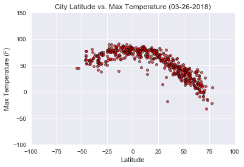
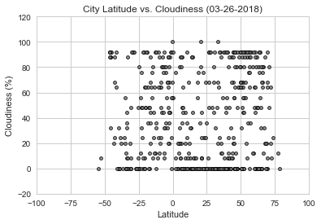
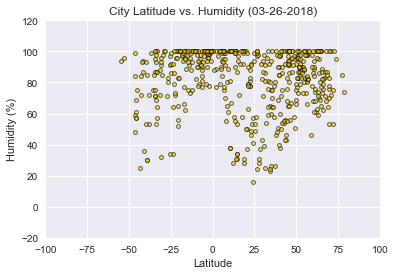

WeatherPy

Observations:
(1)  There is a distinct trend of temperatures rising as latitudes get closer to the equator, regardless of the fact that our data set includes temperaures from varying time zones (day vs night) as well as varying seasons in the temperate regions.
(2)  I expected cloud cover to increase as latitudes approached the equator, but this was not supported by the plot of "cloudiness" values.  My data set likely trends towards coastal regions of lower altitudes (see WhyCitiPy for full explaination), and that this may have impacted any trends in cloud cover I anticipated.
(3)  Humidity trends match anticipated behavior as latitudes approach the equator: high humidity at the equator (rainforest climates), a noticeable decrease in humidity around the 20 to 40-degree latitudes (desert climates), and a mix of humidity values moving throughout the temperate climates.
(4)  Wind speeds shows little pattern versus latitude except that the highest speeds are at greater than 50 degrees from the equator.


```python
#Import dependencies
%matplotlib inline
import json
import requests
from config import api_key
import openweathermapy.core as owm
import pandas as pd
from citipy import citipy
import random
import random as uniform
import pandas as pd
import matplotlib.pyplot as plt
import seaborn as sns
import datetime
```


```python
#Define a few basic parameters for the final presentation
now = datetime.datetime.now()
now = now.strftime("%m-%d-%Y")

def percent(x):
    return "{:.2f}%".format(x)
```


```python
#Prepare settings for calls to OpenWeatherMap. "Cnt" will return only one hour from the hourly weather forecast.
settings = {"APPID": api_key,
            "units": "imperial",
            "lang": "EN",
            "cnt":1}
```


```python
#Deicide how many unique cities you wish to compare
desired_dataset_size = 500
```

Generate Cities List


```python
#Prepare to store a list of unique cities
cities = []
def remove_duplicates(x):
    return list(set(x))

#Generate random coordinates, pass through CitiPy for city names, store uniques.  
#Total cities should exceed desired OpenWeatherMap calls by at least 16%, the "not found" rate based on several runs
x = 0
while x < (desired_dataset_size*1.20):
    lat = float(random.randrange(-9000, 9000))/100
    long = float(random.randrange(-18000, 18000))/100
    city = citipy.nearest_city(lat, long)
    cities.append(city.city_name)
    cities = remove_duplicates(cities)
    x  = len(cities)
```

Perform API calls


```python
#Prepare to store info on unique cities
names = []
ids = []
temps = []
lats = []
winds = []
clouds = []
humids = []
countries = []
url_cities = []

#Announce print log
print("------------------------------------------------------------------------------")
print("Beginning Data Retrieval")
print("------------------------------------------------------------------------------")


#loop through unique cities, calling on OpenWeatherMap, until desired number of sucessful returns is met 
y = 1
for city in cities:
    if len(names) < desired_dataset_size:
        #Test for availability on OpenWeatherMap
        try:
            weather = owm.get_forecast_hourly(city,**settings)
            #Get info for city and store it
            countries.append(weather.meta("city.country"))
            names.append(weather.meta("city.name"))
            ids.append(weather.meta("city.id"))
            lats.append(weather.meta("city.coord.lat"))
            temps.append(weather[0]("main.temp"))
            winds.append(weather[0]("wind.speed"))
            clouds.append(weather[0]("clouds.all"))
            humids.append(weather[0]("main.humidity"))
            #Reformat city names for URL output purposes
            url_city=city.replace(" ", "&")
            url_cities.append(url_city)
            #Run Print Log
            print("Making request number: "+str(y)+" for ID: "+str(weather.meta("city.id"))+" Name: "+weather.meta("city.name")+", "+weather.meta("city.country"))
            print("URL: http://api.openweathermap.org/data/2.5/forecast?units=imperial&cnt=1&APPID="+api_key+"&q="+url_city)
            y = y + 1
        #If OpenWeatherMap returns city "not found", do nothing with this city and continue loop
        except:
            continue
    #Break loop once len(names) reaches desired number of returns
    else:
        break
#Close print log
print("-------------------------------------------------------------------------------")
print("Data retrieval complete")
print("-------------------------------------------------------------------------------")
    
```

    ------------------------------------------------------------------------------
    Beginning Data Retrieval
    ------------------------------------------------------------------------------
    Making request number: 1 for ID: 3081752 Name: Wladyslawowo, PL
    URL: http://api.openweathermap.org/data/2.5/forecast?units=imperial&cnt=1&APPID=034bd27b501cbbba0e407d1f36ae033a&q=wladyslawowo
    Making request number: 2 for ID: 1528998 Name: Yumen, CN
    URL: http://api.openweathermap.org/data/2.5/forecast?units=imperial&cnt=1&APPID=034bd27b501cbbba0e407d1f36ae033a&q=yumen
    Making request number: 3 for ID: 1799869 Name: Nanning, CN
    URL: http://api.openweathermap.org/data/2.5/forecast?units=imperial&cnt=1&APPID=034bd27b501cbbba0e407d1f36ae033a&q=nanning
    Making request number: 4 for ID: 3661980 Name: Tamandare, BR
    URL: http://api.openweathermap.org/data/2.5/forecast?units=imperial&cnt=1&APPID=034bd27b501cbbba0e407d1f36ae033a&q=tamandare
    Making request number: 5 for ID: 3468720 Name: Buritizeiro, BR
    URL: http://api.openweathermap.org/data/2.5/forecast?units=imperial&cnt=1&APPID=034bd27b501cbbba0e407d1f36ae033a&q=buritizeiro
    Making request number: 6 for ID: 3354077 Name: Opuwo, NA
    URL: http://api.openweathermap.org/data/2.5/forecast?units=imperial&cnt=1&APPID=034bd27b501cbbba0e407d1f36ae033a&q=opuwo
    Making request number: 7 for ID: 58933 Name: Garowe, SO
    URL: http://api.openweathermap.org/data/2.5/forecast?units=imperial&cnt=1&APPID=034bd27b501cbbba0e407d1f36ae033a&q=garowe
    Making request number: 8 for ID: 3448903 Name: Sao Joao da Barra, BR
    URL: http://api.openweathermap.org/data/2.5/forecast?units=imperial&cnt=1&APPID=034bd27b501cbbba0e407d1f36ae033a&q=sao&joao&da&barra
    Making request number: 9 for ID: 625539 Name: Malaryta, BY
    URL: http://api.openweathermap.org/data/2.5/forecast?units=imperial&cnt=1&APPID=034bd27b501cbbba0e407d1f36ae033a&q=malaryta
    Making request number: 10 for ID: 4011743 Name: Constitucion, MX
    URL: http://api.openweathermap.org/data/2.5/forecast?units=imperial&cnt=1&APPID=034bd27b501cbbba0e407d1f36ae033a&q=constitucion
    Making request number: 11 for ID: 2729907 Name: Longyearbyen, NO
    URL: http://api.openweathermap.org/data/2.5/forecast?units=imperial&cnt=1&APPID=034bd27b501cbbba0e407d1f36ae033a&q=longyearbyen
    Making request number: 12 for ID: 5961417 Name: Husavik, CA
    URL: http://api.openweathermap.org/data/2.5/forecast?units=imperial&cnt=1&APPID=034bd27b501cbbba0e407d1f36ae033a&q=husavik
    Making request number: 13 for ID: 2142316 Name: Yeppoon, AU
    URL: http://api.openweathermap.org/data/2.5/forecast?units=imperial&cnt=1&APPID=034bd27b501cbbba0e407d1f36ae033a&q=yeppoon
    Making request number: 14 for ID: 2015306 Name: Tiksi, RU
    URL: http://api.openweathermap.org/data/2.5/forecast?units=imperial&cnt=1&APPID=034bd27b501cbbba0e407d1f36ae033a&q=tiksi
    Making request number: 15 for ID: 3412093 Name: Vestmannaeyjar, IS
    URL: http://api.openweathermap.org/data/2.5/forecast?units=imperial&cnt=1&APPID=034bd27b501cbbba0e407d1f36ae033a&q=vestmannaeyjar
    Making request number: 16 for ID: 1264037 Name: Malpe, IN
    URL: http://api.openweathermap.org/data/2.5/forecast?units=imperial&cnt=1&APPID=034bd27b501cbbba0e407d1f36ae033a&q=malpe
    Making request number: 17 for ID: 3667478 Name: Tame, CO
    URL: http://api.openweathermap.org/data/2.5/forecast?units=imperial&cnt=1&APPID=034bd27b501cbbba0e407d1f36ae033a&q=tame
    Making request number: 18 for ID: 3870243 Name: Taltal, CL
    URL: http://api.openweathermap.org/data/2.5/forecast?units=imperial&cnt=1&APPID=034bd27b501cbbba0e407d1f36ae033a&q=taltal
    Making request number: 19 for ID: 4035715 Name: Avarua, CK
    URL: http://api.openweathermap.org/data/2.5/forecast?units=imperial&cnt=1&APPID=034bd27b501cbbba0e407d1f36ae033a&q=avarua
    Making request number: 20 for ID: 1487332 Name: Verkhnyaya Inta, RU
    URL: http://api.openweathermap.org/data/2.5/forecast?units=imperial&cnt=1&APPID=034bd27b501cbbba0e407d1f36ae033a&q=verkhnyaya&inta
    Making request number: 21 for ID: 548791 Name: Kichmengskiy Gorodok, RU
    URL: http://api.openweathermap.org/data/2.5/forecast?units=imperial&cnt=1&APPID=034bd27b501cbbba0e407d1f36ae033a&q=kichmengskiy&gorodok
    Making request number: 22 for ID: 2398430 Name: Mimongo, GA
    URL: http://api.openweathermap.org/data/2.5/forecast?units=imperial&cnt=1&APPID=034bd27b501cbbba0e407d1f36ae033a&q=mimongo
    Making request number: 23 for ID: 5962442 Name: Goderich, CA
    URL: http://api.openweathermap.org/data/2.5/forecast?units=imperial&cnt=1&APPID=034bd27b501cbbba0e407d1f36ae033a&q=goderich
    Making request number: 24 for ID: 6167817 Name: Torbay, CA
    URL: http://api.openweathermap.org/data/2.5/forecast?units=imperial&cnt=1&APPID=034bd27b501cbbba0e407d1f36ae033a&q=torbay
    Making request number: 25 for ID: 707451 Name: Ivanivka, UA
    URL: http://api.openweathermap.org/data/2.5/forecast?units=imperial&cnt=1&APPID=034bd27b501cbbba0e407d1f36ae033a&q=ivanivka
    Making request number: 26 for ID: 5915327 Name: Cap-aux-Meules, CA
    URL: http://api.openweathermap.org/data/2.5/forecast?units=imperial&cnt=1&APPID=034bd27b501cbbba0e407d1f36ae033a&q=cap-aux-meules
    Making request number: 27 for ID: 964406 Name: Port Shepstone, ZA
    URL: http://api.openweathermap.org/data/2.5/forecast?units=imperial&cnt=1&APPID=034bd27b501cbbba0e407d1f36ae033a&q=port&shepstone
    Making request number: 28 for ID: 2742416 Name: Barcelos, PT
    URL: http://api.openweathermap.org/data/2.5/forecast?units=imperial&cnt=1&APPID=034bd27b501cbbba0e407d1f36ae033a&q=barcelos
    Making request number: 29 for ID: 3668257 Name: Saravena, CO
    URL: http://api.openweathermap.org/data/2.5/forecast?units=imperial&cnt=1&APPID=034bd27b501cbbba0e407d1f36ae033a&q=saravena
    Making request number: 30 for ID: 3031582 Name: Saint-Augustin, FR
    URL: http://api.openweathermap.org/data/2.5/forecast?units=imperial&cnt=1&APPID=034bd27b501cbbba0e407d1f36ae033a&q=saint-augustin
    Making request number: 31 for ID: 558487 Name: Grivenskaya, RU
    URL: http://api.openweathermap.org/data/2.5/forecast?units=imperial&cnt=1&APPID=034bd27b501cbbba0e407d1f36ae033a&q=grivenskaya
    Making request number: 32 for ID: 1790645 Name: Xiamen, CN
    URL: http://api.openweathermap.org/data/2.5/forecast?units=imperial&cnt=1&APPID=034bd27b501cbbba0e407d1f36ae033a&q=xiamen
    Making request number: 33 for ID: 3394500 Name: Morada Nova, BR
    URL: http://api.openweathermap.org/data/2.5/forecast?units=imperial&cnt=1&APPID=034bd27b501cbbba0e407d1f36ae033a&q=morada&nova
    Making request number: 34 for ID: 217389 Name: Demba, CD
    URL: http://api.openweathermap.org/data/2.5/forecast?units=imperial&cnt=1&APPID=034bd27b501cbbba0e407d1f36ae033a&q=demba
    Making request number: 35 for ID: 1630662 Name: Praya, ID
    URL: http://api.openweathermap.org/data/2.5/forecast?units=imperial&cnt=1&APPID=034bd27b501cbbba0e407d1f36ae033a&q=praya
    Making request number: 36 for ID: 1252783 Name: Yarada, IN
    URL: http://api.openweathermap.org/data/2.5/forecast?units=imperial&cnt=1&APPID=034bd27b501cbbba0e407d1f36ae033a&q=yarada
    Making request number: 37 for ID: 1796236 Name: Shanghai, CN
    URL: http://api.openweathermap.org/data/2.5/forecast?units=imperial&cnt=1&APPID=034bd27b501cbbba0e407d1f36ae033a&q=shanghai
    Making request number: 38 for ID: 6096551 Name: Pangnirtung, CA
    URL: http://api.openweathermap.org/data/2.5/forecast?units=imperial&cnt=1&APPID=034bd27b501cbbba0e407d1f36ae033a&q=pangnirtung
    Making request number: 39 for ID: 934479 Name: Grand Gaube, MU
    URL: http://api.openweathermap.org/data/2.5/forecast?units=imperial&cnt=1&APPID=034bd27b501cbbba0e407d1f36ae033a&q=grand&gaube
    Making request number: 40 for ID: 64814 Name: Bandarbeyla, SO
    URL: http://api.openweathermap.org/data/2.5/forecast?units=imperial&cnt=1&APPID=034bd27b501cbbba0e407d1f36ae033a&q=bandarbeyla
    Making request number: 41 for ID: 1849831 Name: Toyooka, JP
    URL: http://api.openweathermap.org/data/2.5/forecast?units=imperial&cnt=1&APPID=034bd27b501cbbba0e407d1f36ae033a&q=toyooka
    Making request number: 42 for ID: 1282256 Name: Hithadhoo, MV
    URL: http://api.openweathermap.org/data/2.5/forecast?units=imperial&cnt=1&APPID=034bd27b501cbbba0e407d1f36ae033a&q=hithadhoo
    Making request number: 43 for ID: 6431379 Name: Saint-Alexandre, FR
    URL: http://api.openweathermap.org/data/2.5/forecast?units=imperial&cnt=1&APPID=034bd27b501cbbba0e407d1f36ae033a&q=saint-alexandre
    Making request number: 44 for ID: 3873441 Name: Los Rastrojos, CL
    URL: http://api.openweathermap.org/data/2.5/forecast?units=imperial&cnt=1&APPID=034bd27b501cbbba0e407d1f36ae033a&q=los&rastrojos
    Making request number: 45 for ID: 513328 Name: Ozinki, RU
    URL: http://api.openweathermap.org/data/2.5/forecast?units=imperial&cnt=1&APPID=034bd27b501cbbba0e407d1f36ae033a&q=ozinki
    Making request number: 46 for ID: 463838 Name: Zelenoborskiy, RU
    URL: http://api.openweathermap.org/data/2.5/forecast?units=imperial&cnt=1&APPID=034bd27b501cbbba0e407d1f36ae033a&q=zelenoborskiy
    Making request number: 47 for ID: 5826559 Name: Green River, US
    URL: http://api.openweathermap.org/data/2.5/forecast?units=imperial&cnt=1&APPID=034bd27b501cbbba0e407d1f36ae033a&q=green&river
    Making request number: 48 for ID: 1266330 Name: Kokrajhar, IN
    URL: http://api.openweathermap.org/data/2.5/forecast?units=imperial&cnt=1&APPID=034bd27b501cbbba0e407d1f36ae033a&q=kokrajhar
    Making request number: 49 for ID: 5456049 Name: Aztec, US
    URL: http://api.openweathermap.org/data/2.5/forecast?units=imperial&cnt=1&APPID=034bd27b501cbbba0e407d1f36ae033a&q=aztec
    Making request number: 50 for ID: 1078553 Name: Ampanihy, MG
    URL: http://api.openweathermap.org/data/2.5/forecast?units=imperial&cnt=1&APPID=034bd27b501cbbba0e407d1f36ae033a&q=ampanihy
    Making request number: 51 for ID: 3393692 Name: Itarema, BR
    URL: http://api.openweathermap.org/data/2.5/forecast?units=imperial&cnt=1&APPID=034bd27b501cbbba0e407d1f36ae033a&q=itarema
    Making request number: 52 for ID: 2708365 Name: Halmstad, SE
    URL: http://api.openweathermap.org/data/2.5/forecast?units=imperial&cnt=1&APPID=034bd27b501cbbba0e407d1f36ae033a&q=halmstad
    Making request number: 53 for ID: 2013465 Name: Verkhoyansk, RU
    URL: http://api.openweathermap.org/data/2.5/forecast?units=imperial&cnt=1&APPID=034bd27b501cbbba0e407d1f36ae033a&q=verkhoyansk
    Making request number: 54 for ID: 2075265 Name: Busselton, AU
    URL: http://api.openweathermap.org/data/2.5/forecast?units=imperial&cnt=1&APPID=034bd27b501cbbba0e407d1f36ae033a&q=busselton
    Making request number: 55 for ID: 2109528 Name: Buala, SB
    URL: http://api.openweathermap.org/data/2.5/forecast?units=imperial&cnt=1&APPID=034bd27b501cbbba0e407d1f36ae033a&q=buala
    Making request number: 56 for ID: 1263997 Name: Mamallapuram, IN
    URL: http://api.openweathermap.org/data/2.5/forecast?units=imperial&cnt=1&APPID=034bd27b501cbbba0e407d1f36ae033a&q=mamallapuram
    Making request number: 57 for ID: 1264976 Name: Leh, IN
    URL: http://api.openweathermap.org/data/2.5/forecast?units=imperial&cnt=1&APPID=034bd27b501cbbba0e407d1f36ae033a&q=leh
    Making request number: 58 for ID: 3146831 Name: Lundamo, NO
    URL: http://api.openweathermap.org/data/2.5/forecast?units=imperial&cnt=1&APPID=034bd27b501cbbba0e407d1f36ae033a&q=lundamo
    Making request number: 59 for ID: 2122090 Name: Pevek, RU
    URL: http://api.openweathermap.org/data/2.5/forecast?units=imperial&cnt=1&APPID=034bd27b501cbbba0e407d1f36ae033a&q=pevek
    Making request number: 60 for ID: 1258864 Name: Rajgir, IN
    URL: http://api.openweathermap.org/data/2.5/forecast?units=imperial&cnt=1&APPID=034bd27b501cbbba0e407d1f36ae033a&q=rajgir
    Making request number: 61 for ID: 3146487 Name: Raudeberg, NO
    URL: http://api.openweathermap.org/data/2.5/forecast?units=imperial&cnt=1&APPID=034bd27b501cbbba0e407d1f36ae033a&q=raudeberg
    Making request number: 62 for ID: 2873499 Name: Mariental, DE
    URL: http://api.openweathermap.org/data/2.5/forecast?units=imperial&cnt=1&APPID=034bd27b501cbbba0e407d1f36ae033a&q=mariental
    Making request number: 63 for ID: 986717 Name: Kruisfontein, ZA
    URL: http://api.openweathermap.org/data/2.5/forecast?units=imperial&cnt=1&APPID=034bd27b501cbbba0e407d1f36ae033a&q=kruisfontein
    Making request number: 64 for ID: 553725 Name: Kamenka, RU
    URL: http://api.openweathermap.org/data/2.5/forecast?units=imperial&cnt=1&APPID=034bd27b501cbbba0e407d1f36ae033a&q=kamenka
    Making request number: 65 for ID: 6201424 Name: Mataura, NZ
    URL: http://api.openweathermap.org/data/2.5/forecast?units=imperial&cnt=1&APPID=034bd27b501cbbba0e407d1f36ae033a&q=mataura
    Making request number: 66 for ID: 2146219 Name: Hervey Bay, AU
    URL: http://api.openweathermap.org/data/2.5/forecast?units=imperial&cnt=1&APPID=034bd27b501cbbba0e407d1f36ae033a&q=hervey&bay
    Making request number: 67 for ID: 6165406 Name: Thompson, CA
    URL: http://api.openweathermap.org/data/2.5/forecast?units=imperial&cnt=1&APPID=034bd27b501cbbba0e407d1f36ae033a&q=thompson
    Making request number: 68 for ID: 917688 Name: Chongwe, ZM
    URL: http://api.openweathermap.org/data/2.5/forecast?units=imperial&cnt=1&APPID=034bd27b501cbbba0e407d1f36ae033a&q=chongwe
    Making request number: 69 for ID: 2132606 Name: Samarai, PG
    URL: http://api.openweathermap.org/data/2.5/forecast?units=imperial&cnt=1&APPID=034bd27b501cbbba0e407d1f36ae033a&q=samarai
    Making request number: 70 for ID: 546105 Name: Nikolskoye, RU
    URL: http://api.openweathermap.org/data/2.5/forecast?units=imperial&cnt=1&APPID=034bd27b501cbbba0e407d1f36ae033a&q=nikolskoye
    Making request number: 71 for ID: 3451261 Name: Caxito, BR
    URL: http://api.openweathermap.org/data/2.5/forecast?units=imperial&cnt=1&APPID=034bd27b501cbbba0e407d1f36ae033a&q=caxito
    Making request number: 72 for ID: 3397119 Name: Jucas, BR
    URL: http://api.openweathermap.org/data/2.5/forecast?units=imperial&cnt=1&APPID=034bd27b501cbbba0e407d1f36ae033a&q=jucas
    Making request number: 73 for ID: 3465542 Name: Coracao de Jesus, BR
    URL: http://api.openweathermap.org/data/2.5/forecast?units=imperial&cnt=1&APPID=034bd27b501cbbba0e407d1f36ae033a&q=coracao&de&jesus
    Making request number: 74 for ID: 934649 Name: Cap Malheureux, MU
    URL: http://api.openweathermap.org/data/2.5/forecast?units=imperial&cnt=1&APPID=034bd27b501cbbba0e407d1f36ae033a&q=cap&malheureux
    Making request number: 75 for ID: 4267710 Name: Sitka, US
    URL: http://api.openweathermap.org/data/2.5/forecast?units=imperial&cnt=1&APPID=034bd27b501cbbba0e407d1f36ae033a&q=sitka
    Making request number: 76 for ID: 2163355 Name: Hobart, AU
    URL: http://api.openweathermap.org/data/2.5/forecast?units=imperial&cnt=1&APPID=034bd27b501cbbba0e407d1f36ae033a&q=hobart
    Making request number: 77 for ID: 3985710 Name: Cabo San Lucas, MX
    URL: http://api.openweathermap.org/data/2.5/forecast?units=imperial&cnt=1&APPID=034bd27b501cbbba0e407d1f36ae033a&q=cabo&san&lucas
    Making request number: 78 for ID: 1244713 Name: Haputale, LK
    URL: http://api.openweathermap.org/data/2.5/forecast?units=imperial&cnt=1&APPID=034bd27b501cbbba0e407d1f36ae033a&q=haputale
    Making request number: 79 for ID: 5855927 Name: Hilo, US
    URL: http://api.openweathermap.org/data/2.5/forecast?units=imperial&cnt=1&APPID=034bd27b501cbbba0e407d1f36ae033a&q=hilo
    Making request number: 80 for ID: 1651810 Name: Airai, TL
    URL: http://api.openweathermap.org/data/2.5/forecast?units=imperial&cnt=1&APPID=034bd27b501cbbba0e407d1f36ae033a&q=airai
    Making request number: 81 for ID: 2270385 Name: Camacha, PT
    URL: http://api.openweathermap.org/data/2.5/forecast?units=imperial&cnt=1&APPID=034bd27b501cbbba0e407d1f36ae033a&q=camacha
    Making request number: 82 for ID: 6111862 Name: Port Hardy, CA
    URL: http://api.openweathermap.org/data/2.5/forecast?units=imperial&cnt=1&APPID=034bd27b501cbbba0e407d1f36ae033a&q=port&hardy
    Making request number: 83 for ID: 3640226 Name: Guanare, VE
    URL: http://api.openweathermap.org/data/2.5/forecast?units=imperial&cnt=1&APPID=034bd27b501cbbba0e407d1f36ae033a&q=guanare
    Making request number: 84 for ID: 350203 Name: Rosetta, EG
    URL: http://api.openweathermap.org/data/2.5/forecast?units=imperial&cnt=1&APPID=034bd27b501cbbba0e407d1f36ae033a&q=rosetta
    Making request number: 85 for ID: 2265388 Name: Ourem, PT
    URL: http://api.openweathermap.org/data/2.5/forecast?units=imperial&cnt=1&APPID=034bd27b501cbbba0e407d1f36ae033a&q=ourem
    Making request number: 86 for ID: 3382160 Name: Cayenne, GF
    URL: http://api.openweathermap.org/data/2.5/forecast?units=imperial&cnt=1&APPID=034bd27b501cbbba0e407d1f36ae033a&q=cayenne
    Making request number: 87 for ID: 1052944 Name: Angoche, MZ
    URL: http://api.openweathermap.org/data/2.5/forecast?units=imperial&cnt=1&APPID=034bd27b501cbbba0e407d1f36ae033a&q=angoche
    Making request number: 88 for ID: 1712961 Name: Gigmoto, PH
    URL: http://api.openweathermap.org/data/2.5/forecast?units=imperial&cnt=1&APPID=034bd27b501cbbba0e407d1f36ae033a&q=gigmoto
    Making request number: 89 for ID: 1176048 Name: Jati, PK
    URL: http://api.openweathermap.org/data/2.5/forecast?units=imperial&cnt=1&APPID=034bd27b501cbbba0e407d1f36ae033a&q=jati
    Making request number: 90 for ID: 2337542 Name: Naze, NG
    URL: http://api.openweathermap.org/data/2.5/forecast?units=imperial&cnt=1&APPID=034bd27b501cbbba0e407d1f36ae033a&q=naze
    Making request number: 91 for ID: 2338660 Name: Yaan, NG
    URL: http://api.openweathermap.org/data/2.5/forecast?units=imperial&cnt=1&APPID=034bd27b501cbbba0e407d1f36ae033a&q=yaan
    Making request number: 92 for ID: 5353775 Name: Grass Valley, US
    URL: http://api.openweathermap.org/data/2.5/forecast?units=imperial&cnt=1&APPID=034bd27b501cbbba0e407d1f36ae033a&q=grass&valley
    Making request number: 93 for ID: 2126710 Name: Beringovskiy, RU
    URL: http://api.openweathermap.org/data/2.5/forecast?units=imperial&cnt=1&APPID=034bd27b501cbbba0e407d1f36ae033a&q=beringovskiy
    Making request number: 94 for ID: 3704327 Name: Meteti, PA
    URL: http://api.openweathermap.org/data/2.5/forecast?units=imperial&cnt=1&APPID=034bd27b501cbbba0e407d1f36ae033a&q=meteti
    Making request number: 95 for ID: 3406442 Name: Barbalha, BR
    URL: http://api.openweathermap.org/data/2.5/forecast?units=imperial&cnt=1&APPID=034bd27b501cbbba0e407d1f36ae033a&q=barbalha
    Making request number: 96 for ID: 1053384 Name: Toamasina, MG
    URL: http://api.openweathermap.org/data/2.5/forecast?units=imperial&cnt=1&APPID=034bd27b501cbbba0e407d1f36ae033a&q=toamasina
    Making request number: 97 for ID: 2633414 Name: Yarmouth, GB
    URL: http://api.openweathermap.org/data/2.5/forecast?units=imperial&cnt=1&APPID=034bd27b501cbbba0e407d1f36ae033a&q=yarmouth
    Making request number: 98 for ID: 2037886 Name: Dandong, CN
    URL: http://api.openweathermap.org/data/2.5/forecast?units=imperial&cnt=1&APPID=034bd27b501cbbba0e407d1f36ae033a&q=dandong
    Making request number: 99 for ID: 1215502 Name: Banda Aceh, ID
    URL: http://api.openweathermap.org/data/2.5/forecast?units=imperial&cnt=1&APPID=034bd27b501cbbba0e407d1f36ae033a&q=banda&aceh
    Making request number: 100 for ID: 1259385 Name: Port Blair, IN
    URL: http://api.openweathermap.org/data/2.5/forecast?units=imperial&cnt=1&APPID=034bd27b501cbbba0e407d1f36ae033a&q=port&blair
    Making request number: 101 for ID: 2013918 Name: Ust-Maya, RU
    URL: http://api.openweathermap.org/data/2.5/forecast?units=imperial&cnt=1&APPID=034bd27b501cbbba0e407d1f36ae033a&q=ust-maya
    Making request number: 102 for ID: 2656708 Name: Ayr, GB
    URL: http://api.openweathermap.org/data/2.5/forecast?units=imperial&cnt=1&APPID=034bd27b501cbbba0e407d1f36ae033a&q=ayr
    Making request number: 103 for ID: 1795632 Name: Shenjiamen, CN
    URL: http://api.openweathermap.org/data/2.5/forecast?units=imperial&cnt=1&APPID=034bd27b501cbbba0e407d1f36ae033a&q=shenjiamen
    Making request number: 104 for ID: 1718234 Name: Caruray, PH
    URL: http://api.openweathermap.org/data/2.5/forecast?units=imperial&cnt=1&APPID=034bd27b501cbbba0e407d1f36ae033a&q=caruray
    Making request number: 105 for ID: 1067565 Name: Beloha, MG
    URL: http://api.openweathermap.org/data/2.5/forecast?units=imperial&cnt=1&APPID=034bd27b501cbbba0e407d1f36ae033a&q=beloha
    Making request number: 106 for ID: 1622318 Name: Waingapu, ID
    URL: http://api.openweathermap.org/data/2.5/forecast?units=imperial&cnt=1&APPID=034bd27b501cbbba0e407d1f36ae033a&q=waingapu
    Making request number: 107 for ID: 1732738 Name: Kota Tinggi, MY
    URL: http://api.openweathermap.org/data/2.5/forecast?units=imperial&cnt=1&APPID=034bd27b501cbbba0e407d1f36ae033a&q=kota&tinggi
    Making request number: 108 for ID: 2381334 Name: Atar, MR
    URL: http://api.openweathermap.org/data/2.5/forecast?units=imperial&cnt=1&APPID=034bd27b501cbbba0e407d1f36ae033a&q=atar
    Making request number: 109 for ID: 2012956 Name: Yerbogachen, RU
    URL: http://api.openweathermap.org/data/2.5/forecast?units=imperial&cnt=1&APPID=034bd27b501cbbba0e407d1f36ae033a&q=yerbogachen
    Making request number: 110 for ID: 1267390 Name: Kavaratti, IN
    URL: http://api.openweathermap.org/data/2.5/forecast?units=imperial&cnt=1&APPID=034bd27b501cbbba0e407d1f36ae033a&q=kavaratti
    Making request number: 111 for ID: 5911745 Name: Burns Lake, CA
    URL: http://api.openweathermap.org/data/2.5/forecast?units=imperial&cnt=1&APPID=034bd27b501cbbba0e407d1f36ae033a&q=burns&lake
    Making request number: 112 for ID: 921786 Name: Mitsamiouli, KM
    URL: http://api.openweathermap.org/data/2.5/forecast?units=imperial&cnt=1&APPID=034bd27b501cbbba0e407d1f36ae033a&q=mitsamiouli
    Making request number: 113 for ID: 245669 Name: Adre, TD
    URL: http://api.openweathermap.org/data/2.5/forecast?units=imperial&cnt=1&APPID=034bd27b501cbbba0e407d1f36ae033a&q=adre
    Making request number: 114 for ID: 2186313 Name: Napier, NZ
    URL: http://api.openweathermap.org/data/2.5/forecast?units=imperial&cnt=1&APPID=034bd27b501cbbba0e407d1f36ae033a&q=napier
    Making request number: 115 for ID: 2164771 Name: Grafton, AU
    URL: http://api.openweathermap.org/data/2.5/forecast?units=imperial&cnt=1&APPID=034bd27b501cbbba0e407d1f36ae033a&q=grafton
    Making request number: 116 for ID: 1504382 Name: Kargasok, RU
    URL: http://api.openweathermap.org/data/2.5/forecast?units=imperial&cnt=1&APPID=034bd27b501cbbba0e407d1f36ae033a&q=kargasok
    Making request number: 117 for ID: 647572 Name: Loviisa, FI
    URL: http://api.openweathermap.org/data/2.5/forecast?units=imperial&cnt=1&APPID=034bd27b501cbbba0e407d1f36ae033a&q=loviisa
    Making request number: 118 for ID: 233019 Name: Kaberamaido, UG
    URL: http://api.openweathermap.org/data/2.5/forecast?units=imperial&cnt=1&APPID=034bd27b501cbbba0e407d1f36ae033a&q=kaberamaido
    Making request number: 119 for ID: 3833859 Name: Barrow, AR
    URL: http://api.openweathermap.org/data/2.5/forecast?units=imperial&cnt=1&APPID=034bd27b501cbbba0e407d1f36ae033a&q=barrow
    Making request number: 120 for ID: 542322 Name: Krasnokholm, RU
    URL: http://api.openweathermap.org/data/2.5/forecast?units=imperial&cnt=1&APPID=034bd27b501cbbba0e407d1f36ae033a&q=krasnokholm
    Making request number: 121 for ID: 2418596 Name: Koundara, GN
    URL: http://api.openweathermap.org/data/2.5/forecast?units=imperial&cnt=1&APPID=034bd27b501cbbba0e407d1f36ae033a&q=koundara
    Making request number: 122 for ID: 1847947 Name: Shingu, JP
    URL: http://api.openweathermap.org/data/2.5/forecast?units=imperial&cnt=1&APPID=034bd27b501cbbba0e407d1f36ae033a&q=shingu
    Making request number: 123 for ID: 502265 Name: Mirnyy, RU
    URL: http://api.openweathermap.org/data/2.5/forecast?units=imperial&cnt=1&APPID=034bd27b501cbbba0e407d1f36ae033a&q=mirnyy
    Making request number: 124 for ID: 4031742 Name: Egvekinot, RU
    URL: http://api.openweathermap.org/data/2.5/forecast?units=imperial&cnt=1&APPID=034bd27b501cbbba0e407d1f36ae033a&q=egvekinot
    Making request number: 125 for ID: 1024312 Name: Mocuba, MZ
    URL: http://api.openweathermap.org/data/2.5/forecast?units=imperial&cnt=1&APPID=034bd27b501cbbba0e407d1f36ae033a&q=mocuba
    Making request number: 126 for ID: 4004293 Name: Ixtapa, MX
    URL: http://api.openweathermap.org/data/2.5/forecast?units=imperial&cnt=1&APPID=034bd27b501cbbba0e407d1f36ae033a&q=ixtapa
    Making request number: 127 for ID: 1255619 Name: Srivardhan, IN
    URL: http://api.openweathermap.org/data/2.5/forecast?units=imperial&cnt=1&APPID=034bd27b501cbbba0e407d1f36ae033a&q=srivardhan
    Making request number: 128 for ID: 1488414 Name: Urengoy, RU
    URL: http://api.openweathermap.org/data/2.5/forecast?units=imperial&cnt=1&APPID=034bd27b501cbbba0e407d1f36ae033a&q=urengoy
    Making request number: 129 for ID: 328316 Name: Bolo, ET
    URL: http://api.openweathermap.org/data/2.5/forecast?units=imperial&cnt=1&APPID=034bd27b501cbbba0e407d1f36ae033a&q=bolo
    Making request number: 130 for ID: 4031574 Name: Provideniya, RU
    URL: http://api.openweathermap.org/data/2.5/forecast?units=imperial&cnt=1&APPID=034bd27b501cbbba0e407d1f36ae033a&q=provideniya
    Making request number: 131 for ID: 6113406 Name: Prince Rupert, CA
    URL: http://api.openweathermap.org/data/2.5/forecast?units=imperial&cnt=1&APPID=034bd27b501cbbba0e407d1f36ae033a&q=prince&rupert
    Making request number: 132 for ID: 503977 Name: Marfino, RU
    URL: http://api.openweathermap.org/data/2.5/forecast?units=imperial&cnt=1&APPID=034bd27b501cbbba0e407d1f36ae033a&q=marfino
    Making request number: 133 for ID: 3453439 Name: Ponta do Sol, BR
    URL: http://api.openweathermap.org/data/2.5/forecast?units=imperial&cnt=1&APPID=034bd27b501cbbba0e407d1f36ae033a&q=ponta&do&sol
    Making request number: 134 for ID: 6145890 Name: Shelburne, CA
    URL: http://api.openweathermap.org/data/2.5/forecast?units=imperial&cnt=1&APPID=034bd27b501cbbba0e407d1f36ae033a&q=shelburne
    Making request number: 135 for ID: 3387082 Name: Tabira, BR
    URL: http://api.openweathermap.org/data/2.5/forecast?units=imperial&cnt=1&APPID=034bd27b501cbbba0e407d1f36ae033a&q=tabira
    Making request number: 136 for ID: 2079582 Name: Alyangula, AU
    URL: http://api.openweathermap.org/data/2.5/forecast?units=imperial&cnt=1&APPID=034bd27b501cbbba0e407d1f36ae033a&q=alyangula
    Making request number: 137 for ID: 3595803 Name: Escuintla, GT
    URL: http://api.openweathermap.org/data/2.5/forecast?units=imperial&cnt=1&APPID=034bd27b501cbbba0e407d1f36ae033a&q=escuintla
    Making request number: 138 for ID: 3372707 Name: Ribeira Grande, PT
    URL: http://api.openweathermap.org/data/2.5/forecast?units=imperial&cnt=1&APPID=034bd27b501cbbba0e407d1f36ae033a&q=ribeira&grande
    Making request number: 139 for ID: 877747 Name: Mtwara, TZ
    URL: http://api.openweathermap.org/data/2.5/forecast?units=imperial&cnt=1&APPID=034bd27b501cbbba0e407d1f36ae033a&q=mtwara
    Making request number: 140 for ID: 4034551 Name: Faanui, PF
    URL: http://api.openweathermap.org/data/2.5/forecast?units=imperial&cnt=1&APPID=034bd27b501cbbba0e407d1f36ae033a&q=faanui
    Making request number: 141 for ID: 3369157 Name: Cape Town, ZA
    URL: http://api.openweathermap.org/data/2.5/forecast?units=imperial&cnt=1&APPID=034bd27b501cbbba0e407d1f36ae033a&q=cape&town
    Making request number: 142 for ID: 5848280 Name: Kapaa, US
    URL: http://api.openweathermap.org/data/2.5/forecast?units=imperial&cnt=1&APPID=034bd27b501cbbba0e407d1f36ae033a&q=kapaa
    Making request number: 143 for ID: 2185329 Name: Waipawa, NZ
    URL: http://api.openweathermap.org/data/2.5/forecast?units=imperial&cnt=1&APPID=034bd27b501cbbba0e407d1f36ae033a&q=waipawa
    Making request number: 144 for ID: 3874787 Name: Punta Arenas, CL
    URL: http://api.openweathermap.org/data/2.5/forecast?units=imperial&cnt=1&APPID=034bd27b501cbbba0e407d1f36ae033a&q=punta&arenas
    Making request number: 145 for ID: 359792 Name: Aswan, EG
    URL: http://api.openweathermap.org/data/2.5/forecast?units=imperial&cnt=1&APPID=034bd27b501cbbba0e407d1f36ae033a&q=aswan
    Making request number: 146 for ID: 610091 Name: Chingirlau, KZ
    URL: http://api.openweathermap.org/data/2.5/forecast?units=imperial&cnt=1&APPID=034bd27b501cbbba0e407d1f36ae033a&q=chingirlau
    Making request number: 147 for ID: 1795565 Name: Shenzhen, CN
    URL: http://api.openweathermap.org/data/2.5/forecast?units=imperial&cnt=1&APPID=034bd27b501cbbba0e407d1f36ae033a&q=shenzhen
    Making request number: 148 for ID: 3652764 Name: Puerto Ayora, EC
    URL: http://api.openweathermap.org/data/2.5/forecast?units=imperial&cnt=1&APPID=034bd27b501cbbba0e407d1f36ae033a&q=puerto&ayora
    Making request number: 149 for ID: 1491999 Name: Shumikha, RU
    URL: http://api.openweathermap.org/data/2.5/forecast?units=imperial&cnt=1&APPID=034bd27b501cbbba0e407d1f36ae033a&q=shumikha
    Making request number: 150 for ID: 3948642 Name: Matara, PE
    URL: http://api.openweathermap.org/data/2.5/forecast?units=imperial&cnt=1&APPID=034bd27b501cbbba0e407d1f36ae033a&q=matara
    Making request number: 151 for ID: 463355 Name: Zheleznodorozhnyy, RU
    URL: http://api.openweathermap.org/data/2.5/forecast?units=imperial&cnt=1&APPID=034bd27b501cbbba0e407d1f36ae033a&q=zheleznodorozhnyy
    Making request number: 152 for ID: 5919850 Name: Chapais, CA
    URL: http://api.openweathermap.org/data/2.5/forecast?units=imperial&cnt=1&APPID=034bd27b501cbbba0e407d1f36ae033a&q=chapais
    Making request number: 153 for ID: 153955 Name: Micheweni, TZ
    URL: http://api.openweathermap.org/data/2.5/forecast?units=imperial&cnt=1&APPID=034bd27b501cbbba0e407d1f36ae033a&q=micheweni
    Making request number: 154 for ID: 2191562 Name: Dunedin, NZ
    URL: http://api.openweathermap.org/data/2.5/forecast?units=imperial&cnt=1&APPID=034bd27b501cbbba0e407d1f36ae033a&q=dunedin
    Making request number: 155 for ID: 2059470 Name: Victor Harbor, AU
    URL: http://api.openweathermap.org/data/2.5/forecast?units=imperial&cnt=1&APPID=034bd27b501cbbba0e407d1f36ae033a&q=victor&harbor
    Making request number: 156 for ID: 94298 Name: Kifri, IQ
    URL: http://api.openweathermap.org/data/2.5/forecast?units=imperial&cnt=1&APPID=034bd27b501cbbba0e407d1f36ae033a&q=kifri
    Making request number: 157 for ID: 5554428 Name: Ketchikan, US
    URL: http://api.openweathermap.org/data/2.5/forecast?units=imperial&cnt=1&APPID=034bd27b501cbbba0e407d1f36ae033a&q=ketchikan
    Making request number: 158 for ID: 2141714 Name: Bourail, NC
    URL: http://api.openweathermap.org/data/2.5/forecast?units=imperial&cnt=1&APPID=034bd27b501cbbba0e407d1f36ae033a&q=bourail
    Making request number: 159 for ID: 5106834 Name: Albany, US
    URL: http://api.openweathermap.org/data/2.5/forecast?units=imperial&cnt=1&APPID=034bd27b501cbbba0e407d1f36ae033a&q=albany
    Making request number: 160 for ID: 1816440 Name: Huaiyuan, CN
    URL: http://api.openweathermap.org/data/2.5/forecast?units=imperial&cnt=1&APPID=034bd27b501cbbba0e407d1f36ae033a&q=huaiyuan
    Making request number: 161 for ID: 6171332 Name: Two Hills, CA
    URL: http://api.openweathermap.org/data/2.5/forecast?units=imperial&cnt=1&APPID=034bd27b501cbbba0e407d1f36ae033a&q=two&hills
    Making request number: 162 for ID: 3936456 Name: Lima, PE
    URL: http://api.openweathermap.org/data/2.5/forecast?units=imperial&cnt=1&APPID=034bd27b501cbbba0e407d1f36ae033a&q=lima
    Making request number: 163 for ID: 2152659 Name: Port Macquarie, AU
    URL: http://api.openweathermap.org/data/2.5/forecast?units=imperial&cnt=1&APPID=034bd27b501cbbba0e407d1f36ae033a&q=port&macquarie
    Making request number: 164 for ID: 2077895 Name: Alice Springs, AU
    URL: http://api.openweathermap.org/data/2.5/forecast?units=imperial&cnt=1&APPID=034bd27b501cbbba0e407d1f36ae033a&q=alice&springs
    Making request number: 165 for ID: 2036973 Name: Heihe, RU
    URL: http://api.openweathermap.org/data/2.5/forecast?units=imperial&cnt=1&APPID=034bd27b501cbbba0e407d1f36ae033a&q=heihe
    Making request number: 166 for ID: 306571 Name: Konya, TR
    URL: http://api.openweathermap.org/data/2.5/forecast?units=imperial&cnt=1&APPID=034bd27b501cbbba0e407d1f36ae033a&q=konya
    Making request number: 167 for ID: 5367788 Name: Lompoc, US
    URL: http://api.openweathermap.org/data/2.5/forecast?units=imperial&cnt=1&APPID=034bd27b501cbbba0e407d1f36ae033a&q=lompoc
    Making request number: 168 for ID: 2737599 Name: Saldanha, PT
    URL: http://api.openweathermap.org/data/2.5/forecast?units=imperial&cnt=1&APPID=034bd27b501cbbba0e407d1f36ae033a&q=saldanha
    Making request number: 169 for ID: 3924679 Name: Vilhena, BR
    URL: http://api.openweathermap.org/data/2.5/forecast?units=imperial&cnt=1&APPID=034bd27b501cbbba0e407d1f36ae033a&q=vilhena
    Making request number: 170 for ID: 2278158 Name: Buchanan, LR
    URL: http://api.openweathermap.org/data/2.5/forecast?units=imperial&cnt=1&APPID=034bd27b501cbbba0e407d1f36ae033a&q=buchanan
    Making request number: 171 for ID: 3440777 Name: Rocha, UY
    URL: http://api.openweathermap.org/data/2.5/forecast?units=imperial&cnt=1&APPID=034bd27b501cbbba0e407d1f36ae033a&q=rocha
    Making request number: 172 for ID: 464260 Name: Zaterechnyy, RU
    URL: http://api.openweathermap.org/data/2.5/forecast?units=imperial&cnt=1&APPID=034bd27b501cbbba0e407d1f36ae033a&q=zaterechnyy
    Making request number: 173 for ID: 2448442 Name: Yorosso, ML
    URL: http://api.openweathermap.org/data/2.5/forecast?units=imperial&cnt=1&APPID=034bd27b501cbbba0e407d1f36ae033a&q=yorosso
    Making request number: 174 for ID: 5993072 Name: Kitimat, CA
    URL: http://api.openweathermap.org/data/2.5/forecast?units=imperial&cnt=1&APPID=034bd27b501cbbba0e407d1f36ae033a&q=kitimat
    Making request number: 175 for ID: 5762718 Name: Belle Fourche, US
    URL: http://api.openweathermap.org/data/2.5/forecast?units=imperial&cnt=1&APPID=034bd27b501cbbba0e407d1f36ae033a&q=belle&fourche
    Making request number: 176 for ID: 1652203 Name: Xam Nua, LA
    URL: http://api.openweathermap.org/data/2.5/forecast?units=imperial&cnt=1&APPID=034bd27b501cbbba0e407d1f36ae033a&q=xam&nua
    Making request number: 177 for ID: 2409215 Name: Mattru, SL
    URL: http://api.openweathermap.org/data/2.5/forecast?units=imperial&cnt=1&APPID=034bd27b501cbbba0e407d1f36ae033a&q=mattru
    Making request number: 178 for ID: 2065594 Name: Mount Isa, AU
    URL: http://api.openweathermap.org/data/2.5/forecast?units=imperial&cnt=1&APPID=034bd27b501cbbba0e407d1f36ae033a&q=mount&isa
    Making request number: 179 for ID: 4167694 Name: Panama City, US
    URL: http://api.openweathermap.org/data/2.5/forecast?units=imperial&cnt=1&APPID=034bd27b501cbbba0e407d1f36ae033a&q=panama&city
    Making request number: 180 for ID: 3031871 Name: Veraval, FR
    URL: http://api.openweathermap.org/data/2.5/forecast?units=imperial&cnt=1&APPID=034bd27b501cbbba0e407d1f36ae033a&q=veraval
    Making request number: 181 for ID: 2399001 Name: Mayumba, GA
    URL: http://api.openweathermap.org/data/2.5/forecast?units=imperial&cnt=1&APPID=034bd27b501cbbba0e407d1f36ae033a&q=mayumba
    Making request number: 182 for ID: 2374688 Name: Bolama, GW
    URL: http://api.openweathermap.org/data/2.5/forecast?units=imperial&cnt=1&APPID=034bd27b501cbbba0e407d1f36ae033a&q=bolama
    Making request number: 183 for ID: 286987 Name: Nizwa, OM
    URL: http://api.openweathermap.org/data/2.5/forecast?units=imperial&cnt=1&APPID=034bd27b501cbbba0e407d1f36ae033a&q=nizwa
    Making request number: 184 for ID: 3867291 Name: Filadelfia, PY
    URL: http://api.openweathermap.org/data/2.5/forecast?units=imperial&cnt=1&APPID=034bd27b501cbbba0e407d1f36ae033a&q=filadelfia
    Making request number: 185 for ID: 1524298 Name: Aksu, KZ
    URL: http://api.openweathermap.org/data/2.5/forecast?units=imperial&cnt=1&APPID=034bd27b501cbbba0e407d1f36ae033a&q=aksu
    Making request number: 186 for ID: 3355672 Name: Luderitz, NA
    URL: http://api.openweathermap.org/data/2.5/forecast?units=imperial&cnt=1&APPID=034bd27b501cbbba0e407d1f36ae033a&q=luderitz
    Making request number: 187 for ID: 3520271 Name: Nuevo Progreso, US
    URL: http://api.openweathermap.org/data/2.5/forecast?units=imperial&cnt=1&APPID=034bd27b501cbbba0e407d1f36ae033a&q=nuevo&progreso
    Making request number: 188 for ID: 2377457 Name: Nouadhibou, MR
    URL: http://api.openweathermap.org/data/2.5/forecast?units=imperial&cnt=1&APPID=034bd27b501cbbba0e407d1f36ae033a&q=nouadhibou
    Making request number: 189 for ID: 5697939 Name: North Platte, US
    URL: http://api.openweathermap.org/data/2.5/forecast?units=imperial&cnt=1&APPID=034bd27b501cbbba0e407d1f36ae033a&q=north&platte
    Making request number: 190 for ID: 2267254 Name: Lagoa, PT
    URL: http://api.openweathermap.org/data/2.5/forecast?units=imperial&cnt=1&APPID=034bd27b501cbbba0e407d1f36ae033a&q=lagoa
    Making request number: 191 for ID: 1266668 Name: Khonsa, IN
    URL: http://api.openweathermap.org/data/2.5/forecast?units=imperial&cnt=1&APPID=034bd27b501cbbba0e407d1f36ae033a&q=khonsa
    Making request number: 192 for ID: 3366880 Name: Hermanus, ZA
    URL: http://api.openweathermap.org/data/2.5/forecast?units=imperial&cnt=1&APPID=034bd27b501cbbba0e407d1f36ae033a&q=hermanus
    Making request number: 193 for ID: 5852602 Name: Princeville, US
    URL: http://api.openweathermap.org/data/2.5/forecast?units=imperial&cnt=1&APPID=034bd27b501cbbba0e407d1f36ae033a&q=princeville
    Making request number: 194 for ID: 921889 Name: Fomboni, KM
    URL: http://api.openweathermap.org/data/2.5/forecast?units=imperial&cnt=1&APPID=034bd27b501cbbba0e407d1f36ae033a&q=fomboni
    Making request number: 195 for ID: 3141866 Name: Rindal, NO
    URL: http://api.openweathermap.org/data/2.5/forecast?units=imperial&cnt=1&APPID=034bd27b501cbbba0e407d1f36ae033a&q=rindal
    Making request number: 196 for ID: 3991347 Name: Puerto Penasco, MX
    URL: http://api.openweathermap.org/data/2.5/forecast?units=imperial&cnt=1&APPID=034bd27b501cbbba0e407d1f36ae033a&q=puerto&penasco
    Making request number: 197 for ID: 934322 Name: Mahebourg, MU
    URL: http://api.openweathermap.org/data/2.5/forecast?units=imperial&cnt=1&APPID=034bd27b501cbbba0e407d1f36ae033a&q=mahebourg
    Making request number: 198 for ID: 1510689 Name: Baykit, RU
    URL: http://api.openweathermap.org/data/2.5/forecast?units=imperial&cnt=1&APPID=034bd27b501cbbba0e407d1f36ae033a&q=baykit
    Making request number: 199 for ID: 2013442 Name: Vershino-Darasunskiy, RU
    URL: http://api.openweathermap.org/data/2.5/forecast?units=imperial&cnt=1&APPID=034bd27b501cbbba0e407d1f36ae033a&q=vershino-darasunskiy
    Making request number: 200 for ID: 2136697 Name: Lakatoro, VU
    URL: http://api.openweathermap.org/data/2.5/forecast?units=imperial&cnt=1&APPID=034bd27b501cbbba0e407d1f36ae033a&q=lakatoro
    Making request number: 201 for ID: 3443061 Name: Chuy, UY
    URL: http://api.openweathermap.org/data/2.5/forecast?units=imperial&cnt=1&APPID=034bd27b501cbbba0e407d1f36ae033a&q=chuy
    Making request number: 202 for ID: 1214488 Name: Meulaboh, ID
    URL: http://api.openweathermap.org/data/2.5/forecast?units=imperial&cnt=1&APPID=034bd27b501cbbba0e407d1f36ae033a&q=meulaboh
    Making request number: 203 for ID: 2038300 Name: Benxi, CN
    URL: http://api.openweathermap.org/data/2.5/forecast?units=imperial&cnt=1&APPID=034bd27b501cbbba0e407d1f36ae033a&q=benxi
    Making request number: 204 for ID: 1734586 Name: Simpang, MY
    URL: http://api.openweathermap.org/data/2.5/forecast?units=imperial&cnt=1&APPID=034bd27b501cbbba0e407d1f36ae033a&q=simpang
    Making request number: 205 for ID: 3102459 Name: Brzeg, PL
    URL: http://api.openweathermap.org/data/2.5/forecast?units=imperial&cnt=1&APPID=034bd27b501cbbba0e407d1f36ae033a&q=brzeg
    Making request number: 206 for ID: 779554 Name: Honningsvag, NO
    URL: http://api.openweathermap.org/data/2.5/forecast?units=imperial&cnt=1&APPID=034bd27b501cbbba0e407d1f36ae033a&q=honningsvag
    Making request number: 207 for ID: 1736356 Name: Tumpat, MY
    URL: http://api.openweathermap.org/data/2.5/forecast?units=imperial&cnt=1&APPID=034bd27b501cbbba0e407d1f36ae033a&q=tumpat
    Making request number: 208 for ID: 3437029 Name: San Patricio, PY
    URL: http://api.openweathermap.org/data/2.5/forecast?units=imperial&cnt=1&APPID=034bd27b501cbbba0e407d1f36ae033a&q=san&patricio
    Making request number: 209 for ID: 3728097 Name: Les Cayes, HT
    URL: http://api.openweathermap.org/data/2.5/forecast?units=imperial&cnt=1&APPID=034bd27b501cbbba0e407d1f36ae033a&q=les&cayes
    Making request number: 210 for ID: 2092164 Name: Lorengau, PG
    URL: http://api.openweathermap.org/data/2.5/forecast?units=imperial&cnt=1&APPID=034bd27b501cbbba0e407d1f36ae033a&q=lorengau
    Making request number: 211 for ID: 1507745 Name: Choya, RU
    URL: http://api.openweathermap.org/data/2.5/forecast?units=imperial&cnt=1&APPID=034bd27b501cbbba0e407d1f36ae033a&q=choya
    Making request number: 212 for ID: 4020109 Name: Atuona, PF
    URL: http://api.openweathermap.org/data/2.5/forecast?units=imperial&cnt=1&APPID=034bd27b501cbbba0e407d1f36ae033a&q=atuona
    Making request number: 213 for ID: 3650121 Name: Olinda, EC
    URL: http://api.openweathermap.org/data/2.5/forecast?units=imperial&cnt=1&APPID=034bd27b501cbbba0e407d1f36ae033a&q=olinda
    Making request number: 214 for ID: 2034754 Name: Shunyi, CN
    URL: http://api.openweathermap.org/data/2.5/forecast?units=imperial&cnt=1&APPID=034bd27b501cbbba0e407d1f36ae033a&q=shunyi
    Making request number: 215 for ID: 863061 Name: Usinsk, RU
    URL: http://api.openweathermap.org/data/2.5/forecast?units=imperial&cnt=1&APPID=034bd27b501cbbba0e407d1f36ae033a&q=usinsk
    Making request number: 216 for ID: 3996322 Name: Mazatlan, MX
    URL: http://api.openweathermap.org/data/2.5/forecast?units=imperial&cnt=1&APPID=034bd27b501cbbba0e407d1f36ae033a&q=mazatlan
    Making request number: 217 for ID: 2108502 Name: Honiara, SB
    URL: http://api.openweathermap.org/data/2.5/forecast?units=imperial&cnt=1&APPID=034bd27b501cbbba0e407d1f36ae033a&q=honiara
    Making request number: 218 for ID: 3843123 Name: Neuquen, AR
    URL: http://api.openweathermap.org/data/2.5/forecast?units=imperial&cnt=1&APPID=034bd27b501cbbba0e407d1f36ae033a&q=neuquen
    Making request number: 219 for ID: 3170094 Name: Portoferraio, IT
    URL: http://api.openweathermap.org/data/2.5/forecast?units=imperial&cnt=1&APPID=034bd27b501cbbba0e407d1f36ae033a&q=portoferraio
    Making request number: 220 for ID: 3833062 Name: Venado Tuerto, AR
    URL: http://api.openweathermap.org/data/2.5/forecast?units=imperial&cnt=1&APPID=034bd27b501cbbba0e407d1f36ae033a&q=venado&tuerto
    Making request number: 221 for ID: 5949493 Name: Espanola, CA
    URL: http://api.openweathermap.org/data/2.5/forecast?units=imperial&cnt=1&APPID=034bd27b501cbbba0e407d1f36ae033a&q=espanola
    Making request number: 222 for ID: 5681948 Name: Fallon, US
    URL: http://api.openweathermap.org/data/2.5/forecast?units=imperial&cnt=1&APPID=034bd27b501cbbba0e407d1f36ae033a&q=fallon
    Making request number: 223 for ID: 5849996 Name: Lahaina, US
    URL: http://api.openweathermap.org/data/2.5/forecast?units=imperial&cnt=1&APPID=034bd27b501cbbba0e407d1f36ae033a&q=lahaina
    Making request number: 224 for ID: 694919 Name: Sakhnovshchyna, UA
    URL: http://api.openweathermap.org/data/2.5/forecast?units=imperial&cnt=1&APPID=034bd27b501cbbba0e407d1f36ae033a&q=sakhnovshchyna
    Making request number: 225 for ID: 2019309 Name: Neryungri, RU
    URL: http://api.openweathermap.org/data/2.5/forecast?units=imperial&cnt=1&APPID=034bd27b501cbbba0e407d1f36ae033a&q=neryungri
    Making request number: 226 for ID: 5746545 Name: Portland, US
    URL: http://api.openweathermap.org/data/2.5/forecast?units=imperial&cnt=1&APPID=034bd27b501cbbba0e407d1f36ae033a&q=portland
    Making request number: 227 for ID: 1131462 Name: Uruzgan, AF
    URL: http://api.openweathermap.org/data/2.5/forecast?units=imperial&cnt=1&APPID=034bd27b501cbbba0e407d1f36ae033a&q=uruzgan
    Making request number: 228 for ID: 2686469 Name: Ornskoldsvik, SE
    URL: http://api.openweathermap.org/data/2.5/forecast?units=imperial&cnt=1&APPID=034bd27b501cbbba0e407d1f36ae033a&q=ornskoldsvik
    Making request number: 229 for ID: 2640006 Name: Portree, GB
    URL: http://api.openweathermap.org/data/2.5/forecast?units=imperial&cnt=1&APPID=034bd27b501cbbba0e407d1f36ae033a&q=portree
    Making request number: 230 for ID: 3844421 Name: Russell, AR
    URL: http://api.openweathermap.org/data/2.5/forecast?units=imperial&cnt=1&APPID=034bd27b501cbbba0e407d1f36ae033a&q=russell
    Making request number: 231 for ID: 1296736 Name: Shwebo, MM
    URL: http://api.openweathermap.org/data/2.5/forecast?units=imperial&cnt=1&APPID=034bd27b501cbbba0e407d1f36ae033a&q=shwebo
    Making request number: 232 for ID: 72181 Name: Marzuq, YE
    URL: http://api.openweathermap.org/data/2.5/forecast?units=imperial&cnt=1&APPID=034bd27b501cbbba0e407d1f36ae033a&q=marzuq
    Making request number: 233 for ID: 6620339 Name: Karratha, AU
    URL: http://api.openweathermap.org/data/2.5/forecast?units=imperial&cnt=1&APPID=034bd27b501cbbba0e407d1f36ae033a&q=karratha
    Making request number: 234 for ID: 3374210 Name: Sao Filipe, CV
    URL: http://api.openweathermap.org/data/2.5/forecast?units=imperial&cnt=1&APPID=034bd27b501cbbba0e407d1f36ae033a&q=sao&filipe
    Making request number: 235 for ID: 2027109 Name: Barguzin, RU
    URL: http://api.openweathermap.org/data/2.5/forecast?units=imperial&cnt=1&APPID=034bd27b501cbbba0e407d1f36ae033a&q=barguzin
    Making request number: 236 for ID: 3664956 Name: Boca do Acre, BR
    URL: http://api.openweathermap.org/data/2.5/forecast?units=imperial&cnt=1&APPID=034bd27b501cbbba0e407d1f36ae033a&q=boca&do&acre
    Making request number: 237 for ID: 2021188 Name: Kurumkan, RU
    URL: http://api.openweathermap.org/data/2.5/forecast?units=imperial&cnt=1&APPID=034bd27b501cbbba0e407d1f36ae033a&q=kurumkan
    Making request number: 238 for ID: 3567546 Name: Bejucal, CU
    URL: http://api.openweathermap.org/data/2.5/forecast?units=imperial&cnt=1&APPID=034bd27b501cbbba0e407d1f36ae033a&q=bejucal
    Making request number: 239 for ID: 3389822 Name: Salinopolis, BR
    URL: http://api.openweathermap.org/data/2.5/forecast?units=imperial&cnt=1&APPID=034bd27b501cbbba0e407d1f36ae033a&q=salinopolis
    Making request number: 240 for ID: 6941099 Name: Mahendranagar, IN
    URL: http://api.openweathermap.org/data/2.5/forecast?units=imperial&cnt=1&APPID=034bd27b501cbbba0e407d1f36ae033a&q=mahendranagar
    Making request number: 241 for ID: 1082243 Name: Ambilobe, MG
    URL: http://api.openweathermap.org/data/2.5/forecast?units=imperial&cnt=1&APPID=034bd27b501cbbba0e407d1f36ae033a&q=ambilobe
    Making request number: 242 for ID: 2447513 Name: Arlit, NE
    URL: http://api.openweathermap.org/data/2.5/forecast?units=imperial&cnt=1&APPID=034bd27b501cbbba0e407d1f36ae033a&q=arlit
    Making request number: 243 for ID: 3378644 Name: Georgetown, GY
    URL: http://api.openweathermap.org/data/2.5/forecast?units=imperial&cnt=1&APPID=034bd27b501cbbba0e407d1f36ae033a&q=georgetown
    Making request number: 244 for ID: 2542997 Name: Marrakesh, MA
    URL: http://api.openweathermap.org/data/2.5/forecast?units=imperial&cnt=1&APPID=034bd27b501cbbba0e407d1f36ae033a&q=marrakesh
    Making request number: 245 for ID: 3833367 Name: Ushuaia, AR
    URL: http://api.openweathermap.org/data/2.5/forecast?units=imperial&cnt=1&APPID=034bd27b501cbbba0e407d1f36ae033a&q=ushuaia
    Making request number: 246 for ID: 1242110 Name: Kalmunai, LK
    URL: http://api.openweathermap.org/data/2.5/forecast?units=imperial&cnt=1&APPID=034bd27b501cbbba0e407d1f36ae033a&q=kalmunai
    Making request number: 247 for ID: 526296 Name: Mirskoy, RU
    URL: http://api.openweathermap.org/data/2.5/forecast?units=imperial&cnt=1&APPID=034bd27b501cbbba0e407d1f36ae033a&q=mirskoy
    Making request number: 248 for ID: 1106677 Name: Bambous Virieux, MU
    URL: http://api.openweathermap.org/data/2.5/forecast?units=imperial&cnt=1&APPID=034bd27b501cbbba0e407d1f36ae033a&q=bambous&virieux
    Making request number: 249 for ID: 5742974 Name: North Bend, US
    URL: http://api.openweathermap.org/data/2.5/forecast?units=imperial&cnt=1&APPID=034bd27b501cbbba0e407d1f36ae033a&q=north&bend
    Making request number: 250 for ID: 2013399 Name: Vikhorevka, RU
    URL: http://api.openweathermap.org/data/2.5/forecast?units=imperial&cnt=1&APPID=034bd27b501cbbba0e407d1f36ae033a&q=vikhorevka
    Making request number: 251 for ID: 3440714 Name: Salto, UY
    URL: http://api.openweathermap.org/data/2.5/forecast?units=imperial&cnt=1&APPID=034bd27b501cbbba0e407d1f36ae033a&q=salto
    Making request number: 252 for ID: 1628884 Name: Sampit, ID
    URL: http://api.openweathermap.org/data/2.5/forecast?units=imperial&cnt=1&APPID=034bd27b501cbbba0e407d1f36ae033a&q=sampit
    Making request number: 253 for ID: 5931074 Name: Cowansville, CA
    URL: http://api.openweathermap.org/data/2.5/forecast?units=imperial&cnt=1&APPID=034bd27b501cbbba0e407d1f36ae033a&q=cowansville
    Making request number: 254 for ID: 5469841 Name: Grants, US
    URL: http://api.openweathermap.org/data/2.5/forecast?units=imperial&cnt=1&APPID=034bd27b501cbbba0e407d1f36ae033a&q=grants
    Making request number: 255 for ID: 3676604 Name: Rosarito, CO
    URL: http://api.openweathermap.org/data/2.5/forecast?units=imperial&cnt=1&APPID=034bd27b501cbbba0e407d1f36ae033a&q=rosarito
    Making request number: 256 for ID: 4568138 Name: San Juan, PR
    URL: http://api.openweathermap.org/data/2.5/forecast?units=imperial&cnt=1&APPID=034bd27b501cbbba0e407d1f36ae033a&q=san&juan
    Making request number: 257 for ID: 5543462 Name: Moroni, US
    URL: http://api.openweathermap.org/data/2.5/forecast?units=imperial&cnt=1&APPID=034bd27b501cbbba0e407d1f36ae033a&q=moroni
    Making request number: 258 for ID: 1028434 Name: Quelimane, MZ
    URL: http://api.openweathermap.org/data/2.5/forecast?units=imperial&cnt=1&APPID=034bd27b501cbbba0e407d1f36ae033a&q=quelimane
    Making request number: 259 for ID: 3471451 Name: Arraial do Cabo, BR
    URL: http://api.openweathermap.org/data/2.5/forecast?units=imperial&cnt=1&APPID=034bd27b501cbbba0e407d1f36ae033a&q=arraial&do&cabo
    Making request number: 260 for ID: 2239862 Name: Malanje, AO
    URL: http://api.openweathermap.org/data/2.5/forecast?units=imperial&cnt=1&APPID=034bd27b501cbbba0e407d1f36ae033a&q=malanje
    Making request number: 261 for ID: 3407882 Name: Altamira, BR
    URL: http://api.openweathermap.org/data/2.5/forecast?units=imperial&cnt=1&APPID=034bd27b501cbbba0e407d1f36ae033a&q=altamira
    Making request number: 262 for ID: 1507116 Name: Dudinka, RU
    URL: http://api.openweathermap.org/data/2.5/forecast?units=imperial&cnt=1&APPID=034bd27b501cbbba0e407d1f36ae033a&q=dudinka
    Making request number: 263 for ID: 2123814 Name: Leningradskiy, RU
    URL: http://api.openweathermap.org/data/2.5/forecast?units=imperial&cnt=1&APPID=034bd27b501cbbba0e407d1f36ae033a&q=leningradskiy
    Making request number: 264 for ID: 1507390 Name: Dikson, RU
    URL: http://api.openweathermap.org/data/2.5/forecast?units=imperial&cnt=1&APPID=034bd27b501cbbba0e407d1f36ae033a&q=dikson
    Making request number: 265 for ID: 1689431 Name: San Jose, PH
    URL: http://api.openweathermap.org/data/2.5/forecast?units=imperial&cnt=1&APPID=034bd27b501cbbba0e407d1f36ae033a&q=san&jose
    Making request number: 266 for ID: 3573374 Name: The Valley, AI
    URL: http://api.openweathermap.org/data/2.5/forecast?units=imperial&cnt=1&APPID=034bd27b501cbbba0e407d1f36ae033a&q=the&valley
    Making request number: 267 for ID: 1283285 Name: Jumla, NP
    URL: http://api.openweathermap.org/data/2.5/forecast?units=imperial&cnt=1&APPID=034bd27b501cbbba0e407d1f36ae033a&q=jumla
    Making request number: 268 for ID: 3423146 Name: Ilulissat, GL
    URL: http://api.openweathermap.org/data/2.5/forecast?units=imperial&cnt=1&APPID=034bd27b501cbbba0e407d1f36ae033a&q=ilulissat
    Making request number: 269 for ID: 1641899 Name: Labuhan, ID
    URL: http://api.openweathermap.org/data/2.5/forecast?units=imperial&cnt=1&APPID=034bd27b501cbbba0e407d1f36ae033a&q=labuhan
    Making request number: 270 for ID: 1494482 Name: Polunochnoye, RU
    URL: http://api.openweathermap.org/data/2.5/forecast?units=imperial&cnt=1&APPID=034bd27b501cbbba0e407d1f36ae033a&q=polunochnoye
    Making request number: 271 for ID: 2508813 Name: Adrar, DZ
    URL: http://api.openweathermap.org/data/2.5/forecast?units=imperial&cnt=1&APPID=034bd27b501cbbba0e407d1f36ae033a&q=adrar
    Making request number: 272 for ID: 4732862 Name: Nome, US
    URL: http://api.openweathermap.org/data/2.5/forecast?units=imperial&cnt=1&APPID=034bd27b501cbbba0e407d1f36ae033a&q=nome
    Making request number: 273 for ID: 2034340 Name: Tumen, CN
    URL: http://api.openweathermap.org/data/2.5/forecast?units=imperial&cnt=1&APPID=034bd27b501cbbba0e407d1f36ae033a&q=tumen
    Making request number: 274 for ID: 2063036 Name: Port Lincoln, AU
    URL: http://api.openweathermap.org/data/2.5/forecast?units=imperial&cnt=1&APPID=034bd27b501cbbba0e407d1f36ae033a&q=port&lincoln
    Making request number: 275 for ID: 3671549 Name: Puerto Asis, CO
    URL: http://api.openweathermap.org/data/2.5/forecast?units=imperial&cnt=1&APPID=034bd27b501cbbba0e407d1f36ae033a&q=puerto&asis
    Making request number: 276 for ID: 6162949 Name: Terrace, CA
    URL: http://api.openweathermap.org/data/2.5/forecast?units=imperial&cnt=1&APPID=034bd27b501cbbba0e407d1f36ae033a&q=terrace
    Making request number: 277 for ID: 57000 Name: Hobyo, SO
    URL: http://api.openweathermap.org/data/2.5/forecast?units=imperial&cnt=1&APPID=034bd27b501cbbba0e407d1f36ae033a&q=hobyo
    Making request number: 278 for ID: 2647074 Name: Hereford, GB
    URL: http://api.openweathermap.org/data/2.5/forecast?units=imperial&cnt=1&APPID=034bd27b501cbbba0e407d1f36ae033a&q=hereford
    Making request number: 279 for ID: 2249901 Name: Gat, SN
    URL: http://api.openweathermap.org/data/2.5/forecast?units=imperial&cnt=1&APPID=034bd27b501cbbba0e407d1f36ae033a&q=gat
    Making request number: 280 for ID: 4551177 Name: Shawnee, US
    URL: http://api.openweathermap.org/data/2.5/forecast?units=imperial&cnt=1&APPID=034bd27b501cbbba0e407d1f36ae033a&q=shawnee
    Making request number: 281 for ID: 1497397 Name: Nizhnyaya Poyma, RU
    URL: http://api.openweathermap.org/data/2.5/forecast?units=imperial&cnt=1&APPID=034bd27b501cbbba0e407d1f36ae033a&q=nizhnyaya&poyma
    Making request number: 282 for ID: 3141310 Name: Rorvik, NO
    URL: http://api.openweathermap.org/data/2.5/forecast?units=imperial&cnt=1&APPID=034bd27b501cbbba0e407d1f36ae033a&q=rorvik
    Making request number: 283 for ID: 2094342 Name: Kavieng, PG
    URL: http://api.openweathermap.org/data/2.5/forecast?units=imperial&cnt=1&APPID=034bd27b501cbbba0e407d1f36ae033a&q=kavieng
    Making request number: 284 for ID: 5061221 Name: Rugby, US
    URL: http://api.openweathermap.org/data/2.5/forecast?units=imperial&cnt=1&APPID=034bd27b501cbbba0e407d1f36ae033a&q=rugby
    Making request number: 285 for ID: 2067089 Name: Maningrida, AU
    URL: http://api.openweathermap.org/data/2.5/forecast?units=imperial&cnt=1&APPID=034bd27b501cbbba0e407d1f36ae033a&q=maningrida
    Making request number: 286 for ID: 4642938 Name: Morristown, US
    URL: http://api.openweathermap.org/data/2.5/forecast?units=imperial&cnt=1&APPID=034bd27b501cbbba0e407d1f36ae033a&q=morristown
    Making request number: 287 for ID: 3831208 Name: Qaanaaq, GL
    URL: http://api.openweathermap.org/data/2.5/forecast?units=imperial&cnt=1&APPID=034bd27b501cbbba0e407d1f36ae033a&q=qaanaaq
    Making request number: 288 for ID: 1691355 Name: Sabang, PH
    URL: http://api.openweathermap.org/data/2.5/forecast?units=imperial&cnt=1&APPID=034bd27b501cbbba0e407d1f36ae033a&q=sabang
    Making request number: 289 for ID: 3981391 Name: Tomatlan, MX
    URL: http://api.openweathermap.org/data/2.5/forecast?units=imperial&cnt=1&APPID=034bd27b501cbbba0e407d1f36ae033a&q=tomatlan
    Making request number: 290 for ID: 2120047 Name: Ust-Omchug, RU
    URL: http://api.openweathermap.org/data/2.5/forecast?units=imperial&cnt=1&APPID=034bd27b501cbbba0e407d1f36ae033a&q=ust-omchug
    Making request number: 291 for ID: 4033557 Name: Tautira, PF
    URL: http://api.openweathermap.org/data/2.5/forecast?units=imperial&cnt=1&APPID=034bd27b501cbbba0e407d1f36ae033a&q=tautira
    Making request number: 292 for ID: 1248991 Name: Colombo, LK
    URL: http://api.openweathermap.org/data/2.5/forecast?units=imperial&cnt=1&APPID=034bd27b501cbbba0e407d1f36ae033a&q=colombo
    Making request number: 293 for ID: 6094817 Name: Ottawa, CA
    URL: http://api.openweathermap.org/data/2.5/forecast?units=imperial&cnt=1&APPID=034bd27b501cbbba0e407d1f36ae033a&q=ottawa
    Making request number: 294 for ID: 2214846 Name: Misratah, LY
    URL: http://api.openweathermap.org/data/2.5/forecast?units=imperial&cnt=1&APPID=034bd27b501cbbba0e407d1f36ae033a&q=misratah
    Making request number: 295 for ID: 1684245 Name: Tagusao, PH
    URL: http://api.openweathermap.org/data/2.5/forecast?units=imperial&cnt=1&APPID=034bd27b501cbbba0e407d1f36ae033a&q=tagusao
    Making request number: 296 for ID: 2122293 Name: Ozernovskiy, RU
    URL: http://api.openweathermap.org/data/2.5/forecast?units=imperial&cnt=1&APPID=034bd27b501cbbba0e407d1f36ae033a&q=ozernovskiy
    Making request number: 297 for ID: 1714733 Name: Dingle, PH
    URL: http://api.openweathermap.org/data/2.5/forecast?units=imperial&cnt=1&APPID=034bd27b501cbbba0e407d1f36ae033a&q=dingle
    Making request number: 298 for ID: 4034496 Name: Fare, PF
    URL: http://api.openweathermap.org/data/2.5/forecast?units=imperial&cnt=1&APPID=034bd27b501cbbba0e407d1f36ae033a&q=fare
    Making request number: 299 for ID: 3690608 Name: Zorritos, PE
    URL: http://api.openweathermap.org/data/2.5/forecast?units=imperial&cnt=1&APPID=034bd27b501cbbba0e407d1f36ae033a&q=zorritos
    Making request number: 300 for ID: 3664716 Name: Canutama, BR
    URL: http://api.openweathermap.org/data/2.5/forecast?units=imperial&cnt=1&APPID=034bd27b501cbbba0e407d1f36ae033a&q=canutama
    Making request number: 301 for ID: 1580410 Name: Hong Gai, VN
    URL: http://api.openweathermap.org/data/2.5/forecast?units=imperial&cnt=1&APPID=034bd27b501cbbba0e407d1f36ae033a&q=hong&gai
    Making request number: 302 for ID: 2178753 Name: Kirakira, SB
    URL: http://api.openweathermap.org/data/2.5/forecast?units=imperial&cnt=1&APPID=034bd27b501cbbba0e407d1f36ae033a&q=kirakira
    Making request number: 303 for ID: 2069194 Name: Jamestown, AU
    URL: http://api.openweathermap.org/data/2.5/forecast?units=imperial&cnt=1&APPID=034bd27b501cbbba0e407d1f36ae033a&q=jamestown
    Making request number: 304 for ID: 2179103 Name: Whitianga, NZ
    URL: http://api.openweathermap.org/data/2.5/forecast?units=imperial&cnt=1&APPID=034bd27b501cbbba0e407d1f36ae033a&q=whitianga
    Making request number: 305 for ID: 2701713 Name: Karlskrona, SE
    URL: http://api.openweathermap.org/data/2.5/forecast?units=imperial&cnt=1&APPID=034bd27b501cbbba0e407d1f36ae033a&q=karlskrona
    Making request number: 306 for ID: 34886 Name: Sabya, YE
    URL: http://api.openweathermap.org/data/2.5/forecast?units=imperial&cnt=1&APPID=034bd27b501cbbba0e407d1f36ae033a&q=sabya
    Making request number: 307 for ID: 2127202 Name: Anadyr, RU
    URL: http://api.openweathermap.org/data/2.5/forecast?units=imperial&cnt=1&APPID=034bd27b501cbbba0e407d1f36ae033a&q=anadyr
    Making request number: 308 for ID: 544084 Name: Koslan, RU
    URL: http://api.openweathermap.org/data/2.5/forecast?units=imperial&cnt=1&APPID=034bd27b501cbbba0e407d1f36ae033a&q=koslan
    Making request number: 309 for ID: 2160063 Name: Codrington, AU
    URL: http://api.openweathermap.org/data/2.5/forecast?units=imperial&cnt=1&APPID=034bd27b501cbbba0e407d1f36ae033a&q=codrington
    Making request number: 310 for ID: 2120048 Name: Ust-Nera, RU
    URL: http://api.openweathermap.org/data/2.5/forecast?units=imperial&cnt=1&APPID=034bd27b501cbbba0e407d1f36ae033a&q=ust-nera
    Making request number: 311 for ID: 2175403 Name: Bluff, AU
    URL: http://api.openweathermap.org/data/2.5/forecast?units=imperial&cnt=1&APPID=034bd27b501cbbba0e407d1f36ae033a&q=bluff
    Making request number: 312 for ID: 107304 Name: Buraydah, SA
    URL: http://api.openweathermap.org/data/2.5/forecast?units=imperial&cnt=1&APPID=034bd27b501cbbba0e407d1f36ae033a&q=buraydah
    Making request number: 313 for ID: 3855065 Name: General Roca, AR
    URL: http://api.openweathermap.org/data/2.5/forecast?units=imperial&cnt=1&APPID=034bd27b501cbbba0e407d1f36ae033a&q=general&roca
    Making request number: 314 for ID: 2090021 Name: Namatanai, PG
    URL: http://api.openweathermap.org/data/2.5/forecast?units=imperial&cnt=1&APPID=034bd27b501cbbba0e407d1f36ae033a&q=namatanai
    Making request number: 315 for ID: 1498161 Name: Muzhi, RU
    URL: http://api.openweathermap.org/data/2.5/forecast?units=imperial&cnt=1&APPID=034bd27b501cbbba0e407d1f36ae033a&q=muzhi
    Making request number: 316 for ID: 2610343 Name: Vestmanna, FO
    URL: http://api.openweathermap.org/data/2.5/forecast?units=imperial&cnt=1&APPID=034bd27b501cbbba0e407d1f36ae033a&q=vestmanna
    Making request number: 317 for ID: 6086673 Name: Neepawa, CA
    URL: http://api.openweathermap.org/data/2.5/forecast?units=imperial&cnt=1&APPID=034bd27b501cbbba0e407d1f36ae033a&q=neepawa
    Making request number: 318 for ID: 2396518 Name: Port-Gentil, GA
    URL: http://api.openweathermap.org/data/2.5/forecast?units=imperial&cnt=1&APPID=034bd27b501cbbba0e407d1f36ae033a&q=port-gentil
    Making request number: 319 for ID: 2093846 Name: Kiunga, PG
    URL: http://api.openweathermap.org/data/2.5/forecast?units=imperial&cnt=1&APPID=034bd27b501cbbba0e407d1f36ae033a&q=kiunga
    Making request number: 320 for ID: 1267433 Name: Kattivakkam, IN
    URL: http://api.openweathermap.org/data/2.5/forecast?units=imperial&cnt=1&APPID=034bd27b501cbbba0e407d1f36ae033a&q=kattivakkam
    Making request number: 321 for ID: 292953 Name: Manama, AE
    URL: http://api.openweathermap.org/data/2.5/forecast?units=imperial&cnt=1&APPID=034bd27b501cbbba0e407d1f36ae033a&q=manama
    Making request number: 322 for ID: 2033536 Name: Yakeshi, CN
    URL: http://api.openweathermap.org/data/2.5/forecast?units=imperial&cnt=1&APPID=034bd27b501cbbba0e407d1f36ae033a&q=yakeshi
    Making request number: 323 for ID: 3860443 Name: Comodoro Rivadavia, AR
    URL: http://api.openweathermap.org/data/2.5/forecast?units=imperial&cnt=1&APPID=034bd27b501cbbba0e407d1f36ae033a&q=comodoro&rivadavia
    Making request number: 324 for ID: 7671223 Name: Kloulklubed, PW
    URL: http://api.openweathermap.org/data/2.5/forecast?units=imperial&cnt=1&APPID=034bd27b501cbbba0e407d1f36ae033a&q=kloulklubed
    Making request number: 325 for ID: 4671240 Name: Estelle, US
    URL: http://api.openweathermap.org/data/2.5/forecast?units=imperial&cnt=1&APPID=034bd27b501cbbba0e407d1f36ae033a&q=estelle
    Making request number: 326 for ID: 103630 Name: Najran, SA
    URL: http://api.openweathermap.org/data/2.5/forecast?units=imperial&cnt=1&APPID=034bd27b501cbbba0e407d1f36ae033a&q=najran
    Making request number: 327 for ID: 2455518 Name: Kayes, ML
    URL: http://api.openweathermap.org/data/2.5/forecast?units=imperial&cnt=1&APPID=034bd27b501cbbba0e407d1f36ae033a&q=kayes
    Making request number: 328 for ID: 2082539 Name: Merauke, ID
    URL: http://api.openweathermap.org/data/2.5/forecast?units=imperial&cnt=1&APPID=034bd27b501cbbba0e407d1f36ae033a&q=merauke
    Making request number: 329 for ID: 3622716 Name: Nicoya, CR
    URL: http://api.openweathermap.org/data/2.5/forecast?units=imperial&cnt=1&APPID=034bd27b501cbbba0e407d1f36ae033a&q=nicoya
    Making request number: 330 for ID: 3137469 Name: Sorland, NO
    URL: http://api.openweathermap.org/data/2.5/forecast?units=imperial&cnt=1&APPID=034bd27b501cbbba0e407d1f36ae033a&q=sorland
    Making request number: 331 for ID: 4470244 Name: Havelock, US
    URL: http://api.openweathermap.org/data/2.5/forecast?units=imperial&cnt=1&APPID=034bd27b501cbbba0e407d1f36ae033a&q=havelock
    Making request number: 332 for ID: 3899695 Name: Ancud, CL
    URL: http://api.openweathermap.org/data/2.5/forecast?units=imperial&cnt=1&APPID=034bd27b501cbbba0e407d1f36ae033a&q=ancud
    Making request number: 333 for ID: 1529651 Name: Altay, CN
    URL: http://api.openweathermap.org/data/2.5/forecast?units=imperial&cnt=1&APPID=034bd27b501cbbba0e407d1f36ae033a&q=altay
    Making request number: 334 for ID: 3374083 Name: Bathsheba, BB
    URL: http://api.openweathermap.org/data/2.5/forecast?units=imperial&cnt=1&APPID=034bd27b501cbbba0e407d1f36ae033a&q=bathsheba
    Making request number: 335 for ID: 2021017 Name: Kysyl-Syr, RU
    URL: http://api.openweathermap.org/data/2.5/forecast?units=imperial&cnt=1&APPID=034bd27b501cbbba0e407d1f36ae033a&q=kysyl-syr
    Making request number: 336 for ID: 4276792 Name: Oskaloosa, US
    URL: http://api.openweathermap.org/data/2.5/forecast?units=imperial&cnt=1&APPID=034bd27b501cbbba0e407d1f36ae033a&q=oskaloosa
    Making request number: 337 for ID: 1685422 Name: Sulangan, PH
    URL: http://api.openweathermap.org/data/2.5/forecast?units=imperial&cnt=1&APPID=034bd27b501cbbba0e407d1f36ae033a&q=sulangan
    Making request number: 338 for ID: 6078372 Name: Moose Factory, CA
    URL: http://api.openweathermap.org/data/2.5/forecast?units=imperial&cnt=1&APPID=034bd27b501cbbba0e407d1f36ae033a&q=moose&factory
    Making request number: 339 for ID: 2225940 Name: Yatou, CM
    URL: http://api.openweathermap.org/data/2.5/forecast?units=imperial&cnt=1&APPID=034bd27b501cbbba0e407d1f36ae033a&q=yatou
    Making request number: 340 for ID: 3428576 Name: San Pedro, AR
    URL: http://api.openweathermap.org/data/2.5/forecast?units=imperial&cnt=1&APPID=034bd27b501cbbba0e407d1f36ae033a&q=san&pedro
    Making request number: 341 for ID: 3416888 Name: Grindavik, IS
    URL: http://api.openweathermap.org/data/2.5/forecast?units=imperial&cnt=1&APPID=034bd27b501cbbba0e407d1f36ae033a&q=grindavik
    Making request number: 342 for ID: 1241622 Name: Wattegama, LK
    URL: http://api.openweathermap.org/data/2.5/forecast?units=imperial&cnt=1&APPID=034bd27b501cbbba0e407d1f36ae033a&q=wattegama
    Making request number: 343 for ID: 1056899 Name: Sambava, MG
    URL: http://api.openweathermap.org/data/2.5/forecast?units=imperial&cnt=1&APPID=034bd27b501cbbba0e407d1f36ae033a&q=sambava
    Making request number: 344 for ID: 1508501 Name: Chadan, RU
    URL: http://api.openweathermap.org/data/2.5/forecast?units=imperial&cnt=1&APPID=034bd27b501cbbba0e407d1f36ae033a&q=chadan
    Making request number: 345 for ID: 3026644 Name: Souillac, FR
    URL: http://api.openweathermap.org/data/2.5/forecast?units=imperial&cnt=1&APPID=034bd27b501cbbba0e407d1f36ae033a&q=souillac
    Making request number: 346 for ID: 1014034 Name: Carnarvon, ZA
    URL: http://api.openweathermap.org/data/2.5/forecast?units=imperial&cnt=1&APPID=034bd27b501cbbba0e407d1f36ae033a&q=carnarvon
    Making request number: 347 for ID: 3896218 Name: Castro, CL
    URL: http://api.openweathermap.org/data/2.5/forecast?units=imperial&cnt=1&APPID=034bd27b501cbbba0e407d1f36ae033a&q=castro
    Making request number: 348 for ID: 5071348 Name: Kearney, US
    URL: http://api.openweathermap.org/data/2.5/forecast?units=imperial&cnt=1&APPID=034bd27b501cbbba0e407d1f36ae033a&q=kearney
    Making request number: 349 for ID: 2444219 Name: Goure, NE
    URL: http://api.openweathermap.org/data/2.5/forecast?units=imperial&cnt=1&APPID=034bd27b501cbbba0e407d1f36ae033a&q=goure
    Making request number: 350 for ID: 1636426 Name: Manggar, ID
    URL: http://api.openweathermap.org/data/2.5/forecast?units=imperial&cnt=1&APPID=034bd27b501cbbba0e407d1f36ae033a&q=manggar
    Making request number: 351 for ID: 3421765 Name: Nanortalik, GL
    URL: http://api.openweathermap.org/data/2.5/forecast?units=imperial&cnt=1&APPID=034bd27b501cbbba0e407d1f36ae033a&q=nanortalik
    Making request number: 352 for ID: 1863495 Name: Gushikawa, JP
    URL: http://api.openweathermap.org/data/2.5/forecast?units=imperial&cnt=1&APPID=034bd27b501cbbba0e407d1f36ae033a&q=gushikawa
    Making request number: 353 for ID: 2642910 Name: Matlock, GB
    URL: http://api.openweathermap.org/data/2.5/forecast?units=imperial&cnt=1&APPID=034bd27b501cbbba0e407d1f36ae033a&q=matlock
    Making request number: 354 for ID: 5392952 Name: Santa Barbara, US
    URL: http://api.openweathermap.org/data/2.5/forecast?units=imperial&cnt=1&APPID=034bd27b501cbbba0e407d1f36ae033a&q=santa&barbara
    Making request number: 355 for ID: 5983720 Name: Iqaluit, CA
    URL: http://api.openweathermap.org/data/2.5/forecast?units=imperial&cnt=1&APPID=034bd27b501cbbba0e407d1f36ae033a&q=iqaluit
    Making request number: 356 for ID: 3571913 Name: Marsh Harbour, BS
    URL: http://api.openweathermap.org/data/2.5/forecast?units=imperial&cnt=1&APPID=034bd27b501cbbba0e407d1f36ae033a&q=marsh&harbour
    Making request number: 357 for ID: 889215 Name: Kariba, ZW
    URL: http://api.openweathermap.org/data/2.5/forecast?units=imperial&cnt=1&APPID=034bd27b501cbbba0e407d1f36ae033a&q=kariba
    Making request number: 358 for ID: 2084442 Name: Vanimo, PG
    URL: http://api.openweathermap.org/data/2.5/forecast?units=imperial&cnt=1&APPID=034bd27b501cbbba0e407d1f36ae033a&q=vanimo
    Making request number: 359 for ID: 3839307 Name: Rawson, AR
    URL: http://api.openweathermap.org/data/2.5/forecast?units=imperial&cnt=1&APPID=034bd27b501cbbba0e407d1f36ae033a&q=rawson
    Making request number: 360 for ID: 3456248 Name: Nortelandia, BR
    URL: http://api.openweathermap.org/data/2.5/forecast?units=imperial&cnt=1&APPID=034bd27b501cbbba0e407d1f36ae033a&q=nortelandia
    Making request number: 361 for ID: 5859699 Name: College, US
    URL: http://api.openweathermap.org/data/2.5/forecast?units=imperial&cnt=1&APPID=034bd27b501cbbba0e407d1f36ae033a&q=college
    Making request number: 362 for ID: 1006984 Name: East London, ZA
    URL: http://api.openweathermap.org/data/2.5/forecast?units=imperial&cnt=1&APPID=034bd27b501cbbba0e407d1f36ae033a&q=east&london
    Making request number: 363 for ID: 6185377 Name: Yellowknife, CA
    URL: http://api.openweathermap.org/data/2.5/forecast?units=imperial&cnt=1&APPID=034bd27b501cbbba0e407d1f36ae033a&q=yellowknife
    Making request number: 364 for ID: 2022572 Name: Khatanga, RU
    URL: http://api.openweathermap.org/data/2.5/forecast?units=imperial&cnt=1&APPID=034bd27b501cbbba0e407d1f36ae033a&q=khatanga
    Making request number: 365 for ID: 2094027 Name: Kieta, PG
    URL: http://api.openweathermap.org/data/2.5/forecast?units=imperial&cnt=1&APPID=034bd27b501cbbba0e407d1f36ae033a&q=kieta
    Making request number: 366 for ID: 6180550 Name: Whitehorse, CA
    URL: http://api.openweathermap.org/data/2.5/forecast?units=imperial&cnt=1&APPID=034bd27b501cbbba0e407d1f36ae033a&q=whitehorse
    Making request number: 367 for ID: 3404558 Name: Cabedelo, BR
    URL: http://api.openweathermap.org/data/2.5/forecast?units=imperial&cnt=1&APPID=034bd27b501cbbba0e407d1f36ae033a&q=cabedelo
    Making request number: 368 for ID: 1255361 Name: Suratgarh, IN
    URL: http://api.openweathermap.org/data/2.5/forecast?units=imperial&cnt=1&APPID=034bd27b501cbbba0e407d1f36ae033a&q=suratgarh
    Making request number: 369 for ID: 292968 Name: Abu Dhabi, AE
    URL: http://api.openweathermap.org/data/2.5/forecast?units=imperial&cnt=1&APPID=034bd27b501cbbba0e407d1f36ae033a&q=abu&dhabi
    Making request number: 370 for ID: 6170031 Name: Tuktoyaktuk, CA
    URL: http://api.openweathermap.org/data/2.5/forecast?units=imperial&cnt=1&APPID=034bd27b501cbbba0e407d1f36ae033a&q=tuktoyaktuk
    Making request number: 371 for ID: 3155913 Name: Geilo, NO
    URL: http://api.openweathermap.org/data/2.5/forecast?units=imperial&cnt=1&APPID=034bd27b501cbbba0e407d1f36ae033a&q=geilo
    Making request number: 372 for ID: 1253628 Name: Lata, IN
    URL: http://api.openweathermap.org/data/2.5/forecast?units=imperial&cnt=1&APPID=034bd27b501cbbba0e407d1f36ae033a&q=lata
    Making request number: 373 for ID: 2121385 Name: Severo-Kurilsk, RU
    URL: http://api.openweathermap.org/data/2.5/forecast?units=imperial&cnt=1&APPID=034bd27b501cbbba0e407d1f36ae033a&q=severo-kurilsk
    Making request number: 374 for ID: 6089245 Name: Norman Wells, CA
    URL: http://api.openweathermap.org/data/2.5/forecast?units=imperial&cnt=1&APPID=034bd27b501cbbba0e407d1f36ae033a&q=norman&wells
    Making request number: 375 for ID: 1244926 Name: Hambantota, LK
    URL: http://api.openweathermap.org/data/2.5/forecast?units=imperial&cnt=1&APPID=034bd27b501cbbba0e407d1f36ae033a&q=hambantota
    Making request number: 376 for ID: 3573739 Name: Esperance, TT
    URL: http://api.openweathermap.org/data/2.5/forecast?units=imperial&cnt=1&APPID=034bd27b501cbbba0e407d1f36ae033a&q=esperance
    Making request number: 377 for ID: 49747 Name: Xuddur, SO
    URL: http://api.openweathermap.org/data/2.5/forecast?units=imperial&cnt=1&APPID=034bd27b501cbbba0e407d1f36ae033a&q=xuddur
    Making request number: 378 for ID: 3424607 Name: Tasiilaq, GL
    URL: http://api.openweathermap.org/data/2.5/forecast?units=imperial&cnt=1&APPID=034bd27b501cbbba0e407d1f36ae033a&q=tasiilaq
    Making request number: 379 for ID: 1511057 Name: Bakchar, RU
    URL: http://api.openweathermap.org/data/2.5/forecast?units=imperial&cnt=1&APPID=034bd27b501cbbba0e407d1f36ae033a&q=bakchar
    Making request number: 380 for ID: 3135728 Name: Straumen, NO
    URL: http://api.openweathermap.org/data/2.5/forecast?units=imperial&cnt=1&APPID=034bd27b501cbbba0e407d1f36ae033a&q=straumen
    Making request number: 381 for ID: 668660 Name: Roseti, RO
    URL: http://api.openweathermap.org/data/2.5/forecast?units=imperial&cnt=1&APPID=034bd27b501cbbba0e407d1f36ae033a&q=roseti
    Making request number: 382 for ID: 3356832 Name: Henties Bay, NA
    URL: http://api.openweathermap.org/data/2.5/forecast?units=imperial&cnt=1&APPID=034bd27b501cbbba0e407d1f36ae033a&q=henties&bay
    Making request number: 383 for ID: 262462 Name: Chara, GR
    URL: http://api.openweathermap.org/data/2.5/forecast?units=imperial&cnt=1&APPID=034bd27b501cbbba0e407d1f36ae033a&q=chara
    Making request number: 384 for ID: 7626370 Name: Bud, NO
    URL: http://api.openweathermap.org/data/2.5/forecast?units=imperial&cnt=1&APPID=034bd27b501cbbba0e407d1f36ae033a&q=bud
    Making request number: 385 for ID: 3421982 Name: Maniitsoq, GL
    URL: http://api.openweathermap.org/data/2.5/forecast?units=imperial&cnt=1&APPID=034bd27b501cbbba0e407d1f36ae033a&q=maniitsoq
    Making request number: 386 for ID: 3572189 Name: Freetown, BS
    URL: http://api.openweathermap.org/data/2.5/forecast?units=imperial&cnt=1&APPID=034bd27b501cbbba0e407d1f36ae033a&q=freetown
    Making request number: 387 for ID: 2181625 Name: Te Anau, NZ
    URL: http://api.openweathermap.org/data/2.5/forecast?units=imperial&cnt=1&APPID=034bd27b501cbbba0e407d1f36ae033a&q=te&anau
    Making request number: 388 for ID: 3141548 Name: Rognan, NO
    URL: http://api.openweathermap.org/data/2.5/forecast?units=imperial&cnt=1&APPID=034bd27b501cbbba0e407d1f36ae033a&q=rognan
    Making request number: 389 for ID: 2063030 Name: Port Pirie, AU
    URL: http://api.openweathermap.org/data/2.5/forecast?units=imperial&cnt=1&APPID=034bd27b501cbbba0e407d1f36ae033a&q=port&pirie
    Making request number: 390 for ID: 1490256 Name: Talnakh, RU
    URL: http://api.openweathermap.org/data/2.5/forecast?units=imperial&cnt=1&APPID=034bd27b501cbbba0e407d1f36ae033a&q=talnakh
    Making request number: 391 for ID: 4036284 Name: Alofi, NU
    URL: http://api.openweathermap.org/data/2.5/forecast?units=imperial&cnt=1&APPID=034bd27b501cbbba0e407d1f36ae033a&q=alofi
    Making request number: 392 for ID: 2160517 Name: Launceston, AU
    URL: http://api.openweathermap.org/data/2.5/forecast?units=imperial&cnt=1&APPID=034bd27b501cbbba0e407d1f36ae033a&q=launceston
    Making request number: 393 for ID: 3894426 Name: Coihaique, CL
    URL: http://api.openweathermap.org/data/2.5/forecast?units=imperial&cnt=1&APPID=034bd27b501cbbba0e407d1f36ae033a&q=coihaique
    Making request number: 394 for ID: 2517679 Name: Fortuna, ES
    URL: http://api.openweathermap.org/data/2.5/forecast?units=imperial&cnt=1&APPID=034bd27b501cbbba0e407d1f36ae033a&q=fortuna
    Making request number: 395 for ID: 3154539 Name: Gullhaug, NO
    URL: http://api.openweathermap.org/data/2.5/forecast?units=imperial&cnt=1&APPID=034bd27b501cbbba0e407d1f36ae033a&q=gullhaug
    Making request number: 396 for ID: 5847411 Name: Kahului, US
    URL: http://api.openweathermap.org/data/2.5/forecast?units=imperial&cnt=1&APPID=034bd27b501cbbba0e407d1f36ae033a&q=kahului
    Making request number: 397 for ID: 3347019 Name: Namibe, AO
    URL: http://api.openweathermap.org/data/2.5/forecast?units=imperial&cnt=1&APPID=034bd27b501cbbba0e407d1f36ae033a&q=namibe
    Making request number: 398 for ID: 232571 Name: Kalangala, UG
    URL: http://api.openweathermap.org/data/2.5/forecast?units=imperial&cnt=1&APPID=034bd27b501cbbba0e407d1f36ae033a&q=kalangala
    Making request number: 399 for ID: 3388847 Name: Sao Felix do Xingu, BR
    URL: http://api.openweathermap.org/data/2.5/forecast?units=imperial&cnt=1&APPID=034bd27b501cbbba0e407d1f36ae033a&q=sao&felix&do&xingu
    Making request number: 400 for ID: 712587 Name: Novikovo, UA
    URL: http://api.openweathermap.org/data/2.5/forecast?units=imperial&cnt=1&APPID=034bd27b501cbbba0e407d1f36ae033a&q=novikovo
    Making request number: 401 for ID: 3404713 Name: Buriti dos Lopes, BR
    URL: http://api.openweathermap.org/data/2.5/forecast?units=imperial&cnt=1&APPID=034bd27b501cbbba0e407d1f36ae033a&q=buriti&dos&lopes
    Making request number: 402 for ID: 581080 Name: Arkadak, RU
    URL: http://api.openweathermap.org/data/2.5/forecast?units=imperial&cnt=1&APPID=034bd27b501cbbba0e407d1f36ae033a&q=arkadak
    Making request number: 403 for ID: 1633419 Name: Padang, ID
    URL: http://api.openweathermap.org/data/2.5/forecast?units=imperial&cnt=1&APPID=034bd27b501cbbba0e407d1f36ae033a&q=padang
    Making request number: 404 for ID: 712969 Name: Dachnoye, UA
    URL: http://api.openweathermap.org/data/2.5/forecast?units=imperial&cnt=1&APPID=034bd27b501cbbba0e407d1f36ae033a&q=dachnoye
    Making request number: 405 for ID: 2155858 Name: Nambucca Heads, AU
    URL: http://api.openweathermap.org/data/2.5/forecast?units=imperial&cnt=1&APPID=034bd27b501cbbba0e407d1f36ae033a&q=nambucca&heads
    Making request number: 406 for ID: 6320062 Name: Vila Velha, BR
    URL: http://api.openweathermap.org/data/2.5/forecast?units=imperial&cnt=1&APPID=034bd27b501cbbba0e407d1f36ae033a&q=vila&velha
    Making request number: 407 for ID: 3427761 Name: Tigre, AR
    URL: http://api.openweathermap.org/data/2.5/forecast?units=imperial&cnt=1&APPID=034bd27b501cbbba0e407d1f36ae033a&q=tigre
    Making request number: 408 for ID: 69559 Name: Aras, YE
    URL: http://api.openweathermap.org/data/2.5/forecast?units=imperial&cnt=1&APPID=034bd27b501cbbba0e407d1f36ae033a&q=aras
    Making request number: 409 for ID: 4407665 Name: Kodiak, US
    URL: http://api.openweathermap.org/data/2.5/forecast?units=imperial&cnt=1&APPID=034bd27b501cbbba0e407d1f36ae033a&q=kodiak
    Making request number: 410 for ID: 2126199 Name: Cherskiy, RU
    URL: http://api.openweathermap.org/data/2.5/forecast?units=imperial&cnt=1&APPID=034bd27b501cbbba0e407d1f36ae033a&q=cherskiy
    Making request number: 411 for ID: 286245 Name: Sur, OM
    URL: http://api.openweathermap.org/data/2.5/forecast?units=imperial&cnt=1&APPID=034bd27b501cbbba0e407d1f36ae033a&q=sur
    Making request number: 412 for ID: 750510 Name: Bolu, TR
    URL: http://api.openweathermap.org/data/2.5/forecast?units=imperial&cnt=1&APPID=034bd27b501cbbba0e407d1f36ae033a&q=bolu
    Making request number: 413 for ID: 5880568 Name: Bethel, US
    URL: http://api.openweathermap.org/data/2.5/forecast?units=imperial&cnt=1&APPID=034bd27b501cbbba0e407d1f36ae033a&q=bethel
    Making request number: 414 for ID: 6111867 Name: Port Hawkesbury, CA
    URL: http://api.openweathermap.org/data/2.5/forecast?units=imperial&cnt=1&APPID=034bd27b501cbbba0e407d1f36ae033a&q=port&hawkesbury
    Making request number: 415 for ID: 5406222 Name: Victorville, US
    URL: http://api.openweathermap.org/data/2.5/forecast?units=imperial&cnt=1&APPID=034bd27b501cbbba0e407d1f36ae033a&q=victorville
    Making request number: 416 for ID: 5264223 Name: Neenah, US
    URL: http://api.openweathermap.org/data/2.5/forecast?units=imperial&cnt=1&APPID=034bd27b501cbbba0e407d1f36ae033a&q=neenah
    Making request number: 417 for ID: 694137 Name: Shevchenkove, UA
    URL: http://api.openweathermap.org/data/2.5/forecast?units=imperial&cnt=1&APPID=034bd27b501cbbba0e407d1f36ae033a&q=shevchenkove
    Making request number: 418 for ID: 2641434 Name: Northam, GB
    URL: http://api.openweathermap.org/data/2.5/forecast?units=imperial&cnt=1&APPID=034bd27b501cbbba0e407d1f36ae033a&q=northam
    Making request number: 419 for ID: 160677 Name: Chake Chake, TZ
    URL: http://api.openweathermap.org/data/2.5/forecast?units=imperial&cnt=1&APPID=034bd27b501cbbba0e407d1f36ae033a&q=chake&chake
    Making request number: 420 for ID: 1513957 Name: Hazorasp, UZ
    URL: http://api.openweathermap.org/data/2.5/forecast?units=imperial&cnt=1&APPID=034bd27b501cbbba0e407d1f36ae033a&q=hazorasp
    Making request number: 421 for ID: 2093685 Name: Kokopo, PG
    URL: http://api.openweathermap.org/data/2.5/forecast?units=imperial&cnt=1&APPID=034bd27b501cbbba0e407d1f36ae033a&q=kokopo
    Making request number: 422 for ID: 4204007 Name: Kingsland, US
    URL: http://api.openweathermap.org/data/2.5/forecast?units=imperial&cnt=1&APPID=034bd27b501cbbba0e407d1f36ae033a&q=kingsland
    Making request number: 423 for ID: 5039421 Name: North Branch, US
    URL: http://api.openweathermap.org/data/2.5/forecast?units=imperial&cnt=1&APPID=034bd27b501cbbba0e407d1f36ae033a&q=north&branch
    Making request number: 424 for ID: 2068655 Name: Katherine, AU
    URL: http://api.openweathermap.org/data/2.5/forecast?units=imperial&cnt=1&APPID=034bd27b501cbbba0e407d1f36ae033a&q=katherine
    Making request number: 425 for ID: 2179825 Name: Waitati, NZ
    URL: http://api.openweathermap.org/data/2.5/forecast?units=imperial&cnt=1&APPID=034bd27b501cbbba0e407d1f36ae033a&q=waitati
    Making request number: 426 for ID: 352733 Name: Marsa Matruh, EG
    URL: http://api.openweathermap.org/data/2.5/forecast?units=imperial&cnt=1&APPID=034bd27b501cbbba0e407d1f36ae033a&q=marsa&matruh
    Making request number: 427 for ID: 4776222 Name: Norfolk, US
    URL: http://api.openweathermap.org/data/2.5/forecast?units=imperial&cnt=1&APPID=034bd27b501cbbba0e407d1f36ae033a&q=norfolk
    Making request number: 428 for ID: 1488632 Name: Uglovskoye, RU
    URL: http://api.openweathermap.org/data/2.5/forecast?units=imperial&cnt=1&APPID=034bd27b501cbbba0e407d1f36ae033a&q=uglovskoye
    Making request number: 429 for ID: 3372783 Name: Ponta Delgada, PT
    URL: http://api.openweathermap.org/data/2.5/forecast?units=imperial&cnt=1&APPID=034bd27b501cbbba0e407d1f36ae033a&q=ponta&delgada
    Making request number: 430 for ID: 2025256 Name: Chumikan, RU
    URL: http://api.openweathermap.org/data/2.5/forecast?units=imperial&cnt=1&APPID=034bd27b501cbbba0e407d1f36ae033a&q=chumikan
    Making request number: 431 for ID: 262462 Name: Saint George, GR
    URL: http://api.openweathermap.org/data/2.5/forecast?units=imperial&cnt=1&APPID=034bd27b501cbbba0e407d1f36ae033a&q=saint&george
    Making request number: 432 for ID: 3981460 Name: Coahuayana, MX
    URL: http://api.openweathermap.org/data/2.5/forecast?units=imperial&cnt=1&APPID=034bd27b501cbbba0e407d1f36ae033a&q=coahuayana
    Making request number: 433 for ID: 3863379 Name: Mar del Plata, AR
    URL: http://api.openweathermap.org/data/2.5/forecast?units=imperial&cnt=1&APPID=034bd27b501cbbba0e407d1f36ae033a&q=mar&del&plata
    Making request number: 434 for ID: 94787 Name: Kirkuk, IQ
    URL: http://api.openweathermap.org/data/2.5/forecast?units=imperial&cnt=1&APPID=034bd27b501cbbba0e407d1f36ae033a&q=kirkuk
    Making request number: 435 for ID: 3832899 Name: Viedma, AR
    URL: http://api.openweathermap.org/data/2.5/forecast?units=imperial&cnt=1&APPID=034bd27b501cbbba0e407d1f36ae033a&q=viedma
    Making request number: 436 for ID: 3516376 Name: Tamiahua, MX
    URL: http://api.openweathermap.org/data/2.5/forecast?units=imperial&cnt=1&APPID=034bd27b501cbbba0e407d1f36ae033a&q=tamiahua
    Making request number: 437 for ID: 667952 Name: Saru Dornei, RO
    URL: http://api.openweathermap.org/data/2.5/forecast?units=imperial&cnt=1&APPID=034bd27b501cbbba0e407d1f36ae033a&q=saru&dornei
    Making request number: 438 for ID: 5686121 Name: Whitefish, US
    URL: http://api.openweathermap.org/data/2.5/forecast?units=imperial&cnt=1&APPID=034bd27b501cbbba0e407d1f36ae033a&q=whitefish
    Making request number: 439 for ID: 3397763 Name: Jacareacanga, BR
    URL: http://api.openweathermap.org/data/2.5/forecast?units=imperial&cnt=1&APPID=034bd27b501cbbba0e407d1f36ae033a&q=jacareacanga
    Making request number: 440 for ID: 1015776 Name: Bredasdorp, ZA
    URL: http://api.openweathermap.org/data/2.5/forecast?units=imperial&cnt=1&APPID=034bd27b501cbbba0e407d1f36ae033a&q=bredasdorp
    Making request number: 441 for ID: 3037899 Name: Ambon, FR
    URL: http://api.openweathermap.org/data/2.5/forecast?units=imperial&cnt=1&APPID=034bd27b501cbbba0e407d1f36ae033a&q=ambon
    Making request number: 442 for ID: 4030556 Name: Rikitea, PF
    URL: http://api.openweathermap.org/data/2.5/forecast?units=imperial&cnt=1&APPID=034bd27b501cbbba0e407d1f36ae033a&q=rikitea
    Making request number: 443 for ID: 1529484 Name: Hami, CN
    URL: http://api.openweathermap.org/data/2.5/forecast?units=imperial&cnt=1&APPID=034bd27b501cbbba0e407d1f36ae033a&q=hami
    Making request number: 444 for ID: 2155415 Name: New Norfolk, AU
    URL: http://api.openweathermap.org/data/2.5/forecast?units=imperial&cnt=1&APPID=034bd27b501cbbba0e407d1f36ae033a&q=new&norfolk
    Making request number: 445 for ID: 5955902 Name: Fort Nelson, CA
    URL: http://api.openweathermap.org/data/2.5/forecast?units=imperial&cnt=1&APPID=034bd27b501cbbba0e407d1f36ae033a&q=fort&nelson
    Making request number: 446 for ID: 2101169 Name: Aitape, PG
    URL: http://api.openweathermap.org/data/2.5/forecast?units=imperial&cnt=1&APPID=034bd27b501cbbba0e407d1f36ae033a&q=aitape
    Making request number: 447 for ID: 2136825 Name: Isangel, VU
    URL: http://api.openweathermap.org/data/2.5/forecast?units=imperial&cnt=1&APPID=034bd27b501cbbba0e407d1f36ae033a&q=isangel
    Making request number: 448 for ID: 2264923 Name: Peniche, PT
    URL: http://api.openweathermap.org/data/2.5/forecast?units=imperial&cnt=1&APPID=034bd27b501cbbba0e407d1f36ae033a&q=peniche
    Making request number: 449 for ID: 2281120 Name: Tabou, CI
    URL: http://api.openweathermap.org/data/2.5/forecast?units=imperial&cnt=1&APPID=034bd27b501cbbba0e407d1f36ae033a&q=tabou
    Making request number: 450 for ID: 4501427 Name: Port Elizabeth, US
    URL: http://api.openweathermap.org/data/2.5/forecast?units=imperial&cnt=1&APPID=034bd27b501cbbba0e407d1f36ae033a&q=port&elizabeth
    Making request number: 451 for ID: 2208248 Name: Kaitangata, NZ
    URL: http://api.openweathermap.org/data/2.5/forecast?units=imperial&cnt=1&APPID=034bd27b501cbbba0e407d1f36ae033a&q=kaitangata
    Making request number: 452 for ID: 2016216 Name: Sosnovo-Ozerskoye, RU
    URL: http://api.openweathermap.org/data/2.5/forecast?units=imperial&cnt=1&APPID=034bd27b501cbbba0e407d1f36ae033a&q=sosnovo-ozerskoye
    Making request number: 453 for ID: 5882953 Name: Aklavik, CA
    URL: http://api.openweathermap.org/data/2.5/forecast?units=imperial&cnt=1&APPID=034bd27b501cbbba0e407d1f36ae033a&q=aklavik
    Making request number: 454 for ID: 5972291 Name: Havre-Saint-Pierre, CA
    URL: http://api.openweathermap.org/data/2.5/forecast?units=imperial&cnt=1&APPID=034bd27b501cbbba0e407d1f36ae033a&q=havre-saint-pierre
    Making request number: 455 for ID: 6355222 Name: Yulara, AU
    URL: http://api.openweathermap.org/data/2.5/forecast?units=imperial&cnt=1&APPID=034bd27b501cbbba0e407d1f36ae033a&q=yulara
    Making request number: 456 for ID: 2112802 Name: Hasaki, JP
    URL: http://api.openweathermap.org/data/2.5/forecast?units=imperial&cnt=1&APPID=034bd27b501cbbba0e407d1f36ae033a&q=hasaki
    Making request number: 457 for ID: 2172880 Name: Byron Bay, AU
    URL: http://api.openweathermap.org/data/2.5/forecast?units=imperial&cnt=1&APPID=034bd27b501cbbba0e407d1f36ae033a&q=byron&bay
    Making request number: 458 for ID: 3840300 Name: Presidencia Roque Saenz Pena, AR
    URL: http://api.openweathermap.org/data/2.5/forecast?units=imperial&cnt=1&APPID=034bd27b501cbbba0e407d1f36ae033a&q=presidencia&roque&saenz&pena
    Making request number: 459 for ID: 2399697 Name: Libreville, GA
    URL: http://api.openweathermap.org/data/2.5/forecast?units=imperial&cnt=1&APPID=034bd27b501cbbba0e407d1f36ae033a&q=libreville
    Making request number: 460 for ID: 2035715 Name: Mudanjiang, CN
    URL: http://api.openweathermap.org/data/2.5/forecast?units=imperial&cnt=1&APPID=034bd27b501cbbba0e407d1f36ae033a&q=mudanjiang
    Making request number: 461 for ID: 2618795 Name: Klaksvik, FO
    URL: http://api.openweathermap.org/data/2.5/forecast?units=imperial&cnt=1&APPID=034bd27b501cbbba0e407d1f36ae033a&q=klaksvik
    Making request number: 462 for ID: 5309842 Name: Prescott, US
    URL: http://api.openweathermap.org/data/2.5/forecast?units=imperial&cnt=1&APPID=034bd27b501cbbba0e407d1f36ae033a&q=prescott
    Making request number: 463 for ID: 3418910 Name: Upernavik, GL
    URL: http://api.openweathermap.org/data/2.5/forecast?units=imperial&cnt=1&APPID=034bd27b501cbbba0e407d1f36ae033a&q=upernavik
    Making request number: 464 for ID: 1518542 Name: Karabulak, KZ
    URL: http://api.openweathermap.org/data/2.5/forecast?units=imperial&cnt=1&APPID=034bd27b501cbbba0e407d1f36ae033a&q=karabulak
    Making request number: 465 for ID: 3933104 Name: Pangoa, PE
    URL: http://api.openweathermap.org/data/2.5/forecast?units=imperial&cnt=1&APPID=034bd27b501cbbba0e407d1f36ae033a&q=pangoa
    Making request number: 466 for ID: 2013923 Name: Ust-Kut, RU
    URL: http://api.openweathermap.org/data/2.5/forecast?units=imperial&cnt=1&APPID=034bd27b501cbbba0e407d1f36ae033a&q=ust-kut
    Making request number: 467 for ID: 3577430 Name: Road Town, VG
    URL: http://api.openweathermap.org/data/2.5/forecast?units=imperial&cnt=1&APPID=034bd27b501cbbba0e407d1f36ae033a&q=road&town
    Making request number: 468 for ID: 5814616 Name: Vancouver, US
    URL: http://api.openweathermap.org/data/2.5/forecast?units=imperial&cnt=1&APPID=034bd27b501cbbba0e407d1f36ae033a&q=vancouver
    Making request number: 469 for ID: 3877918 Name: Ovalle, CL
    URL: http://api.openweathermap.org/data/2.5/forecast?units=imperial&cnt=1&APPID=034bd27b501cbbba0e407d1f36ae033a&q=ovalle
    Making request number: 470 for ID: 2037222 Name: Gongzhuling, CN
    URL: http://api.openweathermap.org/data/2.5/forecast?units=imperial&cnt=1&APPID=034bd27b501cbbba0e407d1f36ae033a&q=gongzhuling
    Making request number: 471 for ID: 3466165 Name: Cidreira, BR
    URL: http://api.openweathermap.org/data/2.5/forecast?units=imperial&cnt=1&APPID=034bd27b501cbbba0e407d1f36ae033a&q=cidreira
    Making request number: 472 for ID: 2110227 Name: Butaritari, KI
    URL: http://api.openweathermap.org/data/2.5/forecast?units=imperial&cnt=1&APPID=034bd27b501cbbba0e407d1f36ae033a&q=butaritari
    Making request number: 473 for ID: 2643490 Name: Lowestoft, GB
    URL: http://api.openweathermap.org/data/2.5/forecast?units=imperial&cnt=1&APPID=034bd27b501cbbba0e407d1f36ae033a&q=lowestoft
    Making request number: 474 for ID: 1636308 Name: Manokwari, ID
    URL: http://api.openweathermap.org/data/2.5/forecast?units=imperial&cnt=1&APPID=034bd27b501cbbba0e407d1f36ae033a&q=manokwari
    Making request number: 475 for ID: 2126123 Name: Chokurdakh, RU
    URL: http://api.openweathermap.org/data/2.5/forecast?units=imperial&cnt=1&APPID=034bd27b501cbbba0e407d1f36ae033a&q=chokurdakh
    Making request number: 476 for ID: 2078025 Name: Peterhead, AU
    URL: http://api.openweathermap.org/data/2.5/forecast?units=imperial&cnt=1&APPID=034bd27b501cbbba0e407d1f36ae033a&q=peterhead
    Making request number: 477 for ID: 1273574 Name: Vaini, IN
    URL: http://api.openweathermap.org/data/2.5/forecast?units=imperial&cnt=1&APPID=034bd27b501cbbba0e407d1f36ae033a&q=vaini
    Making request number: 478 for ID: 556268 Name: Ostrovnoy, RU
    URL: http://api.openweathermap.org/data/2.5/forecast?units=imperial&cnt=1&APPID=034bd27b501cbbba0e407d1f36ae033a&q=ostrovnoy
    Making request number: 479 for ID: 211647 Name: Lodja, CD
    URL: http://api.openweathermap.org/data/2.5/forecast?units=imperial&cnt=1&APPID=034bd27b501cbbba0e407d1f36ae033a&q=lodja
    Making request number: 480 for ID: 286621 Name: Salalah, OM
    URL: http://api.openweathermap.org/data/2.5/forecast?units=imperial&cnt=1&APPID=034bd27b501cbbba0e407d1f36ae033a&q=salalah
    Making request number: 481 for ID: 235191 Name: Amudat, UG
    URL: http://api.openweathermap.org/data/2.5/forecast?units=imperial&cnt=1&APPID=034bd27b501cbbba0e407d1f36ae033a&q=amudat
    Making request number: 482 for ID: 6138908 Name: Saint-Philippe, CA
    URL: http://api.openweathermap.org/data/2.5/forecast?units=imperial&cnt=1&APPID=034bd27b501cbbba0e407d1f36ae033a&q=saint-philippe
    Making request number: 483 for ID: 1056386 Name: Soanierana Ivongo, MG
    URL: http://api.openweathermap.org/data/2.5/forecast?units=imperial&cnt=1&APPID=034bd27b501cbbba0e407d1f36ae033a&q=soanierana&ivongo
    Making request number: 484 for ID: 3868707 Name: Valdivia, CL
    URL: http://api.openweathermap.org/data/2.5/forecast?units=imperial&cnt=1&APPID=034bd27b501cbbba0e407d1f36ae033a&q=valdivia
    Making request number: 485 for ID: 3932145 Name: Pisco, PE
    URL: http://api.openweathermap.org/data/2.5/forecast?units=imperial&cnt=1&APPID=034bd27b501cbbba0e407d1f36ae033a&q=pisco
    Making request number: 486 for ID: 4231997 Name: Avera, US
    URL: http://api.openweathermap.org/data/2.5/forecast?units=imperial&cnt=1&APPID=034bd27b501cbbba0e407d1f36ae033a&q=avera
    Making request number: 487 for ID: 2180815 Name: Tuatapere, NZ
    URL: http://api.openweathermap.org/data/2.5/forecast?units=imperial&cnt=1&APPID=034bd27b501cbbba0e407d1f36ae033a&q=tuatapere
    Making request number: 488 for ID: 3373652 Name: Oistins, BB
    URL: http://api.openweathermap.org/data/2.5/forecast?units=imperial&cnt=1&APPID=034bd27b501cbbba0e407d1f36ae033a&q=oistins
    Making request number: 489 for ID: 2122605 Name: Okhotsk, RU
    URL: http://api.openweathermap.org/data/2.5/forecast?units=imperial&cnt=1&APPID=034bd27b501cbbba0e407d1f36ae033a&q=okhotsk
    Making request number: 490 for ID: 1538641 Name: Kedrovyy, RU
    URL: http://api.openweathermap.org/data/2.5/forecast?units=imperial&cnt=1&APPID=034bd27b501cbbba0e407d1f36ae033a&q=kedrovyy
    Making request number: 491 for ID: 3621278 Name: Tilaran, CR
    URL: http://api.openweathermap.org/data/2.5/forecast?units=imperial&cnt=1&APPID=034bd27b501cbbba0e407d1f36ae033a&q=tilaran
    Making request number: 492 for ID: 2025456 Name: Chernyshevskiy, RU
    URL: http://api.openweathermap.org/data/2.5/forecast?units=imperial&cnt=1&APPID=034bd27b501cbbba0e407d1f36ae033a&q=chernyshevskiy
    Making request number: 493 for ID: 933290 Name: Mookane, BW
    URL: http://api.openweathermap.org/data/2.5/forecast?units=imperial&cnt=1&APPID=034bd27b501cbbba0e407d1f36ae033a&q=mookane
    Making request number: 494 for ID: 2156643 Name: Mount Gambier, AU
    URL: http://api.openweathermap.org/data/2.5/forecast?units=imperial&cnt=1&APPID=034bd27b501cbbba0e407d1f36ae033a&q=mount&gambier
    Making request number: 495 for ID: 2173323 Name: Bundaberg, AU
    URL: http://api.openweathermap.org/data/2.5/forecast?units=imperial&cnt=1&APPID=034bd27b501cbbba0e407d1f36ae033a&q=bundaberg
    Making request number: 496 for ID: 5916706 Name: Carberry, CA
    URL: http://api.openweathermap.org/data/2.5/forecast?units=imperial&cnt=1&APPID=034bd27b501cbbba0e407d1f36ae033a&q=carberry
    Making request number: 497 for ID: 5960603 Name: Geraldton, CA
    URL: http://api.openweathermap.org/data/2.5/forecast?units=imperial&cnt=1&APPID=034bd27b501cbbba0e407d1f36ae033a&q=geraldton
    Making request number: 498 for ID: 1797543 Name: Tianpeng, CN
    URL: http://api.openweathermap.org/data/2.5/forecast?units=imperial&cnt=1&APPID=034bd27b501cbbba0e407d1f36ae033a&q=tianpeng
    Making request number: 499 for ID: 4013704 Name: Laguna, MX
    URL: http://api.openweathermap.org/data/2.5/forecast?units=imperial&cnt=1&APPID=034bd27b501cbbba0e407d1f36ae033a&q=laguna
    Making request number: 500 for ID: 2014369 Name: Ulety, RU
    URL: http://api.openweathermap.org/data/2.5/forecast?units=imperial&cnt=1&APPID=034bd27b501cbbba0e407d1f36ae033a&q=ulety
    -------------------------------------------------------------------------------
    Data retrieval complete
    -------------------------------------------------------------------------------
    

City DataFrame


```python
#Build a DataFrame from info collected in loop 
data = {"City Name":names,
        "City ID":ids,
        "Temperature":temps,
        "Latitude":lats,
        "Cloudiness": clouds,
        "Wind Speeds": winds,
        "Humidity": humids,
        "Country":countries
        }
cities_df = pd.DataFrame(data = data)
cities_df["Cloudiness"] = cities_df["Cloudiness"].apply(percent)
cities_df["Humidity"] = cities_df["Humidity"].apply(percent)
cities_df.head()
```


<div>
<style scoped>
    .dataframe tbody tr th:only-of-type {
        vertical-align: middle;
    }

    .dataframe tbody tr th {
        vertical-align: top;
    }

    .dataframe thead th {
        text-align: right;
    }
</style>
<table border="1" class="dataframe">
  <thead>
    <tr style="text-align: right;">
      <th></th>
      <th>City ID</th>
      <th>City Name</th>
      <th>Cloudiness</th>
      <th>Country</th>
      <th>Humidity</th>
      <th>Latitude</th>
      <th>Temperature</th>
      <th>Wind Speeds</th>
    </tr>
  </thead>
  <tbody>
    <tr>
      <th>0</th>
      <td>3081752</td>
      <td>Wladyslawowo</td>
      <td>88.00%</td>
      <td>PL</td>
      <td>100.00%</td>
      <td>54.7909</td>
      <td>30.87</td>
      <td>15.73</td>
    </tr>
    <tr>
      <th>1</th>
      <td>1528998</td>
      <td>Yumen</td>
      <td>8.00%</td>
      <td>CN</td>
      <td>38.00%</td>
      <td>40.2917</td>
      <td>36.09</td>
      <td>13.49</td>
    </tr>
    <tr>
      <th>2</th>
      <td>1799869</td>
      <td>Nanning</td>
      <td>24.00%</td>
      <td>CN</td>
      <td>92.00%</td>
      <td>22.8326</td>
      <td>64.33</td>
      <td>4.43</td>
    </tr>
    <tr>
      <th>3</th>
      <td>3661980</td>
      <td>Tamandare</td>
      <td>80.00%</td>
      <td>BR</td>
      <td>79.00%</td>
      <td>-8.2789</td>
      <td>75.13</td>
      <td>5.66</td>
    </tr>
    <tr>
      <th>4</th>
      <td>3468720</td>
      <td>Buritizeiro</td>
      <td>12.00%</td>
      <td>BR</td>
      <td>66.00%</td>
      <td>-17.3668</td>
      <td>68.99</td>
      <td>11.14</td>
    </tr>
  </tbody>
</table>
</div>


```python
#Confirm final count of unique cities
len(cities_df["City Name"])
```


    500


```python
#Export to csv file
cities_df.to_csv("WeatherPy.csv", encoding='utf-8', index = False)
```

Latitude vs Temperature


```python
#Set data
x = lats
y = temps

#Set parameters
sns.set()
plt.xlim(-100,100)
plt.ylim(-100,150)
plt.title("City Latitude vs. Max Temperature ("+now+")")
plt.xlabel("Latitude")
plt.ylabel("Max Temperature (F)")

#Plot
plt.scatter(x, y, s=15,c="red",alpha=0.6, linewidth=1,edgecolors="black")
```


    <matplotlib.collections.PathCollection at 0x154461ac668>





Latitude vs Wind Speed


```python
#Set data
x = lats
y = winds

#Set parameters
sns.set()
plt.xlim(-90,100)
plt.ylim(-5,60)
plt.title("City Latitude vs. Wind Speed ("+now+")")
plt.xlabel("Latitude")
plt.ylabel("Wind Speed (mph)")

#Plot
plt.scatter(x, y,s=15,c="blue",alpha=0.6, linewidth=1,edgecolors="black")
```


    <matplotlib.collections.PathCollection at 0x154461e3630>


Latitude vs Cloudiness


```python
#Set data
x = lats
y = clouds

#Set parameters
sns.set_style("whitegrid")
plt.xlim(-100,100)
plt.ylim(-20,120)
plt.title("City Latitude vs. Cloudiness ("+now+")")
plt.xlabel("Latitude")
plt.ylabel("Cloudiness (%)")

#Plot
plt.scatter(x, y,s=15, c="grey",alpha=0.8, linewidth=1,edgecolors="black")
```


    <matplotlib.collections.PathCollection at 0x154462696a0>





Latitude vs Humidity


```python
#Set data
x = lats
y = humids

#Set parameters
sns.set()
plt.xlim(-100,100)
plt.ylim(-20,120)
plt.title("City Latitude vs. Humidity ("+now+")")
plt.xlabel("Latitude")
plt.ylabel("Humidity (%)")

#Plot
plt.scatter(x, y,s=15, c="gold",alpha=0.6, linewidth=1,edgecolors="black") 
```


    <matplotlib.collections.PathCollection at 0x154462c4c88>




