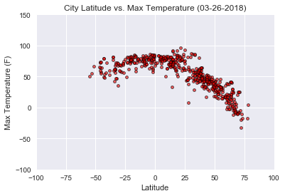
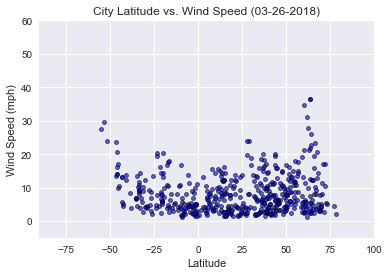
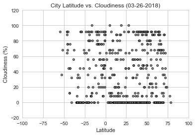
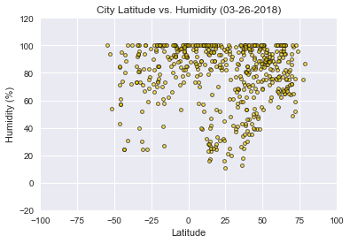

WeatherPy

Observations:
(1)  There is a distinct trend of temperatures rising as latitudes get closer to the equator, regardless of the fact that our data set includes temperaures from varying time zones (day vs night) as well as varying seasons in the temperate regions.
(2)  I expected cloud cover to increase as latitudes approached the equator, but this was not supported by the plot of "cloudiness" values.  My data set likely trends towards coastal regions of lower altitudes (see WhyCitiPy for full explaination), and that this may have impacted any trends in cloud cover I anticipated.
(3)  Humidity trends match anticipated behavior as latitudes approach the equator: high humidity at the equator (rainforest climates), a noticeable decrease in humidity around the 20 to 40-degree latitudes (desert climates), and a mix of humidity values moving throughout the temperate climates.
(4)  Wind speeds shows little pattern versus latitude except that the highest speeds are at greater the 50 degrees from the equator.


```python
#Import dependencies
%matplotlib inline
import json
import requests
from config import api_key
import openweathermapy.core as owm
import pandas as pd
from citipy import citipy
import random
import random as uniform
import pandas as pd
import matplotlib.pyplot as plt
import seaborn as sns
import datetime
```


```python
#Define a few basic parameters for the final presentation
now = datetime.datetime.now()
now = now.strftime("%m-%d-%Y")

def percent(x):
    return "{:.2f}%".format(x)
```


```python
#Prepare settings for calls to OpenWeatherMap. "Cnt" will return only one hour from the hourly weather forecast.
settings = {"APPID": api_key,
            "units": "imperial",
            "lang": "EN",
            "cnt":1}
```

Generate Cities List


```python
#Prepare to store a list of unique cities
cities = []
def remove_duplicates(x):
    return list(set(x))

#Generate random coordinates, pass through CitiPy for city names, store uniques.  
#Total cities should exceed desired OpenWeatherMap calls by at least 16%, the "not found" rate based on several runs
x = 0
while x < 600:
    lat = float(random.randrange(-9000, 9000))/100
    long = float(random.randrange(-18000, 18000))/100
    city = citipy.nearest_city(lat, long)
    cities.append(city.city_name)
    cities = remove_duplicates(cities)
    x  = len(cities)
```

Perform API calls


```python
#Prepare to store info on unique cities
names = []
ids = []
temps = []
lats = []
winds = []
clouds = []
humids = []
countries = []
url_cities = []

#Announce print log
print("------------------------------------------------------------------------------")
print("Beginning Data Retrieval")
print("------------------------------------------------------------------------------")


#loop through unique cities, calling OpenWeatherMap, until 500 sucessful returns 
#var x can be set to any desired number; remember to increase random cities appropriately
y = 1
for city in cities:
    if len(names) < 500:  
        #Test for availability on OpenWeatherMap
        try:
            weather = owm.get_forecast_hourly(city,**settings)
            #Get info for city and store it
            countries.append(weather.meta("city.country"))
            names.append(weather.meta("city.name"))
            ids.append(weather.meta("city.id"))
            lats.append(weather.meta("city.coord.lat"))
            temps.append(weather[0]("main.temp"))
            winds.append(weather[0]("wind.speed"))
            clouds.append(weather[0]("clouds.all"))
            humids.append(weather[0]("main.humidity"))
            #Reformat city names for URL output purposes
            url_city=city.replace(" ", "&")
            url_cities.append(url_city)
            #Run Print Log
            print("Making request number: "+str(y)+" for ID: "+str(weather.meta("city.id"))+" Name: "+weather.meta("city.name")+", "+weather.meta("city.country"))
            print("URL: http://api.openweathermap.org/data/2.5/forecast?units=imperial&cnt=1&APPID="+api_key+"&q="+url_city)
            y = y + 1
        #If OpenWeatherMap returns city "not found", do nothing with this city and continue loop
        except:
            continue
    else:
        break
#Close print log
print("-------------------------------------------------------------------------------")
print("Data retrieval complete")
print("-------------------------------------------------------------------------------")
    
```

    ------------------------------------------------------------------------------
    Beginning Data Retrieval
    ------------------------------------------------------------------------------
    Making request number: 1 for ID: 3655720 Name: Huaquillas, EC
    URL: http://api.openweathermap.org/data/2.5/forecast?units=imperial&cnt=1&APPID=400b9e6c62e3c20dba47a1c9a1fca5b0&q=huaquillas
    Making request number: 2 for ID: 1496511 Name: Novyy Urengoy, RU
    URL: http://api.openweathermap.org/data/2.5/forecast?units=imperial&cnt=1&APPID=400b9e6c62e3c20dba47a1c9a1fca5b0&q=novyy&urengoy
    Making request number: 3 for ID: 3453439 Name: Ponta do Sol, BR
    URL: http://api.openweathermap.org/data/2.5/forecast?units=imperial&cnt=1&APPID=400b9e6c62e3c20dba47a1c9a1fca5b0&q=ponta&do&sol
    Making request number: 4 for ID: 5656882 Name: Helena, US
    URL: http://api.openweathermap.org/data/2.5/forecast?units=imperial&cnt=1&APPID=400b9e6c62e3c20dba47a1c9a1fca5b0&q=helena
    Making request number: 5 for ID: 344979 Name: Lebu, ET
    URL: http://api.openweathermap.org/data/2.5/forecast?units=imperial&cnt=1&APPID=400b9e6c62e3c20dba47a1c9a1fca5b0&q=lebu
    Making request number: 6 for ID: 2562250 Name: Zurrieq, MT
    URL: http://api.openweathermap.org/data/2.5/forecast?units=imperial&cnt=1&APPID=400b9e6c62e3c20dba47a1c9a1fca5b0&q=zurrieq
    Making request number: 7 for ID: 2290609 Name: Dabakala, CI
    URL: http://api.openweathermap.org/data/2.5/forecast?units=imperial&cnt=1&APPID=400b9e6c62e3c20dba47a1c9a1fca5b0&q=dabakala
    Making request number: 8 for ID: 64814 Name: Bandarbeyla, SO
    URL: http://api.openweathermap.org/data/2.5/forecast?units=imperial&cnt=1&APPID=400b9e6c62e3c20dba47a1c9a1fca5b0&q=bandarbeyla
    Making request number: 9 for ID: 2017155 Name: Saskylakh, RU
    URL: http://api.openweathermap.org/data/2.5/forecast?units=imperial&cnt=1&APPID=400b9e6c62e3c20dba47a1c9a1fca5b0&q=saskylakh
    Making request number: 10 for ID: 158514 Name: Kaliua, TZ
    URL: http://api.openweathermap.org/data/2.5/forecast?units=imperial&cnt=1&APPID=400b9e6c62e3c20dba47a1c9a1fca5b0&q=kaliua
    Making request number: 11 for ID: 5746545 Name: Portland, US
    URL: http://api.openweathermap.org/data/2.5/forecast?units=imperial&cnt=1&APPID=400b9e6c62e3c20dba47a1c9a1fca5b0&q=portland
    Making request number: 12 for ID: 262462 Name: Chara, GR
    URL: http://api.openweathermap.org/data/2.5/forecast?units=imperial&cnt=1&APPID=400b9e6c62e3c20dba47a1c9a1fca5b0&q=chara
    Making request number: 13 for ID: 4033356 Name: Tiarei, PF
    URL: http://api.openweathermap.org/data/2.5/forecast?units=imperial&cnt=1&APPID=400b9e6c62e3c20dba47a1c9a1fca5b0&q=tiarei
    Making request number: 14 for ID: 2122104 Name: Petropavlovsk-Kamchatskiy, RU
    URL: http://api.openweathermap.org/data/2.5/forecast?units=imperial&cnt=1&APPID=400b9e6c62e3c20dba47a1c9a1fca5b0&q=petropavlovsk-kamchatskiy
    Making request number: 15 for ID: 696581 Name: Pomichna, UA
    URL: http://api.openweathermap.org/data/2.5/forecast?units=imperial&cnt=1&APPID=400b9e6c62e3c20dba47a1c9a1fca5b0&q=pomichna
    Making request number: 16 for ID: 5703670 Name: Elko, US
    URL: http://api.openweathermap.org/data/2.5/forecast?units=imperial&cnt=1&APPID=400b9e6c62e3c20dba47a1c9a1fca5b0&q=elko
    Making request number: 17 for ID: 3356343 Name: Karasburg, NA
    URL: http://api.openweathermap.org/data/2.5/forecast?units=imperial&cnt=1&APPID=400b9e6c62e3c20dba47a1c9a1fca5b0&q=karasburg
    Making request number: 18 for ID: 3837213 Name: San Juan, AR
    URL: http://api.openweathermap.org/data/2.5/forecast?units=imperial&cnt=1&APPID=400b9e6c62e3c20dba47a1c9a1fca5b0&q=san&juan
    Making request number: 19 for ID: 549748 Name: Kholmogory, RU
    URL: http://api.openweathermap.org/data/2.5/forecast?units=imperial&cnt=1&APPID=400b9e6c62e3c20dba47a1c9a1fca5b0&q=kholmogory
    Making request number: 20 for ID: 1154689 Name: Ko Samui, TH
    URL: http://api.openweathermap.org/data/2.5/forecast?units=imperial&cnt=1&APPID=400b9e6c62e3c20dba47a1c9a1fca5b0&q=ko&samui
    Making request number: 21 for ID: 1637001 Name: Luwuk, ID
    URL: http://api.openweathermap.org/data/2.5/forecast?units=imperial&cnt=1&APPID=400b9e6c62e3c20dba47a1c9a1fca5b0&q=luwuk
    Making request number: 22 for ID: 2501152 Name: Constantine, DZ
    URL: http://api.openweathermap.org/data/2.5/forecast?units=imperial&cnt=1&APPID=400b9e6c62e3c20dba47a1c9a1fca5b0&q=constantine
    Making request number: 23 for ID: 1805987 Name: Jiaozuo, CN
    URL: http://api.openweathermap.org/data/2.5/forecast?units=imperial&cnt=1&APPID=400b9e6c62e3c20dba47a1c9a1fca5b0&q=jiaozuo
    Making request number: 24 for ID: 6174914 Name: Wadena, CA
    URL: http://api.openweathermap.org/data/2.5/forecast?units=imperial&cnt=1&APPID=400b9e6c62e3c20dba47a1c9a1fca5b0&q=wadena
    Making request number: 25 for ID: 545747 Name: Komsomolets, RU
    URL: http://api.openweathermap.org/data/2.5/forecast?units=imperial&cnt=1&APPID=400b9e6c62e3c20dba47a1c9a1fca5b0&q=komsomolets
    Making request number: 26 for ID: 1633419 Name: Padang, ID
    URL: http://api.openweathermap.org/data/2.5/forecast?units=imperial&cnt=1&APPID=400b9e6c62e3c20dba47a1c9a1fca5b0&q=padang
    Making request number: 27 for ID: 2517679 Name: Fortuna, ES
    URL: http://api.openweathermap.org/data/2.5/forecast?units=imperial&cnt=1&APPID=400b9e6c62e3c20dba47a1c9a1fca5b0&q=fortuna
    Making request number: 28 for ID: 2063056 Name: Port Augusta, AU
    URL: http://api.openweathermap.org/data/2.5/forecast?units=imperial&cnt=1&APPID=400b9e6c62e3c20dba47a1c9a1fca5b0&q=port&augusta
    Making request number: 29 for ID: 1808534 Name: Helong, CN
    URL: http://api.openweathermap.org/data/2.5/forecast?units=imperial&cnt=1&APPID=400b9e6c62e3c20dba47a1c9a1fca5b0&q=helong
    Making request number: 30 for ID: 2327546 Name: Keita, NG
    URL: http://api.openweathermap.org/data/2.5/forecast?units=imperial&cnt=1&APPID=400b9e6c62e3c20dba47a1c9a1fca5b0&q=keita
    Making request number: 31 for ID: 5681948 Name: Fallon, US
    URL: http://api.openweathermap.org/data/2.5/forecast?units=imperial&cnt=1&APPID=400b9e6c62e3c20dba47a1c9a1fca5b0&q=fallon
    Making request number: 32 for ID: 2189343 Name: Kaeo, NZ
    URL: http://api.openweathermap.org/data/2.5/forecast?units=imperial&cnt=1&APPID=400b9e6c62e3c20dba47a1c9a1fca5b0&q=kaeo
    Making request number: 33 for ID: 5491487 Name: Silver City, US
    URL: http://api.openweathermap.org/data/2.5/forecast?units=imperial&cnt=1&APPID=400b9e6c62e3c20dba47a1c9a1fca5b0&q=silver&city
    Making request number: 34 for ID: 3421193 Name: Paamiut, GL
    URL: http://api.openweathermap.org/data/2.5/forecast?units=imperial&cnt=1&APPID=400b9e6c62e3c20dba47a1c9a1fca5b0&q=paamiut
    Making request number: 35 for ID: 466538 Name: Yumaguzino, RU
    URL: http://api.openweathermap.org/data/2.5/forecast?units=imperial&cnt=1&APPID=400b9e6c62e3c20dba47a1c9a1fca5b0&q=yumaguzino
    Making request number: 36 for ID: 1524298 Name: Aksu, KZ
    URL: http://api.openweathermap.org/data/2.5/forecast?units=imperial&cnt=1&APPID=400b9e6c62e3c20dba47a1c9a1fca5b0&q=aksu
    Making request number: 37 for ID: 1712961 Name: Gigmoto, PH
    URL: http://api.openweathermap.org/data/2.5/forecast?units=imperial&cnt=1&APPID=400b9e6c62e3c20dba47a1c9a1fca5b0&q=gigmoto
    Making request number: 38 for ID: 3618522 Name: Pearl Lagoon, NI
    URL: http://api.openweathermap.org/data/2.5/forecast?units=imperial&cnt=1&APPID=400b9e6c62e3c20dba47a1c9a1fca5b0&q=laguna&de&perlas
    Making request number: 39 for ID: 4267710 Name: Sitka, US
    URL: http://api.openweathermap.org/data/2.5/forecast?units=imperial&cnt=1&APPID=400b9e6c62e3c20dba47a1c9a1fca5b0&q=sitka
    Making request number: 40 for ID: 3449747 Name: Santa Vitoria do Palmar, BR
    URL: http://api.openweathermap.org/data/2.5/forecast?units=imperial&cnt=1&APPID=400b9e6c62e3c20dba47a1c9a1fca5b0&q=santa&vitoria&do&palmar
    Making request number: 41 for ID: 236950 Name: Obo, CF
    URL: http://api.openweathermap.org/data/2.5/forecast?units=imperial&cnt=1&APPID=400b9e6c62e3c20dba47a1c9a1fca5b0&q=obo
    Making request number: 42 for ID: 3939761 Name: Hualmay, PE
    URL: http://api.openweathermap.org/data/2.5/forecast?units=imperial&cnt=1&APPID=400b9e6c62e3c20dba47a1c9a1fca5b0&q=hualmay
    Making request number: 43 for ID: 3653523 Name: Palora, EC
    URL: http://api.openweathermap.org/data/2.5/forecast?units=imperial&cnt=1&APPID=400b9e6c62e3c20dba47a1c9a1fca5b0&q=palora
    Making request number: 44 for ID: 1632694 Name: Pangkalanbuun, ID
    URL: http://api.openweathermap.org/data/2.5/forecast?units=imperial&cnt=1&APPID=400b9e6c62e3c20dba47a1c9a1fca5b0&q=pangkalanbuun
    Making request number: 45 for ID: 1794903 Name: Shiyan, CN
    URL: http://api.openweathermap.org/data/2.5/forecast?units=imperial&cnt=1&APPID=400b9e6c62e3c20dba47a1c9a1fca5b0&q=shiyan
    Making request number: 46 for ID: 2019867 Name: Mokhsogollokh, RU
    URL: http://api.openweathermap.org/data/2.5/forecast?units=imperial&cnt=1&APPID=400b9e6c62e3c20dba47a1c9a1fca5b0&q=mokhsogollokh
    Making request number: 47 for ID: 710381 Name: Chudniv, UA
    URL: http://api.openweathermap.org/data/2.5/forecast?units=imperial&cnt=1&APPID=400b9e6c62e3c20dba47a1c9a1fca5b0&q=chudniv
    Making request number: 48 for ID: 2069194 Name: Jamestown, AU
    URL: http://api.openweathermap.org/data/2.5/forecast?units=imperial&cnt=1&APPID=400b9e6c62e3c20dba47a1c9a1fca5b0&q=jamestown
    Making request number: 49 for ID: 2062276 Name: Roebourne, AU
    URL: http://api.openweathermap.org/data/2.5/forecast?units=imperial&cnt=1&APPID=400b9e6c62e3c20dba47a1c9a1fca5b0&q=roebourne
    Making request number: 50 for ID: 3718426 Name: Delmas, HT
    URL: http://api.openweathermap.org/data/2.5/forecast?units=imperial&cnt=1&APPID=400b9e6c62e3c20dba47a1c9a1fca5b0&q=delmas
    Making request number: 51 for ID: 4494335 Name: Sylva, US
    URL: http://api.openweathermap.org/data/2.5/forecast?units=imperial&cnt=1&APPID=400b9e6c62e3c20dba47a1c9a1fca5b0&q=sylva
    Making request number: 52 for ID: 2303611 Name: Axim, GH
    URL: http://api.openweathermap.org/data/2.5/forecast?units=imperial&cnt=1&APPID=400b9e6c62e3c20dba47a1c9a1fca5b0&q=axim
    Making request number: 53 for ID: 2146219 Name: Hervey Bay, AU
    URL: http://api.openweathermap.org/data/2.5/forecast?units=imperial&cnt=1&APPID=400b9e6c62e3c20dba47a1c9a1fca5b0&q=hervey&bay
    Making request number: 54 for ID: 1493197 Name: Salekhard, RU
    URL: http://api.openweathermap.org/data/2.5/forecast?units=imperial&cnt=1&APPID=400b9e6c62e3c20dba47a1c9a1fca5b0&q=salekhard
    Making request number: 55 for ID: 1151074 Name: Prachuap Khiri Khan, TH
    URL: http://api.openweathermap.org/data/2.5/forecast?units=imperial&cnt=1&APPID=400b9e6c62e3c20dba47a1c9a1fca5b0&q=prachuap&khiri&khan
    Making request number: 56 for ID: 2156927 Name: Moree, AU
    URL: http://api.openweathermap.org/data/2.5/forecast?units=imperial&cnt=1&APPID=400b9e6c62e3c20dba47a1c9a1fca5b0&q=moree
    Making request number: 57 for ID: 3402920 Name: Careiro da Varzea, BR
    URL: http://api.openweathermap.org/data/2.5/forecast?units=imperial&cnt=1&APPID=400b9e6c62e3c20dba47a1c9a1fca5b0&q=careiro&da&varzea
    Making request number: 58 for ID: 2729907 Name: Longyearbyen, NO
    URL: http://api.openweathermap.org/data/2.5/forecast?units=imperial&cnt=1&APPID=400b9e6c62e3c20dba47a1c9a1fca5b0&q=longyearbyen
    Making request number: 59 for ID: 5983430 Name: Innisfail, CA
    URL: http://api.openweathermap.org/data/2.5/forecast?units=imperial&cnt=1&APPID=400b9e6c62e3c20dba47a1c9a1fca5b0&q=innisfail
    Making request number: 60 for ID: 3438102 Name: Fuerte Olimpo, BR
    URL: http://api.openweathermap.org/data/2.5/forecast?units=imperial&cnt=1&APPID=400b9e6c62e3c20dba47a1c9a1fca5b0&q=fuerte&olimpo
    Making request number: 61 for ID: 4021858 Name: Guerrero Negro, MX
    URL: http://api.openweathermap.org/data/2.5/forecast?units=imperial&cnt=1&APPID=400b9e6c62e3c20dba47a1c9a1fca5b0&q=guerrero&negro
    Making request number: 62 for ID: 3137942 Name: Sola, NO
    URL: http://api.openweathermap.org/data/2.5/forecast?units=imperial&cnt=1&APPID=400b9e6c62e3c20dba47a1c9a1fca5b0&q=sola
    Making request number: 63 for ID: 506598 Name: Ponyri, RU
    URL: http://api.openweathermap.org/data/2.5/forecast?units=imperial&cnt=1&APPID=400b9e6c62e3c20dba47a1c9a1fca5b0&q=ponyri
    Making request number: 64 for ID: 546105 Name: Nikolskoye, RU
    URL: http://api.openweathermap.org/data/2.5/forecast?units=imperial&cnt=1&APPID=400b9e6c62e3c20dba47a1c9a1fca5b0&q=nikolskoye
    Making request number: 65 for ID: 4314550 Name: Alexandria, US
    URL: http://api.openweathermap.org/data/2.5/forecast?units=imperial&cnt=1&APPID=400b9e6c62e3c20dba47a1c9a1fca5b0&q=alexandria
    Making request number: 66 for ID: 4736096 Name: Texarkana, US
    URL: http://api.openweathermap.org/data/2.5/forecast?units=imperial&cnt=1&APPID=400b9e6c62e3c20dba47a1c9a1fca5b0&q=texarkana
    Making request number: 67 for ID: 3397967 Name: Itaituba, BR
    URL: http://api.openweathermap.org/data/2.5/forecast?units=imperial&cnt=1&APPID=400b9e6c62e3c20dba47a1c9a1fca5b0&q=itaituba
    Making request number: 68 for ID: 6944112 Name: Forestville, CA
    URL: http://api.openweathermap.org/data/2.5/forecast?units=imperial&cnt=1&APPID=400b9e6c62e3c20dba47a1c9a1fca5b0&q=forestville
    Making request number: 69 for ID: 3412093 Name: Vestmannaeyjar, IS
    URL: http://api.openweathermap.org/data/2.5/forecast?units=imperial&cnt=1&APPID=400b9e6c62e3c20dba47a1c9a1fca5b0&q=vestmannaeyjar
    Making request number: 70 for ID: 6111696 Name: Port-Cartier, CA
    URL: http://api.openweathermap.org/data/2.5/forecast?units=imperial&cnt=1&APPID=400b9e6c62e3c20dba47a1c9a1fca5b0&q=port-cartier
    Making request number: 71 for ID: 2524379 Name: Lipari, IT
    URL: http://api.openweathermap.org/data/2.5/forecast?units=imperial&cnt=1&APPID=400b9e6c62e3c20dba47a1c9a1fca5b0&q=lipari
    Making request number: 72 for ID: 1214488 Name: Meulaboh, ID
    URL: http://api.openweathermap.org/data/2.5/forecast?units=imperial&cnt=1&APPID=400b9e6c62e3c20dba47a1c9a1fca5b0&q=meulaboh
    Making request number: 73 for ID: 3465329 Name: Coruripe, BR
    URL: http://api.openweathermap.org/data/2.5/forecast?units=imperial&cnt=1&APPID=400b9e6c62e3c20dba47a1c9a1fca5b0&q=coruripe
    Making request number: 74 for ID: 1689431 Name: San Jose, PH
    URL: http://api.openweathermap.org/data/2.5/forecast?units=imperial&cnt=1&APPID=400b9e6c62e3c20dba47a1c9a1fca5b0&q=san&jose
    Making request number: 75 for ID: 6170031 Name: Tuktoyaktuk, CA
    URL: http://api.openweathermap.org/data/2.5/forecast?units=imperial&cnt=1&APPID=400b9e6c62e3c20dba47a1c9a1fca5b0&q=tuktoyaktuk
    Making request number: 76 for ID: 4501427 Name: Port Elizabeth, US
    URL: http://api.openweathermap.org/data/2.5/forecast?units=imperial&cnt=1&APPID=400b9e6c62e3c20dba47a1c9a1fca5b0&q=port&elizabeth
    Making request number: 77 for ID: 3652764 Name: Puerto Ayora, EC
    URL: http://api.openweathermap.org/data/2.5/forecast?units=imperial&cnt=1&APPID=400b9e6c62e3c20dba47a1c9a1fca5b0&q=puerto&ayora
    Making request number: 78 for ID: 2339937 Name: Auki, NG
    URL: http://api.openweathermap.org/data/2.5/forecast?units=imperial&cnt=1&APPID=400b9e6c62e3c20dba47a1c9a1fca5b0&q=auki
    Making request number: 79 for ID: 1264542 Name: Jaisinghnagar, IN
    URL: http://api.openweathermap.org/data/2.5/forecast?units=imperial&cnt=1&APPID=400b9e6c62e3c20dba47a1c9a1fca5b0&q=jaisinghnagar
    Making request number: 80 for ID: 8010472 Name: Belmonte, PT
    URL: http://api.openweathermap.org/data/2.5/forecast?units=imperial&cnt=1&APPID=400b9e6c62e3c20dba47a1c9a1fca5b0&q=belmonte
    Making request number: 81 for ID: 2175403 Name: Bluff, AU
    URL: http://api.openweathermap.org/data/2.5/forecast?units=imperial&cnt=1&APPID=400b9e6c62e3c20dba47a1c9a1fca5b0&q=bluff
    Making request number: 82 for ID: 4732862 Name: Nome, US
    URL: http://api.openweathermap.org/data/2.5/forecast?units=imperial&cnt=1&APPID=400b9e6c62e3c20dba47a1c9a1fca5b0&q=nome
    Making request number: 83 for ID: 457954 Name: Liepaja, LV
    URL: http://api.openweathermap.org/data/2.5/forecast?units=imperial&cnt=1&APPID=400b9e6c62e3c20dba47a1c9a1fca5b0&q=liepaja
    Making request number: 84 for ID: 3378644 Name: Georgetown, GY
    URL: http://api.openweathermap.org/data/2.5/forecast?units=imperial&cnt=1&APPID=400b9e6c62e3c20dba47a1c9a1fca5b0&q=georgetown
    Making request number: 85 for ID: 4030556 Name: Rikitea, PF
    URL: http://api.openweathermap.org/data/2.5/forecast?units=imperial&cnt=1&APPID=400b9e6c62e3c20dba47a1c9a1fca5b0&q=rikitea
    Making request number: 86 for ID: 2013279 Name: Vostok, RU
    URL: http://api.openweathermap.org/data/2.5/forecast?units=imperial&cnt=1&APPID=400b9e6c62e3c20dba47a1c9a1fca5b0&q=vostok
    Making request number: 87 for ID: 3466980 Name: Caravelas, BR
    URL: http://api.openweathermap.org/data/2.5/forecast?units=imperial&cnt=1&APPID=400b9e6c62e3c20dba47a1c9a1fca5b0&q=caravelas
    Making request number: 88 for ID: 2121909 Name: Poronaysk, RU
    URL: http://api.openweathermap.org/data/2.5/forecast?units=imperial&cnt=1&APPID=400b9e6c62e3c20dba47a1c9a1fca5b0&q=poronaysk
    Making request number: 89 for ID: 1159716 Name: Sarakhs, TM
    URL: http://api.openweathermap.org/data/2.5/forecast?units=imperial&cnt=1&APPID=400b9e6c62e3c20dba47a1c9a1fca5b0&q=sarakhs
    Making request number: 90 for ID: 3024035 Name: Concarneau, FR
    URL: http://api.openweathermap.org/data/2.5/forecast?units=imperial&cnt=1&APPID=400b9e6c62e3c20dba47a1c9a1fca5b0&q=concarneau
    Making request number: 91 for ID: 3838859 Name: Rio Gallegos, AR
    URL: http://api.openweathermap.org/data/2.5/forecast?units=imperial&cnt=1&APPID=400b9e6c62e3c20dba47a1c9a1fca5b0&q=rio&gallegos
    Making request number: 92 for ID: 4011743 Name: Constitucion, MX
    URL: http://api.openweathermap.org/data/2.5/forecast?units=imperial&cnt=1&APPID=400b9e6c62e3c20dba47a1c9a1fca5b0&q=constitucion
    Making request number: 93 for ID: 1058381 Name: Morondava, MG
    URL: http://api.openweathermap.org/data/2.5/forecast?units=imperial&cnt=1&APPID=400b9e6c62e3c20dba47a1c9a1fca5b0&q=morondava
    Making request number: 94 for ID: 3529654 Name: Dzilam Gonzalez, MX
    URL: http://api.openweathermap.org/data/2.5/forecast?units=imperial&cnt=1&APPID=400b9e6c62e3c20dba47a1c9a1fca5b0&q=dzilam&gonzalez
    Making request number: 95 for ID: 2447416 Name: Ayorou, NE
    URL: http://api.openweathermap.org/data/2.5/forecast?units=imperial&cnt=1&APPID=400b9e6c62e3c20dba47a1c9a1fca5b0&q=ayorou
    Making request number: 96 for ID: 1623890 Name: Lamu, ID
    URL: http://api.openweathermap.org/data/2.5/forecast?units=imperial&cnt=1&APPID=400b9e6c62e3c20dba47a1c9a1fca5b0&q=lamu
    Making request number: 97 for ID: 2121025 Name: Srednekolymsk, RU
    URL: http://api.openweathermap.org/data/2.5/forecast?units=imperial&cnt=1&APPID=400b9e6c62e3c20dba47a1c9a1fca5b0&q=srednekolymsk
    Making request number: 98 for ID: 2630299 Name: Hofn, IS
    URL: http://api.openweathermap.org/data/2.5/forecast?units=imperial&cnt=1&APPID=400b9e6c62e3c20dba47a1c9a1fca5b0&q=hofn
    Making request number: 99 for ID: 2396853 Name: Omboue, GA
    URL: http://api.openweathermap.org/data/2.5/forecast?units=imperial&cnt=1&APPID=400b9e6c62e3c20dba47a1c9a1fca5b0&q=omboue
    Making request number: 100 for ID: 286245 Name: Sur, OM
    URL: http://api.openweathermap.org/data/2.5/forecast?units=imperial&cnt=1&APPID=400b9e6c62e3c20dba47a1c9a1fca5b0&q=sur
    Making request number: 101 for ID: 546282 Name: Kologriv, RU
    URL: http://api.openweathermap.org/data/2.5/forecast?units=imperial&cnt=1&APPID=400b9e6c62e3c20dba47a1c9a1fca5b0&q=kologriv
    Making request number: 102 for ID: 4034496 Name: Fare, PF
    URL: http://api.openweathermap.org/data/2.5/forecast?units=imperial&cnt=1&APPID=400b9e6c62e3c20dba47a1c9a1fca5b0&q=fare
    Making request number: 103 for ID: 2219235 Name: Awbari, LY
    URL: http://api.openweathermap.org/data/2.5/forecast?units=imperial&cnt=1&APPID=400b9e6c62e3c20dba47a1c9a1fca5b0&q=awbari
    Making request number: 104 for ID: 6089245 Name: Norman Wells, CA
    URL: http://api.openweathermap.org/data/2.5/forecast?units=imperial&cnt=1&APPID=400b9e6c62e3c20dba47a1c9a1fca5b0&q=norman&wells
    Making request number: 105 for ID: 3429732 Name: Puerto Rico, PY
    URL: http://api.openweathermap.org/data/2.5/forecast?units=imperial&cnt=1&APPID=400b9e6c62e3c20dba47a1c9a1fca5b0&q=puerto&rico
    Making request number: 106 for ID: 3424607 Name: Tasiilaq, GL
    URL: http://api.openweathermap.org/data/2.5/forecast?units=imperial&cnt=1&APPID=400b9e6c62e3c20dba47a1c9a1fca5b0&q=tasiilaq
    Making request number: 107 for ID: 2445553 Name: Dogondoutchi, NE
    URL: http://api.openweathermap.org/data/2.5/forecast?units=imperial&cnt=1&APPID=400b9e6c62e3c20dba47a1c9a1fca5b0&q=dogondoutchi
    Making request number: 108 for ID: 2332459 Name: Lagos, NG
    URL: http://api.openweathermap.org/data/2.5/forecast?units=imperial&cnt=1&APPID=400b9e6c62e3c20dba47a1c9a1fca5b0&q=lagos
    Making request number: 109 for ID: 73560 Name: Lahij, YE
    URL: http://api.openweathermap.org/data/2.5/forecast?units=imperial&cnt=1&APPID=400b9e6c62e3c20dba47a1c9a1fca5b0&q=lahij
    Making request number: 110 for ID: 1150965 Name: Ranong, TH
    URL: http://api.openweathermap.org/data/2.5/forecast?units=imperial&cnt=1&APPID=400b9e6c62e3c20dba47a1c9a1fca5b0&q=ranong
    Making request number: 111 for ID: 3356832 Name: Henties Bay, NA
    URL: http://api.openweathermap.org/data/2.5/forecast?units=imperial&cnt=1&APPID=400b9e6c62e3c20dba47a1c9a1fca5b0&q=henties&bay
    Making request number: 112 for ID: 3831208 Name: Qaanaaq, GL
    URL: http://api.openweathermap.org/data/2.5/forecast?units=imperial&cnt=1&APPID=400b9e6c62e3c20dba47a1c9a1fca5b0&q=qaanaaq
    Making request number: 113 for ID: 1337612 Name: Dhidhdhoo, MV
    URL: http://api.openweathermap.org/data/2.5/forecast?units=imperial&cnt=1&APPID=400b9e6c62e3c20dba47a1c9a1fca5b0&q=dhidhdhoo
    Making request number: 114 for ID: 3464547 Name: Dom Pedrito, BR
    URL: http://api.openweathermap.org/data/2.5/forecast?units=imperial&cnt=1&APPID=400b9e6c62e3c20dba47a1c9a1fca5b0&q=dom&pedrito
    Making request number: 115 for ID: 1651810 Name: Airai, TL
    URL: http://api.openweathermap.org/data/2.5/forecast?units=imperial&cnt=1&APPID=400b9e6c62e3c20dba47a1c9a1fca5b0&q=airai
    Making request number: 116 for ID: 3393692 Name: Itarema, BR
    URL: http://api.openweathermap.org/data/2.5/forecast?units=imperial&cnt=1&APPID=400b9e6c62e3c20dba47a1c9a1fca5b0&q=itarema
    Making request number: 117 for ID: 1650434 Name: Bambanglipuro, ID
    URL: http://api.openweathermap.org/data/2.5/forecast?units=imperial&cnt=1&APPID=400b9e6c62e3c20dba47a1c9a1fca5b0&q=bambanglipuro
    Making request number: 118 for ID: 4020109 Name: Atuona, PF
    URL: http://api.openweathermap.org/data/2.5/forecast?units=imperial&cnt=1&APPID=400b9e6c62e3c20dba47a1c9a1fca5b0&q=atuona
    Making request number: 119 for ID: 3938415 Name: Ilo, PE
    URL: http://api.openweathermap.org/data/2.5/forecast?units=imperial&cnt=1&APPID=400b9e6c62e3c20dba47a1c9a1fca5b0&q=ilo
    Making request number: 120 for ID: 3026644 Name: Souillac, FR
    URL: http://api.openweathermap.org/data/2.5/forecast?units=imperial&cnt=1&APPID=400b9e6c62e3c20dba47a1c9a1fca5b0&q=souillac
    Making request number: 121 for ID: 100926 Name: Umm Lajj, SA
    URL: http://api.openweathermap.org/data/2.5/forecast?units=imperial&cnt=1&APPID=400b9e6c62e3c20dba47a1c9a1fca5b0&q=umm&lajj
    Making request number: 122 for ID: 146639 Name: Lasa, CY
    URL: http://api.openweathermap.org/data/2.5/forecast?units=imperial&cnt=1&APPID=400b9e6c62e3c20dba47a1c9a1fca5b0&q=lasa
    Making request number: 123 for ID: 5855927 Name: Hilo, US
    URL: http://api.openweathermap.org/data/2.5/forecast?units=imperial&cnt=1&APPID=400b9e6c62e3c20dba47a1c9a1fca5b0&q=hilo
    Making request number: 124 for ID: 110690 Name: Faya, SA
    URL: http://api.openweathermap.org/data/2.5/forecast?units=imperial&cnt=1&APPID=400b9e6c62e3c20dba47a1c9a1fca5b0&q=faya
    Making request number: 125 for ID: 553518 Name: Vozrozhdeniye, RU
    URL: http://api.openweathermap.org/data/2.5/forecast?units=imperial&cnt=1&APPID=400b9e6c62e3c20dba47a1c9a1fca5b0&q=vozrozhdeniye
    Making request number: 126 for ID: 2271968 Name: Aljezur, PT
    URL: http://api.openweathermap.org/data/2.5/forecast?units=imperial&cnt=1&APPID=400b9e6c62e3c20dba47a1c9a1fca5b0&q=aljezur
    Making request number: 127 for ID: 3466165 Name: Cidreira, BR
    URL: http://api.openweathermap.org/data/2.5/forecast?units=imperial&cnt=1&APPID=400b9e6c62e3c20dba47a1c9a1fca5b0&q=cidreira
    Making request number: 128 for ID: 244878 Name: Biltine, TD
    URL: http://api.openweathermap.org/data/2.5/forecast?units=imperial&cnt=1&APPID=400b9e6c62e3c20dba47a1c9a1fca5b0&q=biltine
    Making request number: 129 for ID: 1131462 Name: Uruzgan, AF
    URL: http://api.openweathermap.org/data/2.5/forecast?units=imperial&cnt=1&APPID=400b9e6c62e3c20dba47a1c9a1fca5b0&q=uruzgan
    Making request number: 130 for ID: 2015306 Name: Tiksi, RU
    URL: http://api.openweathermap.org/data/2.5/forecast?units=imperial&cnt=1&APPID=400b9e6c62e3c20dba47a1c9a1fca5b0&q=tiksi
    Making request number: 131 for ID: 5905393 Name: Bonavista, CA
    URL: http://api.openweathermap.org/data/2.5/forecast?units=imperial&cnt=1&APPID=400b9e6c62e3c20dba47a1c9a1fca5b0&q=bonavista
    Making request number: 132 for ID: 6111862 Name: Port Hardy, CA
    URL: http://api.openweathermap.org/data/2.5/forecast?units=imperial&cnt=1&APPID=400b9e6c62e3c20dba47a1c9a1fca5b0&q=port&hardy
    Making request number: 133 for ID: 1254046 Name: Tura, IN
    URL: http://api.openweathermap.org/data/2.5/forecast?units=imperial&cnt=1&APPID=400b9e6c62e3c20dba47a1c9a1fca5b0&q=tura
    Making request number: 134 for ID: 3036965 Name: Le Port, FR
    URL: http://api.openweathermap.org/data/2.5/forecast?units=imperial&cnt=1&APPID=400b9e6c62e3c20dba47a1c9a1fca5b0&q=le&port
    Making request number: 135 for ID: 3924895 Name: Placido de Castro, BR
    URL: http://api.openweathermap.org/data/2.5/forecast?units=imperial&cnt=1&APPID=400b9e6c62e3c20dba47a1c9a1fca5b0&q=placido&de&castro
    Making request number: 136 for ID: 1629380 Name: Ruteng, ID
    URL: http://api.openweathermap.org/data/2.5/forecast?units=imperial&cnt=1&APPID=400b9e6c62e3c20dba47a1c9a1fca5b0&q=ruteng
    Making request number: 137 for ID: 6295855 Name: Saint-Georges, CA
    URL: http://api.openweathermap.org/data/2.5/forecast?units=imperial&cnt=1&APPID=400b9e6c62e3c20dba47a1c9a1fca5b0&q=saint-georges
    Making request number: 138 for ID: 2121385 Name: Severo-Kurilsk, RU
    URL: http://api.openweathermap.org/data/2.5/forecast?units=imperial&cnt=1&APPID=400b9e6c62e3c20dba47a1c9a1fca5b0&q=severo-kurilsk
    Making request number: 139 for ID: 691650 Name: Petrykiv, UA
    URL: http://api.openweathermap.org/data/2.5/forecast?units=imperial&cnt=1&APPID=400b9e6c62e3c20dba47a1c9a1fca5b0&q=petrykiv
    Making request number: 140 for ID: 2377457 Name: Nouadhibou, MR
    URL: http://api.openweathermap.org/data/2.5/forecast?units=imperial&cnt=1&APPID=400b9e6c62e3c20dba47a1c9a1fca5b0&q=nouadhibou
    Making request number: 141 for ID: 1636022 Name: Martapura, ID
    URL: http://api.openweathermap.org/data/2.5/forecast?units=imperial&cnt=1&APPID=400b9e6c62e3c20dba47a1c9a1fca5b0&q=martapura
    Making request number: 142 for ID: 2194098 Name: Ahipara, NZ
    URL: http://api.openweathermap.org/data/2.5/forecast?units=imperial&cnt=1&APPID=400b9e6c62e3c20dba47a1c9a1fca5b0&q=ahipara
    Making request number: 143 for ID: 1526038 Name: Atbasar, KZ
    URL: http://api.openweathermap.org/data/2.5/forecast?units=imperial&cnt=1&APPID=400b9e6c62e3c20dba47a1c9a1fca5b0&q=atbasar
    Making request number: 144 for ID: 4013704 Name: Laguna, MX
    URL: http://api.openweathermap.org/data/2.5/forecast?units=imperial&cnt=1&APPID=400b9e6c62e3c20dba47a1c9a1fca5b0&q=laguna
    Making request number: 145 for ID: 6063191 Name: Mackenzie, CA
    URL: http://api.openweathermap.org/data/2.5/forecast?units=imperial&cnt=1&APPID=400b9e6c62e3c20dba47a1c9a1fca5b0&q=mackenzie
    Making request number: 146 for ID: 2075265 Name: Busselton, AU
    URL: http://api.openweathermap.org/data/2.5/forecast?units=imperial&cnt=1&APPID=400b9e6c62e3c20dba47a1c9a1fca5b0&q=busselton
    Making request number: 147 for ID: 4787534 Name: Sterling, US
    URL: http://api.openweathermap.org/data/2.5/forecast?units=imperial&cnt=1&APPID=400b9e6c62e3c20dba47a1c9a1fca5b0&q=sterling
    Making request number: 148 for ID: 359792 Name: Aswan, EG
    URL: http://api.openweathermap.org/data/2.5/forecast?units=imperial&cnt=1&APPID=400b9e6c62e3c20dba47a1c9a1fca5b0&q=aswan
    Making request number: 149 for ID: 2013258 Name: Vrangel, RU
    URL: http://api.openweathermap.org/data/2.5/forecast?units=imperial&cnt=1&APPID=400b9e6c62e3c20dba47a1c9a1fca5b0&q=vrangel
    Making request number: 150 for ID: 4407665 Name: Kodiak, US
    URL: http://api.openweathermap.org/data/2.5/forecast?units=imperial&cnt=1&APPID=400b9e6c62e3c20dba47a1c9a1fca5b0&q=kodiak
    Making request number: 151 for ID: 2867726 Name: Munchberg, DE
    URL: http://api.openweathermap.org/data/2.5/forecast?units=imperial&cnt=1&APPID=400b9e6c62e3c20dba47a1c9a1fca5b0&q=munchberg
    Making request number: 152 for ID: 2742416 Name: Barcelos, PT
    URL: http://api.openweathermap.org/data/2.5/forecast?units=imperial&cnt=1&APPID=400b9e6c62e3c20dba47a1c9a1fca5b0&q=barcelos
    Making request number: 153 for ID: 2460954 Name: Araouane, ML
    URL: http://api.openweathermap.org/data/2.5/forecast?units=imperial&cnt=1&APPID=400b9e6c62e3c20dba47a1c9a1fca5b0&q=araouane
    Making request number: 154 for ID: 787487 Name: Poum, MK
    URL: http://api.openweathermap.org/data/2.5/forecast?units=imperial&cnt=1&APPID=400b9e6c62e3c20dba47a1c9a1fca5b0&q=poum
    Making request number: 155 for ID: 588335 Name: Kardla, EE
    URL: http://api.openweathermap.org/data/2.5/forecast?units=imperial&cnt=1&APPID=400b9e6c62e3c20dba47a1c9a1fca5b0&q=kardla
    Making request number: 156 for ID: 3520994 Name: Puerto Escondido, MX
    URL: http://api.openweathermap.org/data/2.5/forecast?units=imperial&cnt=1&APPID=400b9e6c62e3c20dba47a1c9a1fca5b0&q=puerto&escondido
    Making request number: 157 for ID: 584051 Name: Svetlogorsk, RU
    URL: http://api.openweathermap.org/data/2.5/forecast?units=imperial&cnt=1&APPID=400b9e6c62e3c20dba47a1c9a1fca5b0&q=svetlogorsk
    Making request number: 158 for ID: 1269106 Name: Jawhar, IN
    URL: http://api.openweathermap.org/data/2.5/forecast?units=imperial&cnt=1&APPID=400b9e6c62e3c20dba47a1c9a1fca5b0&q=jawhar
    Making request number: 159 for ID: 2125693 Name: Evensk, RU
    URL: http://api.openweathermap.org/data/2.5/forecast?units=imperial&cnt=1&APPID=400b9e6c62e3c20dba47a1c9a1fca5b0&q=evensk
    Making request number: 160 for ID: 1006984 Name: East London, ZA
    URL: http://api.openweathermap.org/data/2.5/forecast?units=imperial&cnt=1&APPID=400b9e6c62e3c20dba47a1c9a1fca5b0&q=east&london
    Making request number: 161 for ID: 2509377 Name: Zafra, ES
    URL: http://api.openweathermap.org/data/2.5/forecast?units=imperial&cnt=1&APPID=400b9e6c62e3c20dba47a1c9a1fca5b0&q=zafra
    Making request number: 162 for ID: 3031582 Name: Saint-Augustin, FR
    URL: http://api.openweathermap.org/data/2.5/forecast?units=imperial&cnt=1&APPID=400b9e6c62e3c20dba47a1c9a1fca5b0&q=saint-augustin
    Making request number: 163 for ID: 1226260 Name: Trincomalee, LK
    URL: http://api.openweathermap.org/data/2.5/forecast?units=imperial&cnt=1&APPID=400b9e6c62e3c20dba47a1c9a1fca5b0&q=trincomalee
    Making request number: 164 for ID: 2077895 Name: Alice Springs, AU
    URL: http://api.openweathermap.org/data/2.5/forecast?units=imperial&cnt=1&APPID=400b9e6c62e3c20dba47a1c9a1fca5b0&q=alice&springs
    Making request number: 165 for ID: 3388456 Name: Sao Jose da Coroa Grande, BR
    URL: http://api.openweathermap.org/data/2.5/forecast?units=imperial&cnt=1&APPID=400b9e6c62e3c20dba47a1c9a1fca5b0&q=sao&jose&da&coroa&grande
    Making request number: 166 for ID: 3133895 Name: Tromso, NO
    URL: http://api.openweathermap.org/data/2.5/forecast?units=imperial&cnt=1&APPID=400b9e6c62e3c20dba47a1c9a1fca5b0&q=tromso
    Making request number: 167 for ID: 2019309 Name: Neryungri, RU
    URL: http://api.openweathermap.org/data/2.5/forecast?units=imperial&cnt=1&APPID=400b9e6c62e3c20dba47a1c9a1fca5b0&q=neryungri
    Making request number: 168 for ID: 1861084 Name: Izumo, JP
    URL: http://api.openweathermap.org/data/2.5/forecast?units=imperial&cnt=1&APPID=400b9e6c62e3c20dba47a1c9a1fca5b0&q=izumo
    Making request number: 169 for ID: 1486321 Name: Yar-Sale, RU
    URL: http://api.openweathermap.org/data/2.5/forecast?units=imperial&cnt=1&APPID=400b9e6c62e3c20dba47a1c9a1fca5b0&q=yar-sale
    Making request number: 170 for ID: 60019 Name: Eyl, SO
    URL: http://api.openweathermap.org/data/2.5/forecast?units=imperial&cnt=1&APPID=400b9e6c62e3c20dba47a1c9a1fca5b0&q=eyl
    Making request number: 171 for ID: 6690297 Name: Saint-Leu, RE
    URL: http://api.openweathermap.org/data/2.5/forecast?units=imperial&cnt=1&APPID=400b9e6c62e3c20dba47a1c9a1fca5b0&q=saint-leu
    Making request number: 172 for ID: 3652462 Name: San Cristobal, EC
    URL: http://api.openweathermap.org/data/2.5/forecast?units=imperial&cnt=1&APPID=400b9e6c62e3c20dba47a1c9a1fca5b0&q=san&cristobal
    Making request number: 173 for ID: 1644605 Name: Galesong, ID
    URL: http://api.openweathermap.org/data/2.5/forecast?units=imperial&cnt=1&APPID=400b9e6c62e3c20dba47a1c9a1fca5b0&q=galesong
    Making request number: 174 for ID: 262462 Name: Saint George, GR
    URL: http://api.openweathermap.org/data/2.5/forecast?units=imperial&cnt=1&APPID=400b9e6c62e3c20dba47a1c9a1fca5b0&q=saint&george
    Making request number: 175 for ID: 2249901 Name: Gat, SN
    URL: http://api.openweathermap.org/data/2.5/forecast?units=imperial&cnt=1&APPID=400b9e6c62e3c20dba47a1c9a1fca5b0&q=gat
    Making request number: 176 for ID: 3894426 Name: Coihaique, CL
    URL: http://api.openweathermap.org/data/2.5/forecast?units=imperial&cnt=1&APPID=400b9e6c62e3c20dba47a1c9a1fca5b0&q=coihaique
    Making request number: 177 for ID: 595016 Name: Salcininkai, LT
    URL: http://api.openweathermap.org/data/2.5/forecast?units=imperial&cnt=1&APPID=400b9e6c62e3c20dba47a1c9a1fca5b0&q=salcininkai
    Making request number: 178 for ID: 3394023 Name: Natal, BR
    URL: http://api.openweathermap.org/data/2.5/forecast?units=imperial&cnt=1&APPID=400b9e6c62e3c20dba47a1c9a1fca5b0&q=natal
    Making request number: 179 for ID: 1225018 Name: Vavuniya, LK
    URL: http://api.openweathermap.org/data/2.5/forecast?units=imperial&cnt=1&APPID=400b9e6c62e3c20dba47a1c9a1fca5b0&q=vavuniya
    Making request number: 180 for ID: 779622 Name: Havoysund, NO
    URL: http://api.openweathermap.org/data/2.5/forecast?units=imperial&cnt=1&APPID=400b9e6c62e3c20dba47a1c9a1fca5b0&q=havoysund
    Making request number: 181 for ID: 1689639 Name: San Isidro, PH
    URL: http://api.openweathermap.org/data/2.5/forecast?units=imperial&cnt=1&APPID=400b9e6c62e3c20dba47a1c9a1fca5b0&q=san&isidro
    Making request number: 182 for ID: 3833883 Name: Trelew, AR
    URL: http://api.openweathermap.org/data/2.5/forecast?units=imperial&cnt=1&APPID=400b9e6c62e3c20dba47a1c9a1fca5b0&q=trelew
    Making request number: 183 for ID: 541344 Name: Krasnyy Yar, RU
    URL: http://api.openweathermap.org/data/2.5/forecast?units=imperial&cnt=1&APPID=400b9e6c62e3c20dba47a1c9a1fca5b0&q=krasnyy&yar
    Making request number: 184 for ID: 3589805 Name: San Marcos, GT
    URL: http://api.openweathermap.org/data/2.5/forecast?units=imperial&cnt=1&APPID=400b9e6c62e3c20dba47a1c9a1fca5b0&q=san&marcos
    Making request number: 185 for ID: 1865309 Name: Katsuura, JP
    URL: http://api.openweathermap.org/data/2.5/forecast?units=imperial&cnt=1&APPID=400b9e6c62e3c20dba47a1c9a1fca5b0&q=katsuura
    Making request number: 186 for ID: 588365 Name: Vao, EE
    URL: http://api.openweathermap.org/data/2.5/forecast?units=imperial&cnt=1&APPID=400b9e6c62e3c20dba47a1c9a1fca5b0&q=vao
    Making request number: 187 for ID: 6138908 Name: Saint-Philippe, CA
    URL: http://api.openweathermap.org/data/2.5/forecast?units=imperial&cnt=1&APPID=400b9e6c62e3c20dba47a1c9a1fca5b0&q=saint-philippe
    Making request number: 188 for ID: 2052479 Name: Zhuhai, CN
    URL: http://api.openweathermap.org/data/2.5/forecast?units=imperial&cnt=1&APPID=400b9e6c62e3c20dba47a1c9a1fca5b0&q=zhuhai
    Making request number: 189 for ID: 2068110 Name: Kununurra, AU
    URL: http://api.openweathermap.org/data/2.5/forecast?units=imperial&cnt=1&APPID=400b9e6c62e3c20dba47a1c9a1fca5b0&q=kununurra
    Making request number: 190 for ID: 5856516 Name: Ahuimanu, US
    URL: http://api.openweathermap.org/data/2.5/forecast?units=imperial&cnt=1&APPID=400b9e6c62e3c20dba47a1c9a1fca5b0&q=ahuimanu
    Making request number: 191 for ID: 3421982 Name: Maniitsoq, GL
    URL: http://api.openweathermap.org/data/2.5/forecast?units=imperial&cnt=1&APPID=400b9e6c62e3c20dba47a1c9a1fca5b0&q=maniitsoq
    Making request number: 192 for ID: 5961417 Name: Husavik, CA
    URL: http://api.openweathermap.org/data/2.5/forecast?units=imperial&cnt=1&APPID=400b9e6c62e3c20dba47a1c9a1fca5b0&q=husavik
    Making request number: 193 for ID: 69559 Name: Yarim, YE
    URL: http://api.openweathermap.org/data/2.5/forecast?units=imperial&cnt=1&APPID=400b9e6c62e3c20dba47a1c9a1fca5b0&q=yarim
    Making request number: 194 for ID: 3355672 Name: Luderitz, NA
    URL: http://api.openweathermap.org/data/2.5/forecast?units=imperial&cnt=1&APPID=400b9e6c62e3c20dba47a1c9a1fca5b0&q=luderitz
    Making request number: 195 for ID: 3421319 Name: Nuuk, GL
    URL: http://api.openweathermap.org/data/2.5/forecast?units=imperial&cnt=1&APPID=400b9e6c62e3c20dba47a1c9a1fca5b0&q=nuuk
    Making request number: 196 for ID: 3407980 Name: Alenquer, BR
    URL: http://api.openweathermap.org/data/2.5/forecast?units=imperial&cnt=1&APPID=400b9e6c62e3c20dba47a1c9a1fca5b0&q=alenquer
    Making request number: 197 for ID: 3395981 Name: Maceio, BR
    URL: http://api.openweathermap.org/data/2.5/forecast?units=imperial&cnt=1&APPID=400b9e6c62e3c20dba47a1c9a1fca5b0&q=maceio
    Making request number: 198 for ID: 2374583 Name: Bubaque, GW
    URL: http://api.openweathermap.org/data/2.5/forecast?units=imperial&cnt=1&APPID=400b9e6c62e3c20dba47a1c9a1fca5b0&q=bubaque
    Making request number: 199 for ID: 2510573 Name: Teguise, ES
    URL: http://api.openweathermap.org/data/2.5/forecast?units=imperial&cnt=1&APPID=400b9e6c62e3c20dba47a1c9a1fca5b0&q=teguise
    Making request number: 200 for ID: 2122605 Name: Okhotsk, RU
    URL: http://api.openweathermap.org/data/2.5/forecast?units=imperial&cnt=1&APPID=400b9e6c62e3c20dba47a1c9a1fca5b0&q=okhotsk
    Making request number: 201 for ID: 3406196 Name: Barreirinhas, BR
    URL: http://api.openweathermap.org/data/2.5/forecast?units=imperial&cnt=1&APPID=400b9e6c62e3c20dba47a1c9a1fca5b0&q=barreirinhas
    Making request number: 202 for ID: 3576994 Name: Cockburn Town, TC
    URL: http://api.openweathermap.org/data/2.5/forecast?units=imperial&cnt=1&APPID=400b9e6c62e3c20dba47a1c9a1fca5b0&q=cockburn&town
    Making request number: 203 for ID: 5742974 Name: North Bend, US
    URL: http://api.openweathermap.org/data/2.5/forecast?units=imperial&cnt=1&APPID=400b9e6c62e3c20dba47a1c9a1fca5b0&q=north&bend
    Making request number: 204 for ID: 2063042 Name: Port Hedland, AU
    URL: http://api.openweathermap.org/data/2.5/forecast?units=imperial&cnt=1&APPID=400b9e6c62e3c20dba47a1c9a1fca5b0&q=port&hedland
    Making request number: 205 for ID: 2092164 Name: Lorengau, PG
    URL: http://api.openweathermap.org/data/2.5/forecast?units=imperial&cnt=1&APPID=400b9e6c62e3c20dba47a1c9a1fca5b0&q=lorengau
    Making request number: 206 for ID: 1282256 Name: Hithadhoo, MV
    URL: http://api.openweathermap.org/data/2.5/forecast?units=imperial&cnt=1&APPID=400b9e6c62e3c20dba47a1c9a1fca5b0&q=hithadhoo
    Making request number: 207 for ID: 2110227 Name: Butaritari, KI
    URL: http://api.openweathermap.org/data/2.5/forecast?units=imperial&cnt=1&APPID=400b9e6c62e3c20dba47a1c9a1fca5b0&q=butaritari
    Making request number: 208 for ID: 5106834 Name: Albany, US
    URL: http://api.openweathermap.org/data/2.5/forecast?units=imperial&cnt=1&APPID=400b9e6c62e3c20dba47a1c9a1fca5b0&q=albany
    Making request number: 209 for ID: 3465713 Name: Conde, BR
    URL: http://api.openweathermap.org/data/2.5/forecast?units=imperial&cnt=1&APPID=400b9e6c62e3c20dba47a1c9a1fca5b0&q=conde
    Making request number: 210 for ID: 5493811 Name: Taos, US
    URL: http://api.openweathermap.org/data/2.5/forecast?units=imperial&cnt=1&APPID=400b9e6c62e3c20dba47a1c9a1fca5b0&q=taos
    Making request number: 211 for ID: 2012956 Name: Yerbogachen, RU
    URL: http://api.openweathermap.org/data/2.5/forecast?units=imperial&cnt=1&APPID=400b9e6c62e3c20dba47a1c9a1fca5b0&q=yerbogachen
    Making request number: 212 for ID: 1812956 Name: Mali, CN
    URL: http://api.openweathermap.org/data/2.5/forecast?units=imperial&cnt=1&APPID=400b9e6c62e3c20dba47a1c9a1fca5b0&q=mali
    Making request number: 213 for ID: 1513990 Name: Gazli, UZ
    URL: http://api.openweathermap.org/data/2.5/forecast?units=imperial&cnt=1&APPID=400b9e6c62e3c20dba47a1c9a1fca5b0&q=gazli
    Making request number: 214 for ID: 2633414 Name: Yarmouth, GB
    URL: http://api.openweathermap.org/data/2.5/forecast?units=imperial&cnt=1&APPID=400b9e6c62e3c20dba47a1c9a1fca5b0&q=yarmouth
    Making request number: 215 for ID: 1636121 Name: Dukuhturi, ID
    URL: http://api.openweathermap.org/data/2.5/forecast?units=imperial&cnt=1&APPID=400b9e6c62e3c20dba47a1c9a1fca5b0&q=dukuhturi
    Making request number: 216 for ID: 2638419 Name: Scarborough, GB
    URL: http://api.openweathermap.org/data/2.5/forecast?units=imperial&cnt=1&APPID=400b9e6c62e3c20dba47a1c9a1fca5b0&q=scarborough
    Making request number: 217 for ID: 3347019 Name: Namibe, AO
    URL: http://api.openweathermap.org/data/2.5/forecast?units=imperial&cnt=1&APPID=400b9e6c62e3c20dba47a1c9a1fca5b0&q=namibe
    Making request number: 218 for ID: 327651 Name: Teseney, ER
    URL: http://api.openweathermap.org/data/2.5/forecast?units=imperial&cnt=1&APPID=400b9e6c62e3c20dba47a1c9a1fca5b0&q=teseney
    Making request number: 219 for ID: 3576765 Name: Dennery, LC
    URL: http://api.openweathermap.org/data/2.5/forecast?units=imperial&cnt=1&APPID=400b9e6c62e3c20dba47a1c9a1fca5b0&q=dennery
    Making request number: 220 for ID: 7626384 Name: Hovd, NO
    URL: http://api.openweathermap.org/data/2.5/forecast?units=imperial&cnt=1&APPID=400b9e6c62e3c20dba47a1c9a1fca5b0&q=hovd
    Making request number: 221 for ID: 1682474 Name: Ternate, PH
    URL: http://api.openweathermap.org/data/2.5/forecast?units=imperial&cnt=1&APPID=400b9e6c62e3c20dba47a1c9a1fca5b0&q=ternate
    Making request number: 222 for ID: 2188874 Name: Kerikeri, NZ
    URL: http://api.openweathermap.org/data/2.5/forecast?units=imperial&cnt=1&APPID=400b9e6c62e3c20dba47a1c9a1fca5b0&q=kerikeri
    Making request number: 223 for ID: 2388036 Name: Bossangoa, CF
    URL: http://api.openweathermap.org/data/2.5/forecast?units=imperial&cnt=1&APPID=400b9e6c62e3c20dba47a1c9a1fca5b0&q=bossangoa
    Making request number: 224 for ID: 5354943 Name: Half Moon Bay, US
    URL: http://api.openweathermap.org/data/2.5/forecast?units=imperial&cnt=1&APPID=400b9e6c62e3c20dba47a1c9a1fca5b0&q=half&moon&bay
    Making request number: 225 for ID: 1260178 Name: Patamundai, IN
    URL: http://api.openweathermap.org/data/2.5/forecast?units=imperial&cnt=1&APPID=400b9e6c62e3c20dba47a1c9a1fca5b0&q=patamundai
    Making request number: 226 for ID: 2522325 Name: Aguimes, ES
    URL: http://api.openweathermap.org/data/2.5/forecast?units=imperial&cnt=1&APPID=400b9e6c62e3c20dba47a1c9a1fca5b0&q=aguimes
    Making request number: 227 for ID: 5848280 Name: Kapaa, US
    URL: http://api.openweathermap.org/data/2.5/forecast?units=imperial&cnt=1&APPID=400b9e6c62e3c20dba47a1c9a1fca5b0&q=kapaa
    Making request number: 228 for ID: 86049 Name: Jalu, LY
    URL: http://api.openweathermap.org/data/2.5/forecast?units=imperial&cnt=1&APPID=400b9e6c62e3c20dba47a1c9a1fca5b0&q=jalu
    Making request number: 229 for ID: 3458498 Name: Linhares, BR
    URL: http://api.openweathermap.org/data/2.5/forecast?units=imperial&cnt=1&APPID=400b9e6c62e3c20dba47a1c9a1fca5b0&q=linhares
    Making request number: 230 for ID: 4069659 Name: Jasper, US
    URL: http://api.openweathermap.org/data/2.5/forecast?units=imperial&cnt=1&APPID=400b9e6c62e3c20dba47a1c9a1fca5b0&q=jasper
    Making request number: 231 for ID: 6068416 Name: Mayo, CA
    URL: http://api.openweathermap.org/data/2.5/forecast?units=imperial&cnt=1&APPID=400b9e6c62e3c20dba47a1c9a1fca5b0&q=mayo
    Making request number: 232 for ID: 2112444 Name: Kamaishi, JP
    URL: http://api.openweathermap.org/data/2.5/forecast?units=imperial&cnt=1&APPID=400b9e6c62e3c20dba47a1c9a1fca5b0&q=kamaishi
    Making request number: 233 for ID: 934479 Name: Grand Gaube, MU
    URL: http://api.openweathermap.org/data/2.5/forecast?units=imperial&cnt=1&APPID=400b9e6c62e3c20dba47a1c9a1fca5b0&q=grand&gaube
    Making request number: 234 for ID: 511592 Name: Peno, RU
    URL: http://api.openweathermap.org/data/2.5/forecast?units=imperial&cnt=1&APPID=400b9e6c62e3c20dba47a1c9a1fca5b0&q=peno
    Making request number: 235 for ID: 3036016 Name: Aurillac, FR
    URL: http://api.openweathermap.org/data/2.5/forecast?units=imperial&cnt=1&APPID=400b9e6c62e3c20dba47a1c9a1fca5b0&q=aurillac
    Making request number: 236 for ID: 778362 Name: Oksfjord, NO
    URL: http://api.openweathermap.org/data/2.5/forecast?units=imperial&cnt=1&APPID=400b9e6c62e3c20dba47a1c9a1fca5b0&q=oksfjord
    Making request number: 237 for ID: 1806466 Name: Guangyuan, CN
    URL: http://api.openweathermap.org/data/2.5/forecast?units=imperial&cnt=1&APPID=400b9e6c62e3c20dba47a1c9a1fca5b0&q=guangyuan
    Making request number: 238 for ID: 3874787 Name: Punta Arenas, CL
    URL: http://api.openweathermap.org/data/2.5/forecast?units=imperial&cnt=1&APPID=400b9e6c62e3c20dba47a1c9a1fca5b0&q=punta&arenas
    Making request number: 239 for ID: 3430443 Name: Necochea, AR
    URL: http://api.openweathermap.org/data/2.5/forecast?units=imperial&cnt=1&APPID=400b9e6c62e3c20dba47a1c9a1fca5b0&q=necochea
    Making request number: 240 for ID: 5428055 Name: Las Animas, US
    URL: http://api.openweathermap.org/data/2.5/forecast?units=imperial&cnt=1&APPID=400b9e6c62e3c20dba47a1c9a1fca5b0&q=las&animas
    Making request number: 241 for ID: 556268 Name: Ostrovnoy, RU
    URL: http://api.openweathermap.org/data/2.5/forecast?units=imperial&cnt=1&APPID=400b9e6c62e3c20dba47a1c9a1fca5b0&q=ostrovnoy
    Making request number: 242 for ID: 2122090 Name: Pevek, RU
    URL: http://api.openweathermap.org/data/2.5/forecast?units=imperial&cnt=1&APPID=400b9e6c62e3c20dba47a1c9a1fca5b0&q=pevek
    Making request number: 243 for ID: 3177219 Name: Fano, IT
    URL: http://api.openweathermap.org/data/2.5/forecast?units=imperial&cnt=1&APPID=400b9e6c62e3c20dba47a1c9a1fca5b0&q=fano
    Making request number: 244 for ID: 2644605 Name: Lerwick, GB
    URL: http://api.openweathermap.org/data/2.5/forecast?units=imperial&cnt=1&APPID=400b9e6c62e3c20dba47a1c9a1fca5b0&q=lerwick
    Making request number: 245 for ID: 113491 Name: Takestan, IR
    URL: http://api.openweathermap.org/data/2.5/forecast?units=imperial&cnt=1&APPID=400b9e6c62e3c20dba47a1c9a1fca5b0&q=takestan
    Making request number: 246 for ID: 3836620 Name: San Ramon de la Nueva Oran, AR
    URL: http://api.openweathermap.org/data/2.5/forecast?units=imperial&cnt=1&APPID=400b9e6c62e3c20dba47a1c9a1fca5b0&q=san&ramon&de&la&nueva&oran
    Making request number: 247 for ID: 3037456 Name: Saint-Joseph, FR
    URL: http://api.openweathermap.org/data/2.5/forecast?units=imperial&cnt=1&APPID=400b9e6c62e3c20dba47a1c9a1fca5b0&q=saint-joseph
    Making request number: 248 for ID: 2013392 Name: Vilyuysk, RU
    URL: http://api.openweathermap.org/data/2.5/forecast?units=imperial&cnt=1&APPID=400b9e6c62e3c20dba47a1c9a1fca5b0&q=vilyuysk
    Making request number: 249 for ID: 544084 Name: Koslan, RU
    URL: http://api.openweathermap.org/data/2.5/forecast?units=imperial&cnt=1&APPID=400b9e6c62e3c20dba47a1c9a1fca5b0&q=koslan
    Making request number: 250 for ID: 3366880 Name: Hermanus, ZA
    URL: http://api.openweathermap.org/data/2.5/forecast?units=imperial&cnt=1&APPID=400b9e6c62e3c20dba47a1c9a1fca5b0&q=hermanus
    Making request number: 251 for ID: 1785572 Name: Yuxia, CN
    URL: http://api.openweathermap.org/data/2.5/forecast?units=imperial&cnt=1&APPID=400b9e6c62e3c20dba47a1c9a1fca5b0&q=yuxia
    Making request number: 252 for ID: 1688687 Name: San Quintin, PH
    URL: http://api.openweathermap.org/data/2.5/forecast?units=imperial&cnt=1&APPID=400b9e6c62e3c20dba47a1c9a1fca5b0&q=san&quintin
    Making request number: 253 for ID: 3406961 Name: Augusto Correa, BR
    URL: http://api.openweathermap.org/data/2.5/forecast?units=imperial&cnt=1&APPID=400b9e6c62e3c20dba47a1c9a1fca5b0&q=augusto&correa
    Making request number: 254 for ID: 5972762 Name: Hay River, CA
    URL: http://api.openweathermap.org/data/2.5/forecast?units=imperial&cnt=1&APPID=400b9e6c62e3c20dba47a1c9a1fca5b0&q=hay&river
    Making request number: 255 for ID: 1255425 Name: Sunel, IN
    URL: http://api.openweathermap.org/data/2.5/forecast?units=imperial&cnt=1&APPID=400b9e6c62e3c20dba47a1c9a1fca5b0&q=sunel
    Making request number: 256 for ID: 3418910 Name: Upernavik, GL
    URL: http://api.openweathermap.org/data/2.5/forecast?units=imperial&cnt=1&APPID=400b9e6c62e3c20dba47a1c9a1fca5b0&q=upernavik
    Making request number: 257 for ID: 1847947 Name: Shingu, JP
    URL: http://api.openweathermap.org/data/2.5/forecast?units=imperial&cnt=1&APPID=400b9e6c62e3c20dba47a1c9a1fca5b0&q=shingu
    Making request number: 258 for ID: 1527497 Name: Kyzyl-Suu, KG
    URL: http://api.openweathermap.org/data/2.5/forecast?units=imperial&cnt=1&APPID=400b9e6c62e3c20dba47a1c9a1fca5b0&q=kyzyl-suu
    Making request number: 259 for ID: 3932145 Name: Pisco, PE
    URL: http://api.openweathermap.org/data/2.5/forecast?units=imperial&cnt=1&APPID=400b9e6c62e3c20dba47a1c9a1fca5b0&q=pisco
    Making request number: 260 for ID: 2112802 Name: Hasaki, JP
    URL: http://api.openweathermap.org/data/2.5/forecast?units=imperial&cnt=1&APPID=400b9e6c62e3c20dba47a1c9a1fca5b0&q=hasaki
    Making request number: 261 for ID: 3372745 Name: Rabo de Peixe, PT
    URL: http://api.openweathermap.org/data/2.5/forecast?units=imperial&cnt=1&APPID=400b9e6c62e3c20dba47a1c9a1fca5b0&q=rabo&de&peixe
    Making request number: 262 for ID: 2294915 Name: Takoradi, GH
    URL: http://api.openweathermap.org/data/2.5/forecast?units=imperial&cnt=1&APPID=400b9e6c62e3c20dba47a1c9a1fca5b0&q=takoradi
    Making request number: 263 for ID: 6201424 Name: Mataura, NZ
    URL: http://api.openweathermap.org/data/2.5/forecast?units=imperial&cnt=1&APPID=400b9e6c62e3c20dba47a1c9a1fca5b0&q=mataura
    Making request number: 264 for ID: 2123979 Name: Kurilsk, RU
    URL: http://api.openweathermap.org/data/2.5/forecast?units=imperial&cnt=1&APPID=400b9e6c62e3c20dba47a1c9a1fca5b0&q=kurilsk
    Making request number: 265 for ID: 1282898 Name: Pokhara, NP
    URL: http://api.openweathermap.org/data/2.5/forecast?units=imperial&cnt=1&APPID=400b9e6c62e3c20dba47a1c9a1fca5b0&q=pokhara
    Making request number: 266 for ID: 2618795 Name: Klaksvik, FO
    URL: http://api.openweathermap.org/data/2.5/forecast?units=imperial&cnt=1&APPID=400b9e6c62e3c20dba47a1c9a1fca5b0&q=klaksvik
    Making request number: 267 for ID: 3401148 Name: Cururupu, BR
    URL: http://api.openweathermap.org/data/2.5/forecast?units=imperial&cnt=1&APPID=400b9e6c62e3c20dba47a1c9a1fca5b0&q=cururupu
    Making request number: 268 for ID: 5545269 Name: Price, US
    URL: http://api.openweathermap.org/data/2.5/forecast?units=imperial&cnt=1&APPID=400b9e6c62e3c20dba47a1c9a1fca5b0&q=price
    Making request number: 269 for ID: 3896218 Name: Castro, CL
    URL: http://api.openweathermap.org/data/2.5/forecast?units=imperial&cnt=1&APPID=400b9e6c62e3c20dba47a1c9a1fca5b0&q=castro
    Making request number: 270 for ID: 964432 Name: Port Alfred, ZA
    URL: http://api.openweathermap.org/data/2.5/forecast?units=imperial&cnt=1&APPID=400b9e6c62e3c20dba47a1c9a1fca5b0&q=port&alfred
    Making request number: 271 for ID: 6148373 Name: Sioux Lookout, CA
    URL: http://api.openweathermap.org/data/2.5/forecast?units=imperial&cnt=1&APPID=400b9e6c62e3c20dba47a1c9a1fca5b0&q=sioux&lookout
    Making request number: 272 for ID: 1035025 Name: Nacala, MZ
    URL: http://api.openweathermap.org/data/2.5/forecast?units=imperial&cnt=1&APPID=400b9e6c62e3c20dba47a1c9a1fca5b0&q=nacala
    Making request number: 273 for ID: 2077454 Name: Australind, AU
    URL: http://api.openweathermap.org/data/2.5/forecast?units=imperial&cnt=1&APPID=400b9e6c62e3c20dba47a1c9a1fca5b0&q=australind
    Making request number: 274 for ID: 2347470 Name: Miri, NG
    URL: http://api.openweathermap.org/data/2.5/forecast?units=imperial&cnt=1&APPID=400b9e6c62e3c20dba47a1c9a1fca5b0&q=miri
    Making request number: 275 for ID: 4034551 Name: Faanui, PF
    URL: http://api.openweathermap.org/data/2.5/forecast?units=imperial&cnt=1&APPID=400b9e6c62e3c20dba47a1c9a1fca5b0&q=faanui
    Making request number: 276 for ID: 2156825 Name: Morwell, AU
    URL: http://api.openweathermap.org/data/2.5/forecast?units=imperial&cnt=1&APPID=400b9e6c62e3c20dba47a1c9a1fca5b0&q=morwell
    Making request number: 277 for ID: 3416888 Name: Grindavik, IS
    URL: http://api.openweathermap.org/data/2.5/forecast?units=imperial&cnt=1&APPID=400b9e6c62e3c20dba47a1c9a1fca5b0&q=grindavik
    Making request number: 278 for ID: 1512019 Name: Aksarka, RU
    URL: http://api.openweathermap.org/data/2.5/forecast?units=imperial&cnt=1&APPID=400b9e6c62e3c20dba47a1c9a1fca5b0&q=aksarka
    Making request number: 279 for ID: 3947322 Name: La Libertad, PE
    URL: http://api.openweathermap.org/data/2.5/forecast?units=imperial&cnt=1&APPID=400b9e6c62e3c20dba47a1c9a1fca5b0&q=la&libertad
    Making request number: 280 for ID: 5468773 Name: Gallup, US
    URL: http://api.openweathermap.org/data/2.5/forecast?units=imperial&cnt=1&APPID=400b9e6c62e3c20dba47a1c9a1fca5b0&q=gallup
    Making request number: 281 for ID: 5404476 Name: Ukiah, US
    URL: http://api.openweathermap.org/data/2.5/forecast?units=imperial&cnt=1&APPID=400b9e6c62e3c20dba47a1c9a1fca5b0&q=ukiah
    Making request number: 282 for ID: 1488235 Name: Ust-Charyshskaya Pristan, RU
    URL: http://api.openweathermap.org/data/2.5/forecast?units=imperial&cnt=1&APPID=400b9e6c62e3c20dba47a1c9a1fca5b0&q=ust-charyshskaya&pristan
    Making request number: 283 for ID: 1037125 Name: Montepuez, MZ
    URL: http://api.openweathermap.org/data/2.5/forecast?units=imperial&cnt=1&APPID=400b9e6c62e3c20dba47a1c9a1fca5b0&q=montepuez
    Making request number: 284 for ID: 1635815 Name: Maumere, ID
    URL: http://api.openweathermap.org/data/2.5/forecast?units=imperial&cnt=1&APPID=400b9e6c62e3c20dba47a1c9a1fca5b0&q=maumere
    Making request number: 285 for ID: 2163355 Name: Hobart, AU
    URL: http://api.openweathermap.org/data/2.5/forecast?units=imperial&cnt=1&APPID=400b9e6c62e3c20dba47a1c9a1fca5b0&q=hobart
    Making request number: 286 for ID: 161901 Name: Kaka, TM
    URL: http://api.openweathermap.org/data/2.5/forecast?units=imperial&cnt=1&APPID=400b9e6c62e3c20dba47a1c9a1fca5b0&q=kaka
    Making request number: 287 for ID: 1605072 Name: Wapi Pathum, TH
    URL: http://api.openweathermap.org/data/2.5/forecast?units=imperial&cnt=1&APPID=400b9e6c62e3c20dba47a1c9a1fca5b0&q=wapi&pathum
    Making request number: 288 for ID: 749747 Name: Ayan, TR
    URL: http://api.openweathermap.org/data/2.5/forecast?units=imperial&cnt=1&APPID=400b9e6c62e3c20dba47a1c9a1fca5b0&q=ayan
    Making request number: 289 for ID: 3577430 Name: Road Town, VG
    URL: http://api.openweathermap.org/data/2.5/forecast?units=imperial&cnt=1&APPID=400b9e6c62e3c20dba47a1c9a1fca5b0&q=road&town
    Making request number: 290 for ID: 1507390 Name: Dikson, RU
    URL: http://api.openweathermap.org/data/2.5/forecast?units=imperial&cnt=1&APPID=400b9e6c62e3c20dba47a1c9a1fca5b0&q=dikson
    Making request number: 291 for ID: 1261853 Name: Narasannapeta, IN
    URL: http://api.openweathermap.org/data/2.5/forecast?units=imperial&cnt=1&APPID=400b9e6c62e3c20dba47a1c9a1fca5b0&q=narasannapeta
    Making request number: 292 for ID: 5228673 Name: Huron, US
    URL: http://api.openweathermap.org/data/2.5/forecast?units=imperial&cnt=1&APPID=400b9e6c62e3c20dba47a1c9a1fca5b0&q=huron
    Making request number: 293 for ID: 524699 Name: Mozhga, RU
    URL: http://api.openweathermap.org/data/2.5/forecast?units=imperial&cnt=1&APPID=400b9e6c62e3c20dba47a1c9a1fca5b0&q=mozhga
    Making request number: 294 for ID: 3421719 Name: Narsaq, GL
    URL: http://api.openweathermap.org/data/2.5/forecast?units=imperial&cnt=1&APPID=400b9e6c62e3c20dba47a1c9a1fca5b0&q=narsaq
    Making request number: 295 for ID: 3435261 Name: Concordia, AR
    URL: http://api.openweathermap.org/data/2.5/forecast?units=imperial&cnt=1&APPID=400b9e6c62e3c20dba47a1c9a1fca5b0&q=concordia
    Making request number: 296 for ID: 1634614 Name: Nabire, ID
    URL: http://api.openweathermap.org/data/2.5/forecast?units=imperial&cnt=1&APPID=400b9e6c62e3c20dba47a1c9a1fca5b0&q=nabire
    Making request number: 297 for ID: 2184707 Name: Wanaka, NZ
    URL: http://api.openweathermap.org/data/2.5/forecast?units=imperial&cnt=1&APPID=400b9e6c62e3c20dba47a1c9a1fca5b0&q=wanaka
    Making request number: 298 for ID: 2337542 Name: Naze, NG
    URL: http://api.openweathermap.org/data/2.5/forecast?units=imperial&cnt=1&APPID=400b9e6c62e3c20dba47a1c9a1fca5b0&q=naze
    Making request number: 299 for ID: 2094746 Name: Kandrian, PG
    URL: http://api.openweathermap.org/data/2.5/forecast?units=imperial&cnt=1&APPID=400b9e6c62e3c20dba47a1c9a1fca5b0&q=kandrian
    Making request number: 300 for ID: 2126199 Name: Cherskiy, RU
    URL: http://api.openweathermap.org/data/2.5/forecast?units=imperial&cnt=1&APPID=400b9e6c62e3c20dba47a1c9a1fca5b0&q=cherskiy
    Making request number: 301 for ID: 2720679 Name: Bollnas, SE
    URL: http://api.openweathermap.org/data/2.5/forecast?units=imperial&cnt=1&APPID=400b9e6c62e3c20dba47a1c9a1fca5b0&q=bollnas
    Making request number: 302 for ID: 6185377 Name: Yellowknife, CA
    URL: http://api.openweathermap.org/data/2.5/forecast?units=imperial&cnt=1&APPID=400b9e6c62e3c20dba47a1c9a1fca5b0&q=yellowknife
    Making request number: 303 for ID: 5919850 Name: Chapais, CA
    URL: http://api.openweathermap.org/data/2.5/forecast?units=imperial&cnt=1&APPID=400b9e6c62e3c20dba47a1c9a1fca5b0&q=chapais
    Making request number: 304 for ID: 2389853 Name: Bangui, CF
    URL: http://api.openweathermap.org/data/2.5/forecast?units=imperial&cnt=1&APPID=400b9e6c62e3c20dba47a1c9a1fca5b0&q=bangui
    Making request number: 305 for ID: 3372472 Name: Vila Franca do Campo, PT
    URL: http://api.openweathermap.org/data/2.5/forecast?units=imperial&cnt=1&APPID=400b9e6c62e3c20dba47a1c9a1fca5b0&q=vila&franca&do&campo
    Making request number: 306 for ID: 6186122 Name: Wiarton, CA
    URL: http://api.openweathermap.org/data/2.5/forecast?units=imperial&cnt=1&APPID=400b9e6c62e3c20dba47a1c9a1fca5b0&q=wiarton
    Making request number: 307 for ID: 5178040 Name: Wexford, US
    URL: http://api.openweathermap.org/data/2.5/forecast?units=imperial&cnt=1&APPID=400b9e6c62e3c20dba47a1c9a1fca5b0&q=wexford
    Making request number: 308 for ID: 2255564 Name: Ouesso, CG
    URL: http://api.openweathermap.org/data/2.5/forecast?units=imperial&cnt=1&APPID=400b9e6c62e3c20dba47a1c9a1fca5b0&q=ouesso
    Making request number: 309 for ID: 6320062 Name: Vila Velha, BR
    URL: http://api.openweathermap.org/data/2.5/forecast?units=imperial&cnt=1&APPID=400b9e6c62e3c20dba47a1c9a1fca5b0&q=vila&velha
    Making request number: 310 for ID: 2698767 Name: Kumla, SE
    URL: http://api.openweathermap.org/data/2.5/forecast?units=imperial&cnt=1&APPID=400b9e6c62e3c20dba47a1c9a1fca5b0&q=kumla
    Making request number: 311 for ID: 2013921 Name: Ust-Kuyga, RU
    URL: http://api.openweathermap.org/data/2.5/forecast?units=imperial&cnt=1&APPID=400b9e6c62e3c20dba47a1c9a1fca5b0&q=ust-kuyga
    Making request number: 312 for ID: 1800764 Name: Mengcheng, CN
    URL: http://api.openweathermap.org/data/2.5/forecast?units=imperial&cnt=1&APPID=400b9e6c62e3c20dba47a1c9a1fca5b0&q=mengcheng
    Making request number: 313 for ID: 3006414 Name: La Seyne-sur-Mer, FR
    URL: http://api.openweathermap.org/data/2.5/forecast?units=imperial&cnt=1&APPID=400b9e6c62e3c20dba47a1c9a1fca5b0&q=la&seyne-sur-mer
    Making request number: 314 for ID: 2191562 Name: Dunedin, NZ
    URL: http://api.openweathermap.org/data/2.5/forecast?units=imperial&cnt=1&APPID=400b9e6c62e3c20dba47a1c9a1fca5b0&q=dunedin
    Making request number: 315 for ID: 2063039 Name: Port Keats, AU
    URL: http://api.openweathermap.org/data/2.5/forecast?units=imperial&cnt=1&APPID=400b9e6c62e3c20dba47a1c9a1fca5b0&q=port&keats
    Making request number: 316 for ID: 1622786 Name: Bone, ID
    URL: http://api.openweathermap.org/data/2.5/forecast?units=imperial&cnt=1&APPID=400b9e6c62e3c20dba47a1c9a1fca5b0&q=bone
    Making request number: 317 for ID: 3934608 Name: Tucuman, PE
    URL: http://api.openweathermap.org/data/2.5/forecast?units=imperial&cnt=1&APPID=400b9e6c62e3c20dba47a1c9a1fca5b0&q=tucuman
    Making request number: 318 for ID: 2413070 Name: Nioro, GM
    URL: http://api.openweathermap.org/data/2.5/forecast?units=imperial&cnt=1&APPID=400b9e6c62e3c20dba47a1c9a1fca5b0&q=nioro
    Making request number: 319 for ID: 5880568 Name: Bethel, US
    URL: http://api.openweathermap.org/data/2.5/forecast?units=imperial&cnt=1&APPID=400b9e6c62e3c20dba47a1c9a1fca5b0&q=bethel
    Making request number: 320 for ID: 1168700 Name: Ormara, PK
    URL: http://api.openweathermap.org/data/2.5/forecast?units=imperial&cnt=1&APPID=400b9e6c62e3c20dba47a1c9a1fca5b0&q=ormara
    Making request number: 321 for ID: 4372777 Name: Vardo, US
    URL: http://api.openweathermap.org/data/2.5/forecast?units=imperial&cnt=1&APPID=400b9e6c62e3c20dba47a1c9a1fca5b0&q=vardo
    Making request number: 322 for ID: 2120591 Name: Tilichiki, RU
    URL: http://api.openweathermap.org/data/2.5/forecast?units=imperial&cnt=1&APPID=400b9e6c62e3c20dba47a1c9a1fca5b0&q=tilichiki
    Making request number: 323 for ID: 2108502 Name: Honiara, SB
    URL: http://api.openweathermap.org/data/2.5/forecast?units=imperial&cnt=1&APPID=400b9e6c62e3c20dba47a1c9a1fca5b0&q=honiara
    Making request number: 324 for ID: 2022304 Name: Khorinsk, RU
    URL: http://api.openweathermap.org/data/2.5/forecast?units=imperial&cnt=1&APPID=400b9e6c62e3c20dba47a1c9a1fca5b0&q=khorinsk
    Making request number: 325 for ID: 2173125 Name: Burnie, AU
    URL: http://api.openweathermap.org/data/2.5/forecast?units=imperial&cnt=1&APPID=400b9e6c62e3c20dba47a1c9a1fca5b0&q=burnie
    Making request number: 326 for ID: 1714733 Name: Dingle, PH
    URL: http://api.openweathermap.org/data/2.5/forecast?units=imperial&cnt=1&APPID=400b9e6c62e3c20dba47a1c9a1fca5b0&q=dingle
    Making request number: 327 for ID: 1682405 Name: Tibiao, PH
    URL: http://api.openweathermap.org/data/2.5/forecast?units=imperial&cnt=1&APPID=400b9e6c62e3c20dba47a1c9a1fca5b0&q=tibiao
    Making request number: 328 for ID: 256952 Name: Milos, GR
    URL: http://api.openweathermap.org/data/2.5/forecast?units=imperial&cnt=1&APPID=400b9e6c62e3c20dba47a1c9a1fca5b0&q=milos
    Making request number: 329 for ID: 2542997 Name: Marrakesh, MA
    URL: http://api.openweathermap.org/data/2.5/forecast?units=imperial&cnt=1&APPID=400b9e6c62e3c20dba47a1c9a1fca5b0&q=marrakesh
    Making request number: 330 for ID: 1503726 Name: Kharp, RU
    URL: http://api.openweathermap.org/data/2.5/forecast?units=imperial&cnt=1&APPID=400b9e6c62e3c20dba47a1c9a1fca5b0&q=kharp
    Making request number: 331 for ID: 6354894 Name: Portneuf, CA
    URL: http://api.openweathermap.org/data/2.5/forecast?units=imperial&cnt=1&APPID=400b9e6c62e3c20dba47a1c9a1fca5b0&q=portneuf
    Making request number: 332 for ID: 4032369 Name: Pangai, TO
    URL: http://api.openweathermap.org/data/2.5/forecast?units=imperial&cnt=1&APPID=400b9e6c62e3c20dba47a1c9a1fca5b0&q=pangai
    Making request number: 333 for ID: 1715499 Name: Daraitan, PH
    URL: http://api.openweathermap.org/data/2.5/forecast?units=imperial&cnt=1&APPID=400b9e6c62e3c20dba47a1c9a1fca5b0&q=daraitan
    Making request number: 334 for ID: 3694112 Name: Paita, PE
    URL: http://api.openweathermap.org/data/2.5/forecast?units=imperial&cnt=1&APPID=400b9e6c62e3c20dba47a1c9a1fca5b0&q=paita
    Making request number: 335 for ID: 1501000 Name: Kyshtovka, RU
    URL: http://api.openweathermap.org/data/2.5/forecast?units=imperial&cnt=1&APPID=400b9e6c62e3c20dba47a1c9a1fca5b0&q=kyshtovka
    Making request number: 336 for ID: 2126123 Name: Chokurdakh, RU
    URL: http://api.openweathermap.org/data/2.5/forecast?units=imperial&cnt=1&APPID=400b9e6c62e3c20dba47a1c9a1fca5b0&q=chokurdakh
    Making request number: 337 for ID: 2126710 Name: Beringovskiy, RU
    URL: http://api.openweathermap.org/data/2.5/forecast?units=imperial&cnt=1&APPID=400b9e6c62e3c20dba47a1c9a1fca5b0&q=beringovskiy
    Making request number: 338 for ID: 616465 Name: Lorut, AM
    URL: http://api.openweathermap.org/data/2.5/forecast?units=imperial&cnt=1&APPID=400b9e6c62e3c20dba47a1c9a1fca5b0&q=lorut
    Making request number: 339 for ID: 292968 Name: Abu Dhabi, AE
    URL: http://api.openweathermap.org/data/2.5/forecast?units=imperial&cnt=1&APPID=400b9e6c62e3c20dba47a1c9a1fca5b0&q=abu&dhabi
    Making request number: 340 for ID: 1792592 Name: Tongren, CN
    URL: http://api.openweathermap.org/data/2.5/forecast?units=imperial&cnt=1&APPID=400b9e6c62e3c20dba47a1c9a1fca5b0&q=tongren
    Making request number: 341 for ID: 2155415 Name: New Norfolk, AU
    URL: http://api.openweathermap.org/data/2.5/forecast?units=imperial&cnt=1&APPID=400b9e6c62e3c20dba47a1c9a1fca5b0&q=new&norfolk
    Making request number: 342 for ID: 3531368 Name: Celestun, MX
    URL: http://api.openweathermap.org/data/2.5/forecast?units=imperial&cnt=1&APPID=400b9e6c62e3c20dba47a1c9a1fca5b0&q=celestun
    Making request number: 343 for ID: 3844421 Name: Russell, AR
    URL: http://api.openweathermap.org/data/2.5/forecast?units=imperial&cnt=1&APPID=400b9e6c62e3c20dba47a1c9a1fca5b0&q=russell
    Making request number: 344 for ID: 5992500 Name: Kingston, CA
    URL: http://api.openweathermap.org/data/2.5/forecast?units=imperial&cnt=1&APPID=400b9e6c62e3c20dba47a1c9a1fca5b0&q=kingston
    Making request number: 345 for ID: 2160063 Name: Codrington, AU
    URL: http://api.openweathermap.org/data/2.5/forecast?units=imperial&cnt=1&APPID=400b9e6c62e3c20dba47a1c9a1fca5b0&q=codrington
    Making request number: 346 for ID: 371745 Name: Kutum, SD
    URL: http://api.openweathermap.org/data/2.5/forecast?units=imperial&cnt=1&APPID=400b9e6c62e3c20dba47a1c9a1fca5b0&q=kutum
    Making request number: 347 for ID: 2208248 Name: Kaitangata, NZ
    URL: http://api.openweathermap.org/data/2.5/forecast?units=imperial&cnt=1&APPID=400b9e6c62e3c20dba47a1c9a1fca5b0&q=kaitangata
    Making request number: 348 for ID: 5509851 Name: Pahrump, US
    URL: http://api.openweathermap.org/data/2.5/forecast?units=imperial&cnt=1&APPID=400b9e6c62e3c20dba47a1c9a1fca5b0&q=pahrump
    Making request number: 349 for ID: 4712933 Name: Mount Pleasant, US
    URL: http://api.openweathermap.org/data/2.5/forecast?units=imperial&cnt=1&APPID=400b9e6c62e3c20dba47a1c9a1fca5b0&q=mount&pleasant
    Making request number: 350 for ID: 1733782 Name: Victoria, BN
    URL: http://api.openweathermap.org/data/2.5/forecast?units=imperial&cnt=1&APPID=400b9e6c62e3c20dba47a1c9a1fca5b0&q=victoria
    Making request number: 351 for ID: 2413419 Name: Gunjur, GM
    URL: http://api.openweathermap.org/data/2.5/forecast?units=imperial&cnt=1&APPID=400b9e6c62e3c20dba47a1c9a1fca5b0&q=gunjur
    Making request number: 352 for ID: 5711847 Name: Astoria, US
    URL: http://api.openweathermap.org/data/2.5/forecast?units=imperial&cnt=1&APPID=400b9e6c62e3c20dba47a1c9a1fca5b0&q=astoria
    Making request number: 353 for ID: 6167817 Name: Torbay, CA
    URL: http://api.openweathermap.org/data/2.5/forecast?units=imperial&cnt=1&APPID=400b9e6c62e3c20dba47a1c9a1fca5b0&q=torbay
    Making request number: 354 for ID: 4696310 Name: Harper, US
    URL: http://api.openweathermap.org/data/2.5/forecast?units=imperial&cnt=1&APPID=400b9e6c62e3c20dba47a1c9a1fca5b0&q=harper
    Making request number: 355 for ID: 2409914 Name: Bonthe, SL
    URL: http://api.openweathermap.org/data/2.5/forecast?units=imperial&cnt=1&APPID=400b9e6c62e3c20dba47a1c9a1fca5b0&q=bonthe
    Making request number: 356 for ID: 4035715 Name: Avarua, CK
    URL: http://api.openweathermap.org/data/2.5/forecast?units=imperial&cnt=1&APPID=400b9e6c62e3c20dba47a1c9a1fca5b0&q=avarua
    Making request number: 357 for ID: 1529484 Name: Hami, CN
    URL: http://api.openweathermap.org/data/2.5/forecast?units=imperial&cnt=1&APPID=400b9e6c62e3c20dba47a1c9a1fca5b0&q=hami
    Making request number: 358 for ID: 1608191 Name: Nong Phai, TH
    URL: http://api.openweathermap.org/data/2.5/forecast?units=imperial&cnt=1&APPID=400b9e6c62e3c20dba47a1c9a1fca5b0&q=nong&phai
    Making request number: 359 for ID: 3603330 Name: Amapa, HN
    URL: http://api.openweathermap.org/data/2.5/forecast?units=imperial&cnt=1&APPID=400b9e6c62e3c20dba47a1c9a1fca5b0&q=amapa
    Making request number: 360 for ID: 4036284 Name: Alofi, NU
    URL: http://api.openweathermap.org/data/2.5/forecast?units=imperial&cnt=1&APPID=400b9e6c62e3c20dba47a1c9a1fca5b0&q=alofi
    Making request number: 361 for ID: 3980760 Name: Caltzontzin, MX
    URL: http://api.openweathermap.org/data/2.5/forecast?units=imperial&cnt=1&APPID=400b9e6c62e3c20dba47a1c9a1fca5b0&q=caltzontzin
    Making request number: 362 for ID: 3449479 Name: Santo Antonio do Sudoeste, BR
    URL: http://api.openweathermap.org/data/2.5/forecast?units=imperial&cnt=1&APPID=400b9e6c62e3c20dba47a1c9a1fca5b0&q=santo&antonio&do&sudoeste
    Making request number: 363 for ID: 1490256 Name: Talnakh, RU
    URL: http://api.openweathermap.org/data/2.5/forecast?units=imperial&cnt=1&APPID=400b9e6c62e3c20dba47a1c9a1fca5b0&q=talnakh
    Making request number: 364 for ID: 779350 Name: Karasjok, NO
    URL: http://api.openweathermap.org/data/2.5/forecast?units=imperial&cnt=1&APPID=400b9e6c62e3c20dba47a1c9a1fca5b0&q=karasjok
    Making request number: 365 for ID: 924572 Name: Nsanje, MZ
    URL: http://api.openweathermap.org/data/2.5/forecast?units=imperial&cnt=1&APPID=400b9e6c62e3c20dba47a1c9a1fca5b0&q=nsanje
    Making request number: 366 for ID: 3415720 Name: Hella, IS
    URL: http://api.openweathermap.org/data/2.5/forecast?units=imperial&cnt=1&APPID=400b9e6c62e3c20dba47a1c9a1fca5b0&q=hella
    Making request number: 367 for ID: 3372707 Name: Ribeira Grande, PT
    URL: http://api.openweathermap.org/data/2.5/forecast?units=imperial&cnt=1&APPID=400b9e6c62e3c20dba47a1c9a1fca5b0&q=ribeira&grande
    Making request number: 368 for ID: 3985710 Name: Cabo San Lucas, MX
    URL: http://api.openweathermap.org/data/2.5/forecast?units=imperial&cnt=1&APPID=400b9e6c62e3c20dba47a1c9a1fca5b0&q=cabo&san&lucas
    Making request number: 369 for ID: 1885823 Name: Jiangyou, CN
    URL: http://api.openweathermap.org/data/2.5/forecast?units=imperial&cnt=1&APPID=400b9e6c62e3c20dba47a1c9a1fca5b0&q=jiangyou
    Making request number: 370 for ID: 5446091 Name: Oakley, US
    URL: http://api.openweathermap.org/data/2.5/forecast?units=imperial&cnt=1&APPID=400b9e6c62e3c20dba47a1c9a1fca5b0&q=oakley
    Making request number: 371 for ID: 3402648 Name: Carutapera, BR
    URL: http://api.openweathermap.org/data/2.5/forecast?units=imperial&cnt=1&APPID=400b9e6c62e3c20dba47a1c9a1fca5b0&q=carutapera
    Making request number: 372 for ID: 6065253 Name: Manitouwadge, CA
    URL: http://api.openweathermap.org/data/2.5/forecast?units=imperial&cnt=1&APPID=400b9e6c62e3c20dba47a1c9a1fca5b0&q=manitouwadge
    Making request number: 373 for ID: 5887916 Name: Athabasca, CA
    URL: http://api.openweathermap.org/data/2.5/forecast?units=imperial&cnt=1&APPID=400b9e6c62e3c20dba47a1c9a1fca5b0&q=athabasca
    Making request number: 374 for ID: 5380420 Name: Pacifica, US
    URL: http://api.openweathermap.org/data/2.5/forecast?units=imperial&cnt=1&APPID=400b9e6c62e3c20dba47a1c9a1fca5b0&q=pacifica
    Making request number: 375 for ID: 5962442 Name: Goderich, CA
    URL: http://api.openweathermap.org/data/2.5/forecast?units=imperial&cnt=1&APPID=400b9e6c62e3c20dba47a1c9a1fca5b0&q=goderich
    Making request number: 376 for ID: 3840300 Name: Presidencia Roque Saenz Pena, AR
    URL: http://api.openweathermap.org/data/2.5/forecast?units=imperial&cnt=1&APPID=400b9e6c62e3c20dba47a1c9a1fca5b0&q=presidencia&roque&saenz&pena
    Making request number: 377 for ID: 5606187 Name: Saint Anthony, US
    URL: http://api.openweathermap.org/data/2.5/forecast?units=imperial&cnt=1&APPID=400b9e6c62e3c20dba47a1c9a1fca5b0&q=saint&anthony
    Making request number: 378 for ID: 2181625 Name: Te Anau, NZ
    URL: http://api.openweathermap.org/data/2.5/forecast?units=imperial&cnt=1&APPID=400b9e6c62e3c20dba47a1c9a1fca5b0&q=te&anau
    Making request number: 379 for ID: 5983720 Name: Iqaluit, CA
    URL: http://api.openweathermap.org/data/2.5/forecast?units=imperial&cnt=1&APPID=400b9e6c62e3c20dba47a1c9a1fca5b0&q=iqaluit
    Making request number: 380 for ID: 3374083 Name: Bathsheba, BB
    URL: http://api.openweathermap.org/data/2.5/forecast?units=imperial&cnt=1&APPID=400b9e6c62e3c20dba47a1c9a1fca5b0&q=bathsheba
    Making request number: 381 for ID: 3981460 Name: Coahuayana, MX
    URL: http://api.openweathermap.org/data/2.5/forecast?units=imperial&cnt=1&APPID=400b9e6c62e3c20dba47a1c9a1fca5b0&q=coahuayana
    Making request number: 382 for ID: 6173864 Name: Vernon, CA
    URL: http://api.openweathermap.org/data/2.5/forecast?units=imperial&cnt=1&APPID=400b9e6c62e3c20dba47a1c9a1fca5b0&q=vernon
    Making request number: 383 for ID: 2179825 Name: Waitati, NZ
    URL: http://api.openweathermap.org/data/2.5/forecast?units=imperial&cnt=1&APPID=400b9e6c62e3c20dba47a1c9a1fca5b0&q=waitati
    Making request number: 384 for ID: 1223738 Name: Weligama, LK
    URL: http://api.openweathermap.org/data/2.5/forecast?units=imperial&cnt=1&APPID=400b9e6c62e3c20dba47a1c9a1fca5b0&q=weligama
    Making request number: 385 for ID: 2136825 Name: Isangel, VU
    URL: http://api.openweathermap.org/data/2.5/forecast?units=imperial&cnt=1&APPID=400b9e6c62e3c20dba47a1c9a1fca5b0&q=isangel
    Making request number: 386 for ID: 5836068 Name: Rawlins, US
    URL: http://api.openweathermap.org/data/2.5/forecast?units=imperial&cnt=1&APPID=400b9e6c62e3c20dba47a1c9a1fca5b0&q=rawlins
    Making request number: 387 for ID: 3423146 Name: Ilulissat, GL
    URL: http://api.openweathermap.org/data/2.5/forecast?units=imperial&cnt=1&APPID=400b9e6c62e3c20dba47a1c9a1fca5b0&q=ilulissat
    Making request number: 388 for ID: 3448903 Name: Sao Joao da Barra, BR
    URL: http://api.openweathermap.org/data/2.5/forecast?units=imperial&cnt=1&APPID=400b9e6c62e3c20dba47a1c9a1fca5b0&q=sao&joao&da&barra
    Making request number: 389 for ID: 6324729 Name: Halifax, CA
    URL: http://api.openweathermap.org/data/2.5/forecast?units=imperial&cnt=1&APPID=400b9e6c62e3c20dba47a1c9a1fca5b0&q=halifax
    Making request number: 390 for ID: 3531023 Name: Chetumal, BZ
    URL: http://api.openweathermap.org/data/2.5/forecast?units=imperial&cnt=1&APPID=400b9e6c62e3c20dba47a1c9a1fca5b0&q=chetumal
    Making request number: 391 for ID: 4563243 Name: Carolina, PR
    URL: http://api.openweathermap.org/data/2.5/forecast?units=imperial&cnt=1&APPID=400b9e6c62e3c20dba47a1c9a1fca5b0&q=carolina
    Making request number: 392 for ID: 527321 Name: Mezen, RU
    URL: http://api.openweathermap.org/data/2.5/forecast?units=imperial&cnt=1&APPID=400b9e6c62e3c20dba47a1c9a1fca5b0&q=mezen
    Making request number: 393 for ID: 525426 Name: Sobolevo, RU
    URL: http://api.openweathermap.org/data/2.5/forecast?units=imperial&cnt=1&APPID=400b9e6c62e3c20dba47a1c9a1fca5b0&q=sobolevo
    Making request number: 394 for ID: 3652350 Name: La Asuncion, EC
    URL: http://api.openweathermap.org/data/2.5/forecast?units=imperial&cnt=1&APPID=400b9e6c62e3c20dba47a1c9a1fca5b0&q=la&asuncion
    Making request number: 395 for ID: 2094342 Name: Kavieng, PG
    URL: http://api.openweathermap.org/data/2.5/forecast?units=imperial&cnt=1&APPID=400b9e6c62e3c20dba47a1c9a1fca5b0&q=kavieng
    Making request number: 396 for ID: 2033630 Name: Xiongyue, CN
    URL: http://api.openweathermap.org/data/2.5/forecast?units=imperial&cnt=1&APPID=400b9e6c62e3c20dba47a1c9a1fca5b0&q=xiongyue
    Making request number: 397 for ID: 2122414 Name: Orotukan, RU
    URL: http://api.openweathermap.org/data/2.5/forecast?units=imperial&cnt=1&APPID=400b9e6c62e3c20dba47a1c9a1fca5b0&q=orotukan
    Making request number: 398 for ID: 1267390 Name: Kavaratti, IN
    URL: http://api.openweathermap.org/data/2.5/forecast?units=imperial&cnt=1&APPID=400b9e6c62e3c20dba47a1c9a1fca5b0&q=kavaratti
    Making request number: 399 for ID: 1337607 Name: Kudahuvadhoo, MV
    URL: http://api.openweathermap.org/data/2.5/forecast?units=imperial&cnt=1&APPID=400b9e6c62e3c20dba47a1c9a1fca5b0&q=kudahuvadhoo
    Making request number: 400 for ID: 1486910 Name: Komsomolskiy, RU
    URL: http://api.openweathermap.org/data/2.5/forecast?units=imperial&cnt=1&APPID=400b9e6c62e3c20dba47a1c9a1fca5b0&q=komsomolskiy
    Making request number: 401 for ID: 2109528 Name: Buala, SB
    URL: http://api.openweathermap.org/data/2.5/forecast?units=imperial&cnt=1&APPID=400b9e6c62e3c20dba47a1c9a1fca5b0&q=buala
    Making request number: 402 for ID: 3911925 Name: El Alto, BO
    URL: http://api.openweathermap.org/data/2.5/forecast?units=imperial&cnt=1&APPID=400b9e6c62e3c20dba47a1c9a1fca5b0&q=el&alto
    Making request number: 403 for ID: 3443061 Name: Chuy, UY
    URL: http://api.openweathermap.org/data/2.5/forecast?units=imperial&cnt=1&APPID=400b9e6c62e3c20dba47a1c9a1fca5b0&q=chuy
    Making request number: 404 for ID: 2720382 Name: Hede, SE
    URL: http://api.openweathermap.org/data/2.5/forecast?units=imperial&cnt=1&APPID=400b9e6c62e3c20dba47a1c9a1fca5b0&q=hede
    Making request number: 405 for ID: 162158 Name: Baherden, TM
    URL: http://api.openweathermap.org/data/2.5/forecast?units=imperial&cnt=1&APPID=400b9e6c62e3c20dba47a1c9a1fca5b0&q=baherden
    Making request number: 406 for ID: 3471451 Name: Arraial do Cabo, BR
    URL: http://api.openweathermap.org/data/2.5/forecast?units=imperial&cnt=1&APPID=400b9e6c62e3c20dba47a1c9a1fca5b0&q=arraial&do&cabo
    Making request number: 407 for ID: 3447409 Name: Sombrio, BR
    URL: http://api.openweathermap.org/data/2.5/forecast?units=imperial&cnt=1&APPID=400b9e6c62e3c20dba47a1c9a1fca5b0&q=sombrio
    Making request number: 408 for ID: 5969025 Name: Haines Junction, CA
    URL: http://api.openweathermap.org/data/2.5/forecast?units=imperial&cnt=1&APPID=400b9e6c62e3c20dba47a1c9a1fca5b0&q=haines&junction
    Making request number: 409 for ID: 88319 Name: Benghazi, LY
    URL: http://api.openweathermap.org/data/2.5/forecast?units=imperial&cnt=1&APPID=400b9e6c62e3c20dba47a1c9a1fca5b0&q=benghazi
    Making request number: 410 for ID: 2065594 Name: Mount Isa, AU
    URL: http://api.openweathermap.org/data/2.5/forecast?units=imperial&cnt=1&APPID=400b9e6c62e3c20dba47a1c9a1fca5b0&q=mount&isa
    Making request number: 411 for ID: 480484 Name: Zykovo, RU
    URL: http://api.openweathermap.org/data/2.5/forecast?units=imperial&cnt=1&APPID=400b9e6c62e3c20dba47a1c9a1fca5b0&q=zykovo
    Making request number: 412 for ID: 5861897 Name: Fairbanks, US
    URL: http://api.openweathermap.org/data/2.5/forecast?units=imperial&cnt=1&APPID=400b9e6c62e3c20dba47a1c9a1fca5b0&q=fairbanks
    Making request number: 413 for ID: 1255364 Name: Dumas, IN
    URL: http://api.openweathermap.org/data/2.5/forecast?units=imperial&cnt=1&APPID=400b9e6c62e3c20dba47a1c9a1fca5b0&q=dumas
    Making request number: 414 for ID: 1705460 Name: Luba, PH
    URL: http://api.openweathermap.org/data/2.5/forecast?units=imperial&cnt=1&APPID=400b9e6c62e3c20dba47a1c9a1fca5b0&q=luba
    Making request number: 415 for ID: 2022572 Name: Khatanga, RU
    URL: http://api.openweathermap.org/data/2.5/forecast?units=imperial&cnt=1&APPID=400b9e6c62e3c20dba47a1c9a1fca5b0&q=khatanga
    Making request number: 416 for ID: 3385920 Name: Tupanatinga, BR
    URL: http://api.openweathermap.org/data/2.5/forecast?units=imperial&cnt=1&APPID=400b9e6c62e3c20dba47a1c9a1fca5b0&q=tupanatinga
    Making request number: 417 for ID: 5882953 Name: Aklavik, CA
    URL: http://api.openweathermap.org/data/2.5/forecast?units=imperial&cnt=1&APPID=400b9e6c62e3c20dba47a1c9a1fca5b0&q=aklavik
    Making request number: 418 for ID: 705626 Name: Klishkivtsi, UA
    URL: http://api.openweathermap.org/data/2.5/forecast?units=imperial&cnt=1&APPID=400b9e6c62e3c20dba47a1c9a1fca5b0&q=klishkivtsi
    Making request number: 419 for ID: 4282757 Name: Ashland, US
    URL: http://api.openweathermap.org/data/2.5/forecast?units=imperial&cnt=1&APPID=400b9e6c62e3c20dba47a1c9a1fca5b0&q=ashland
    Making request number: 420 for ID: 934322 Name: Mahebourg, MU
    URL: http://api.openweathermap.org/data/2.5/forecast?units=imperial&cnt=1&APPID=400b9e6c62e3c20dba47a1c9a1fca5b0&q=mahebourg
    Making request number: 421 for ID: 1505579 Name: Inta, RU
    URL: http://api.openweathermap.org/data/2.5/forecast?units=imperial&cnt=1&APPID=400b9e6c62e3c20dba47a1c9a1fca5b0&q=inta
    Making request number: 422 for ID: 3381538 Name: Grand-Santi, GF
    URL: http://api.openweathermap.org/data/2.5/forecast?units=imperial&cnt=1&APPID=400b9e6c62e3c20dba47a1c9a1fca5b0&q=grand-santi
    Making request number: 423 for ID: 2129163 Name: Mombetsu, JP
    URL: http://api.openweathermap.org/data/2.5/forecast?units=imperial&cnt=1&APPID=400b9e6c62e3c20dba47a1c9a1fca5b0&q=mombetsu
    Making request number: 424 for ID: 3382160 Name: Cayenne, GF
    URL: http://api.openweathermap.org/data/2.5/forecast?units=imperial&cnt=1&APPID=400b9e6c62e3c20dba47a1c9a1fca5b0&q=cayenne
    Making request number: 425 for ID: 5267537 Name: Plover, US
    URL: http://api.openweathermap.org/data/2.5/forecast?units=imperial&cnt=1&APPID=400b9e6c62e3c20dba47a1c9a1fca5b0&q=plover
    Making request number: 426 for ID: 2267254 Name: Lagoa, PT
    URL: http://api.openweathermap.org/data/2.5/forecast?units=imperial&cnt=1&APPID=400b9e6c62e3c20dba47a1c9a1fca5b0&q=lagoa
    Making request number: 427 for ID: 3863379 Name: Mar del Plata, AR
    URL: http://api.openweathermap.org/data/2.5/forecast?units=imperial&cnt=1&APPID=400b9e6c62e3c20dba47a1c9a1fca5b0&q=mar&del&plata
    Making request number: 428 for ID: 6185607 Name: Yorkton, CA
    URL: http://api.openweathermap.org/data/2.5/forecast?units=imperial&cnt=1&APPID=400b9e6c62e3c20dba47a1c9a1fca5b0&q=yorkton
    Making request number: 429 for ID: 3893629 Name: Coquimbo, CL
    URL: http://api.openweathermap.org/data/2.5/forecast?units=imperial&cnt=1&APPID=400b9e6c62e3c20dba47a1c9a1fca5b0&q=coquimbo
    Making request number: 430 for ID: 4231997 Name: Avera, US
    URL: http://api.openweathermap.org/data/2.5/forecast?units=imperial&cnt=1&APPID=400b9e6c62e3c20dba47a1c9a1fca5b0&q=avera
    Making request number: 431 for ID: 1690039 Name: Palimbang, PH
    URL: http://api.openweathermap.org/data/2.5/forecast?units=imperial&cnt=1&APPID=400b9e6c62e3c20dba47a1c9a1fca5b0&q=palimbang
    Making request number: 432 for ID: 5859699 Name: College, US
    URL: http://api.openweathermap.org/data/2.5/forecast?units=imperial&cnt=1&APPID=400b9e6c62e3c20dba47a1c9a1fca5b0&q=college
    Making request number: 433 for ID: 2028462 Name: Ulaanbaatar, MN
    URL: http://api.openweathermap.org/data/2.5/forecast?units=imperial&cnt=1&APPID=400b9e6c62e3c20dba47a1c9a1fca5b0&q=ulaanbaatar
    Making request number: 434 for ID: 1586350 Name: Cam Ranh, VN
    URL: http://api.openweathermap.org/data/2.5/forecast?units=imperial&cnt=1&APPID=400b9e6c62e3c20dba47a1c9a1fca5b0&q=cam&ranh
    Making request number: 435 for ID: 3404558 Name: Cabedelo, BR
    URL: http://api.openweathermap.org/data/2.5/forecast?units=imperial&cnt=1&APPID=400b9e6c62e3c20dba47a1c9a1fca5b0&q=cabedelo
    Making request number: 436 for ID: 3377301 Name: Mabaruma, GY
    URL: http://api.openweathermap.org/data/2.5/forecast?units=imperial&cnt=1&APPID=400b9e6c62e3c20dba47a1c9a1fca5b0&q=mabaruma
    Making request number: 437 for ID: 1263983 Name: Mamit, IN
    URL: http://api.openweathermap.org/data/2.5/forecast?units=imperial&cnt=1&APPID=400b9e6c62e3c20dba47a1c9a1fca5b0&q=mamit
    Making request number: 438 for ID: 1519580 Name: Saryozek, KZ
    URL: http://api.openweathermap.org/data/2.5/forecast?units=imperial&cnt=1&APPID=400b9e6c62e3c20dba47a1c9a1fca5b0&q=saryozek
    Making request number: 439 for ID: 535734 Name: Lesnoy, RU
    URL: http://api.openweathermap.org/data/2.5/forecast?units=imperial&cnt=1&APPID=400b9e6c62e3c20dba47a1c9a1fca5b0&q=lesnoy
    Making request number: 440 for ID: 5367788 Name: Lompoc, US
    URL: http://api.openweathermap.org/data/2.5/forecast?units=imperial&cnt=1&APPID=400b9e6c62e3c20dba47a1c9a1fca5b0&q=lompoc
    Making request number: 441 for ID: 342711 Name: Barentu, ER
    URL: http://api.openweathermap.org/data/2.5/forecast?units=imperial&cnt=1&APPID=400b9e6c62e3c20dba47a1c9a1fca5b0&q=barentu
    Making request number: 442 for ID: 1015776 Name: Bredasdorp, ZA
    URL: http://api.openweathermap.org/data/2.5/forecast?units=imperial&cnt=1&APPID=400b9e6c62e3c20dba47a1c9a1fca5b0&q=bredasdorp
    Making request number: 443 for ID: 5960603 Name: Geraldton, CA
    URL: http://api.openweathermap.org/data/2.5/forecast?units=imperial&cnt=1&APPID=400b9e6c62e3c20dba47a1c9a1fca5b0&q=geraldton
    Making request number: 444 for ID: 1651103 Name: Atambua, ID
    URL: http://api.openweathermap.org/data/2.5/forecast?units=imperial&cnt=1&APPID=400b9e6c62e3c20dba47a1c9a1fca5b0&q=atambua
    Making request number: 445 for ID: 876123 Name: Lumeje, AO
    URL: http://api.openweathermap.org/data/2.5/forecast?units=imperial&cnt=1&APPID=400b9e6c62e3c20dba47a1c9a1fca5b0&q=lumeje
    Making request number: 446 for ID: 2178753 Name: Kirakira, SB
    URL: http://api.openweathermap.org/data/2.5/forecast?units=imperial&cnt=1&APPID=400b9e6c62e3c20dba47a1c9a1fca5b0&q=kirakira
    Making request number: 447 for ID: 1519030 Name: Shu, KZ
    URL: http://api.openweathermap.org/data/2.5/forecast?units=imperial&cnt=1&APPID=400b9e6c62e3c20dba47a1c9a1fca5b0&q=shu
    Making request number: 448 for ID: 2180815 Name: Tuatapere, NZ
    URL: http://api.openweathermap.org/data/2.5/forecast?units=imperial&cnt=1&APPID=400b9e6c62e3c20dba47a1c9a1fca5b0&q=tuatapere
    Making request number: 449 for ID: 6050066 Name: La Ronge, CA
    URL: http://api.openweathermap.org/data/2.5/forecast?units=imperial&cnt=1&APPID=400b9e6c62e3c20dba47a1c9a1fca5b0&q=la&ronge
    Making request number: 450 for ID: 986717 Name: Kruisfontein, ZA
    URL: http://api.openweathermap.org/data/2.5/forecast?units=imperial&cnt=1&APPID=400b9e6c62e3c20dba47a1c9a1fca5b0&q=kruisfontein
    Making request number: 451 for ID: 512255 Name: Pavelets, RU
    URL: http://api.openweathermap.org/data/2.5/forecast?units=imperial&cnt=1&APPID=400b9e6c62e3c20dba47a1c9a1fca5b0&q=pavelets
    Making request number: 452 for ID: 2445704 Name: Diffa, NE
    URL: http://api.openweathermap.org/data/2.5/forecast?units=imperial&cnt=1&APPID=400b9e6c62e3c20dba47a1c9a1fca5b0&q=diffa
    Making request number: 453 for ID: 6165406 Name: Thompson, CA
    URL: http://api.openweathermap.org/data/2.5/forecast?units=imperial&cnt=1&APPID=400b9e6c62e3c20dba47a1c9a1fca5b0&q=thompson
    Making request number: 454 for ID: 2231504 Name: Foumbot, CM
    URL: http://api.openweathermap.org/data/2.5/forecast?units=imperial&cnt=1&APPID=400b9e6c62e3c20dba47a1c9a1fca5b0&q=foumbot
    Making request number: 455 for ID: 1635111 Name: Puri, ID
    URL: http://api.openweathermap.org/data/2.5/forecast?units=imperial&cnt=1&APPID=400b9e6c62e3c20dba47a1c9a1fca5b0&q=puri
    Making request number: 456 for ID: 1507300 Name: Dolgoderevenskoye, RU
    URL: http://api.openweathermap.org/data/2.5/forecast?units=imperial&cnt=1&APPID=400b9e6c62e3c20dba47a1c9a1fca5b0&q=dolgoderevenskoye
    Making request number: 457 for ID: 3833367 Name: Ushuaia, AR
    URL: http://api.openweathermap.org/data/2.5/forecast?units=imperial&cnt=1&APPID=400b9e6c62e3c20dba47a1c9a1fca5b0&q=ushuaia
    Making request number: 458 for ID: 4012344 Name: Pasaje, MX
    URL: http://api.openweathermap.org/data/2.5/forecast?units=imperial&cnt=1&APPID=400b9e6c62e3c20dba47a1c9a1fca5b0&q=pasaje
    Making request number: 459 for ID: 1014034 Name: Carnarvon, ZA
    URL: http://api.openweathermap.org/data/2.5/forecast?units=imperial&cnt=1&APPID=400b9e6c62e3c20dba47a1c9a1fca5b0&q=carnarvon
    Making request number: 460 for ID: 2448085 Name: Agadez, NE
    URL: http://api.openweathermap.org/data/2.5/forecast?units=imperial&cnt=1&APPID=400b9e6c62e3c20dba47a1c9a1fca5b0&q=agadez
    Making request number: 461 for ID: 3691954 Name: Sechura, PE
    URL: http://api.openweathermap.org/data/2.5/forecast?units=imperial&cnt=1&APPID=400b9e6c62e3c20dba47a1c9a1fca5b0&q=sechura
    Making request number: 462 for ID: 1685936 Name: Socorro, PH
    URL: http://api.openweathermap.org/data/2.5/forecast?units=imperial&cnt=1&APPID=400b9e6c62e3c20dba47a1c9a1fca5b0&q=socorro
    Making request number: 463 for ID: 1273574 Name: Vaini, IN
    URL: http://api.openweathermap.org/data/2.5/forecast?units=imperial&cnt=1&APPID=400b9e6c62e3c20dba47a1c9a1fca5b0&q=vaini
    Making request number: 464 for ID: 5253352 Name: Fond du Lac, US
    URL: http://api.openweathermap.org/data/2.5/forecast?units=imperial&cnt=1&APPID=400b9e6c62e3c20dba47a1c9a1fca5b0&q=fond&du&lac
    Making request number: 465 for ID: 4031637 Name: Lavrentiya, RU
    URL: http://api.openweathermap.org/data/2.5/forecast?units=imperial&cnt=1&APPID=400b9e6c62e3c20dba47a1c9a1fca5b0&q=lavrentiya
    Making request number: 466 for ID: 6122085 Name: Richmond, CA
    URL: http://api.openweathermap.org/data/2.5/forecast?units=imperial&cnt=1&APPID=400b9e6c62e3c20dba47a1c9a1fca5b0&q=richmond
    Making request number: 467 for ID: 3832899 Name: Viedma, AR
    URL: http://api.openweathermap.org/data/2.5/forecast?units=imperial&cnt=1&APPID=400b9e6c62e3c20dba47a1c9a1fca5b0&q=viedma
    Making request number: 468 for ID: 866062 Name: Iskateley, RU
    URL: http://api.openweathermap.org/data/2.5/forecast?units=imperial&cnt=1&APPID=400b9e6c62e3c20dba47a1c9a1fca5b0&q=iskateley
    Making request number: 469 for ID: 2757220 Name: Den Helder, NL
    URL: http://api.openweathermap.org/data/2.5/forecast?units=imperial&cnt=1&APPID=400b9e6c62e3c20dba47a1c9a1fca5b0&q=den&helder
    Making request number: 470 for ID: 5069297 Name: Grand Island, US
    URL: http://api.openweathermap.org/data/2.5/forecast?units=imperial&cnt=1&APPID=400b9e6c62e3c20dba47a1c9a1fca5b0&q=grand&island
    Making request number: 471 for ID: 1927639 Name: Yueyang, CN
    URL: http://api.openweathermap.org/data/2.5/forecast?units=imperial&cnt=1&APPID=400b9e6c62e3c20dba47a1c9a1fca5b0&q=yueyang
    Making request number: 472 for ID: 5536630 Name: Cedar City, US
    URL: http://api.openweathermap.org/data/2.5/forecast?units=imperial&cnt=1&APPID=400b9e6c62e3c20dba47a1c9a1fca5b0&q=cedar&city
    Making request number: 473 for ID: 6094817 Name: Ottawa, CA
    URL: http://api.openweathermap.org/data/2.5/forecast?units=imperial&cnt=1&APPID=400b9e6c62e3c20dba47a1c9a1fca5b0&q=ottawa
    Making request number: 474 for ID: 2017215 Name: Sangar, RU
    URL: http://api.openweathermap.org/data/2.5/forecast?units=imperial&cnt=1&APPID=400b9e6c62e3c20dba47a1c9a1fca5b0&q=sangar
    Making request number: 475 for ID: 2020584 Name: Magistralnyy, RU
    URL: http://api.openweathermap.org/data/2.5/forecast?units=imperial&cnt=1&APPID=400b9e6c62e3c20dba47a1c9a1fca5b0&q=magistralnyy
    Making request number: 476 for ID: 1576303 Name: Lao Cai, VN
    URL: http://api.openweathermap.org/data/2.5/forecast?units=imperial&cnt=1&APPID=400b9e6c62e3c20dba47a1c9a1fca5b0&q=lao&cai
    Making request number: 477 for ID: 331038 Name: Mendi, ET
    URL: http://api.openweathermap.org/data/2.5/forecast?units=imperial&cnt=1&APPID=400b9e6c62e3c20dba47a1c9a1fca5b0&q=mendi
    Making request number: 478 for ID: 5954718 Name: Flin Flon, CA
    URL: http://api.openweathermap.org/data/2.5/forecast?units=imperial&cnt=1&APPID=400b9e6c62e3c20dba47a1c9a1fca5b0&q=flin&flon
    Making request number: 479 for ID: 3437029 Name: San Patricio, PY
    URL: http://api.openweathermap.org/data/2.5/forecast?units=imperial&cnt=1&APPID=400b9e6c62e3c20dba47a1c9a1fca5b0&q=san&patricio
    Making request number: 480 for ID: 1106677 Name: Bambous Virieux, MU
    URL: http://api.openweathermap.org/data/2.5/forecast?units=imperial&cnt=1&APPID=400b9e6c62e3c20dba47a1c9a1fca5b0&q=bambous&virieux
    Making request number: 481 for ID: 3372760 Name: Praia da Vitoria, PT
    URL: http://api.openweathermap.org/data/2.5/forecast?units=imperial&cnt=1&APPID=400b9e6c62e3c20dba47a1c9a1fca5b0&q=praia&da&vitoria
    Making request number: 482 for ID: 1784841 Name: Zhaotong, CN
    URL: http://api.openweathermap.org/data/2.5/forecast?units=imperial&cnt=1&APPID=400b9e6c62e3c20dba47a1c9a1fca5b0&q=zhaotong
    Making request number: 483 for ID: 1281256 Name: Gamba, CN
    URL: http://api.openweathermap.org/data/2.5/forecast?units=imperial&cnt=1&APPID=400b9e6c62e3c20dba47a1c9a1fca5b0&q=gamba
    Making request number: 484 for ID: 3421765 Name: Nanortalik, GL
    URL: http://api.openweathermap.org/data/2.5/forecast?units=imperial&cnt=1&APPID=400b9e6c62e3c20dba47a1c9a1fca5b0&q=nanortalik
    Making request number: 485 for ID: 2012530 Name: Zhigansk, RU
    URL: http://api.openweathermap.org/data/2.5/forecast?units=imperial&cnt=1&APPID=400b9e6c62e3c20dba47a1c9a1fca5b0&q=zhigansk
    Making request number: 486 for ID: 3374210 Name: Sao Filipe, CV
    URL: http://api.openweathermap.org/data/2.5/forecast?units=imperial&cnt=1&APPID=400b9e6c62e3c20dba47a1c9a1fca5b0&q=sao&filipe
    Making request number: 487 for ID: 1150533 Name: Sukhothai, TH
    URL: http://api.openweathermap.org/data/2.5/forecast?units=imperial&cnt=1&APPID=400b9e6c62e3c20dba47a1c9a1fca5b0&q=sukhothai
    Making request number: 488 for ID: 3037899 Name: Ambon, FR
    URL: http://api.openweathermap.org/data/2.5/forecast?units=imperial&cnt=1&APPID=400b9e6c62e3c20dba47a1c9a1fca5b0&q=ambon
    Making request number: 489 for ID: 3839307 Name: Rawson, AR
    URL: http://api.openweathermap.org/data/2.5/forecast?units=imperial&cnt=1&APPID=400b9e6c62e3c20dba47a1c9a1fca5b0&q=rawson
    Making request number: 490 for ID: 4359984 Name: Kingsville, US
    URL: http://api.openweathermap.org/data/2.5/forecast?units=imperial&cnt=1&APPID=400b9e6c62e3c20dba47a1c9a1fca5b0&q=kingsville
    Making request number: 491 for ID: 3573374 Name: The Valley, AI
    URL: http://api.openweathermap.org/data/2.5/forecast?units=imperial&cnt=1&APPID=400b9e6c62e3c20dba47a1c9a1fca5b0&q=the&valley
    Making request number: 492 for ID: 2025256 Name: Chumikan, RU
    URL: http://api.openweathermap.org/data/2.5/forecast?units=imperial&cnt=1&APPID=400b9e6c62e3c20dba47a1c9a1fca5b0&q=chumikan
    Making request number: 493 for ID: 216281 Name: Goma, CD
    URL: http://api.openweathermap.org/data/2.5/forecast?units=imperial&cnt=1&APPID=400b9e6c62e3c20dba47a1c9a1fca5b0&q=goma
    Making request number: 494 for ID: 5515743 Name: Guymon, US
    URL: http://api.openweathermap.org/data/2.5/forecast?units=imperial&cnt=1&APPID=400b9e6c62e3c20dba47a1c9a1fca5b0&q=guymon
    Making request number: 495 for ID: 2995603 Name: Saint-Pierre, FR
    URL: http://api.openweathermap.org/data/2.5/forecast?units=imperial&cnt=1&APPID=400b9e6c62e3c20dba47a1c9a1fca5b0&q=saint-pierre
    Making request number: 496 for ID: 4031574 Name: Provideniya, RU
    URL: http://api.openweathermap.org/data/2.5/forecast?units=imperial&cnt=1&APPID=400b9e6c62e3c20dba47a1c9a1fca5b0&q=provideniya
    Making request number: 497 for ID: 101312 Name: Turayf, SA
    URL: http://api.openweathermap.org/data/2.5/forecast?units=imperial&cnt=1&APPID=400b9e6c62e3c20dba47a1c9a1fca5b0&q=turayf
    Making request number: 498 for ID: 3036938 Name: Arles, FR
    URL: http://api.openweathermap.org/data/2.5/forecast?units=imperial&cnt=1&APPID=400b9e6c62e3c20dba47a1c9a1fca5b0&q=arles
    Making request number: 499 for ID: 286621 Name: Salalah, OM
    URL: http://api.openweathermap.org/data/2.5/forecast?units=imperial&cnt=1&APPID=400b9e6c62e3c20dba47a1c9a1fca5b0&q=salalah
    Making request number: 500 for ID: 2127202 Name: Anadyr, RU
    URL: http://api.openweathermap.org/data/2.5/forecast?units=imperial&cnt=1&APPID=400b9e6c62e3c20dba47a1c9a1fca5b0&q=anadyr
    -------------------------------------------------------------------------------
    Data retrieval complete
    -------------------------------------------------------------------------------
    

City DataFrame


```python
#Build a DataFrame from info collected in loop 
data = {"City Name":names,
        "City ID":ids,
        "Temperature":temps,
        "Latitude":lats,
        "Cloudiness": clouds,
        "Wind Speeds": winds,
        "Humidity": humids,
        "Country":countries
        }
cities_df = pd.DataFrame(data = data)
cities_df["Cloudiness"] = cities_df["Cloudiness"].apply(percent)
cities_df["Humidity"] = cities_df["Humidity"].apply(percent)
cities_df.head()
```


<div>
<style scoped>
    .dataframe tbody tr th:only-of-type {
        vertical-align: middle;
    }

    .dataframe tbody tr th {
        vertical-align: top;
    }

    .dataframe thead th {
        text-align: right;
    }
</style>
<table border="1" class="dataframe">
  <thead>
    <tr style="text-align: right;">
      <th></th>
      <th>City ID</th>
      <th>City Name</th>
      <th>Cloudiness</th>
      <th>Country</th>
      <th>Humidity</th>
      <th>Latitude</th>
      <th>Temperature</th>
      <th>Wind Speeds</th>
    </tr>
  </thead>
  <tbody>
    <tr>
      <th>0</th>
      <td>3655720</td>
      <td>Huaquillas</td>
      <td>56.00%</td>
      <td>EC</td>
      <td>73.00%</td>
      <td>-3.4811</td>
      <td>78.24</td>
      <td>9.01</td>
    </tr>
    <tr>
      <th>1</th>
      <td>1496511</td>
      <td>Novyy Urengoy</td>
      <td>56.00%</td>
      <td>RU</td>
      <td>75.00%</td>
      <td>66.0833</td>
      <td>13.41</td>
      <td>15.73</td>
    </tr>
    <tr>
      <th>2</th>
      <td>3453439</td>
      <td>Ponta do Sol</td>
      <td>20.00%</td>
      <td>BR</td>
      <td>58.00%</td>
      <td>-20.6335</td>
      <td>73.26</td>
      <td>5.77</td>
    </tr>
    <tr>
      <th>3</th>
      <td>5656882</td>
      <td>Helena</td>
      <td>20.00%</td>
      <td>US</td>
      <td>48.00%</td>
      <td>46.5927</td>
      <td>43.27</td>
      <td>9.91</td>
    </tr>
    <tr>
      <th>4</th>
      <td>344979</td>
      <td>Lebu</td>
      <td>0.00%</td>
      <td>ET</td>
      <td>39.00%</td>
      <td>8.9611</td>
      <td>50.34</td>
      <td>5.88</td>
    </tr>
  </tbody>
</table>
</div>


```python
#Confirm final count of unique cities
len(cities_df["City Name"])
```


    500


```python
#Export to csv file
cities_df.to_csv("WeatherPy.csv", encoding='utf-8', index = False)
```

Latitude vs Temperature


```python
#Set data
x = lats
y = temps

#Set parameters
sns.set()
plt.xlim(-100,100)
plt.ylim(-100,150)
plt.title("City Latitude vs. Max Temperature ("+now+")")
plt.xlabel("Latitude")
plt.ylabel("Max Temperature (F)")

#Plot
plt.scatter(x, y, s=15,c="red",alpha=0.6, linewidth=1,edgecolors="black")
```


    <matplotlib.collections.PathCollection at 0x1ed6a778668>





Latitude vs Wind Speed


```python
#Set data
x = lats
y = winds

#Set parameters
sns.set()
plt.xlim(-90,100)
plt.ylim(-5,60)
plt.title("City Latitude vs. Wind Speed ("+now+")")
plt.xlabel("Latitude")
plt.ylabel("Wind Speed (mph)")

#Plot
plt.scatter(x, y,s=15,c="blue",alpha=0.6, linewidth=1,edgecolors="black")
```


    <matplotlib.collections.PathCollection at 0x1ed6d7cfa20>





Latitude vs Cloudiness


```python
#Set data
x = lats
y = clouds

#Set parameters
sns.set_style("whitegrid")
plt.xlim(-100,100)
plt.ylim(-20,120)
plt.title("City Latitude vs. Cloudiness ("+now+")")
plt.xlabel("Latitude")
plt.ylabel("Cloudiness (%)")

#Plot
plt.scatter(x, y,s=15, c="grey",alpha=0.8, linewidth=1,edgecolors="black")
```


    <matplotlib.collections.PathCollection at 0x1ed6d82f518>





Latitude vs Humidity


```python
#Set data
x = lats
y = humids

#Set parameters
sns.set()
plt.xlim(-100,100)
plt.ylim(-20,120)
plt.title("City Latitude vs. Humidity ("+now+")")
plt.xlabel("Latitude")
plt.ylabel("Humidity (%)")

#Plot
plt.scatter(x, y,s=15, c="gold",alpha=0.6, linewidth=1,edgecolors="black") 
```


    <matplotlib.collections.PathCollection at 0x1ed6a746e10>




